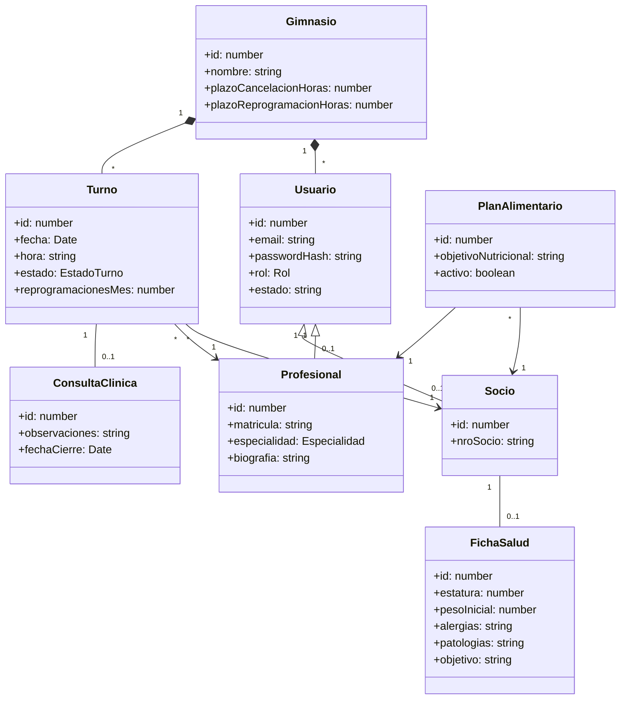
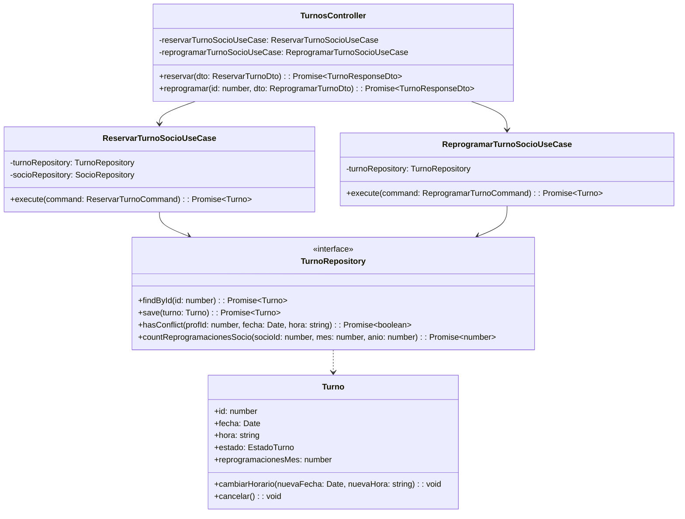

# Proyecto de Diploma: NutriFit Supervisor

## **Docente:** Pablo Andrés Audoglio  
## **Alumno:** Albónico, Agustín  
## **Legajo:** B00104869-T1  
## **Sede:** Roca  
## **Comisión:** 3-A  
## **Turno:** T  
## **Año:** 2025  
## **Versión:** 1.0

---

## 1. Nombre del Proyecto
**NutriFit Supervisor**

---

## 2. Siglas del Proyecto
**NFS** (o **MFS** en algunas especificaciones del módulo funcional de salud)

---

## 3. Descripción del Proyecto
NutriFit Supervisor es un sistema web SaaS B2B desarrollado para modernizar la gestión integral de gimnasios y centros de entrenamiento en Rosario, permitiendo la incorporación de servicios profesionales de salud (nutricionistas y deportólogos) de forma centralizada y digital. Está diseñado para funcionar desde cualquier dispositivo con conexión a Internet a través de un navegador moderno, adaptándose específicamente a las necesidades de gimnasios que desean ofrecer un abordaje de bienestar interdisciplinario.

El sistema permite que cada socio acceda a su perfil personal, donde puede consultar rutinas físicas, visualizar planes alimentarios creados por profesionales asignados, reservar turnos con especialistas, y realizar un seguimiento gráfico de su progreso físico y antropométrico. El gimnasio centraliza la administración de los profesionales de salud, las agendas horarias de atención, los datos de asistencia diaria y la configuración de políticas de cancelación de turnos. 

Por otro lado, los profesionales de la salud tienen a su disposición una agenda digital diaria, acceso a las fichas de salud de sus pacientes, y herramientas de edición clínica para registrar observaciones de consultas y estructurar planes de alimentación validados automáticamente contra las alergias declaradas por el socio. El sistema incorpora un asistente de inteligencia artificial (OpenAI API) que genera sugerencias de recetas y combinaciones de comidas basadas en objetivos y restricciones del socio, las cuales deben ser aprobadas o modificadas por el especialista humano antes de publicarse para el socio. Los entrenadores cuentan con acceso de sólo lectura a las indicaciones del plan nutricional para ajustar los planes físicos, garantizando así un flujo de trabajo coordinada y unificada.

---

## 4. Objetivos del Proyecto

### **Objetivo General**
Desarrollar una plataforma inteligente bajo modelo SaaS B2B para gimnasios que permita la integración digital de servicios profesionales de salud (nutrición y deportología), promoviendo la atención personalizada y el acompañamiento clínico de los socios mediante la coordinación interdisciplinaria y la asistencia de inteligencia artificial.

### **Objetivos Específicos**
- Diseñar una interfaz accesible y clara para que los socios visualicen, seleccionen y contraten turnos con nutricionistas y deportólogos registrados de su gimnasio.
- Habilitar a profesionales de la salud para configurar agendas horarias y registrar planes alimentarios, observaciones clínicas, mediciones y seguimiento evolutivo.
- Desarrollar un motor de IA que analice el perfil, preferencias, historial y restricciones del socio para sugerir recomendaciones nutricionales y comidas estructuradas sujetas a validación del especialista.
- Facilitar la colaboración interdisciplinaria entre entrenadores y profesionales de salud mediante perfiles de lectura parcial compartidos.
- Brindar al gimnasio un tablero administrativo con métricas de uso, asistencia, no-shows y utilización de agenda para optimizar la toma de decisiones comerciales.
- Garantizar la trazabilidad de auditoría, disponibilidad del sistema y estricta confidencialidad de la información médica mediante control de acceso por roles y aislamiento multi-tenant.

---

## 5. Definición de Requerimientos

### **5.1 Requerimientos Funcionales (RF)**

#### **Gestión de Profesionales (Asistente/Admin)**
*   **RF01:** El sistema debe permitir al asistente registrar nuevos profesionales de la salud cargando sus datos básicos (nombre, apellido, DNI, email, matrícula, experiencia, tarifa y archivos de matrícula/diploma) y generando credenciales provisionales encriptadas enviadas por correo electrónico.
*   **RF02:** El sistema debe permitir modificar los datos de un profesional existente.
*   **RF03:** El sistema debe permitir desactivar o eliminar de forma lógica a un profesional, bloqueando su inicio de sesión e impidiendo que aparezca en los listados públicos para socios, validando previamente que no posea turnos activos asignados.
*   **RF04:** El sistema debe mostrar un listado completo de todos los profesionales registrados, permitiendo filtrar por especialidad, estado y realizar búsquedas por nombre.
*   **RF05:** El sistema debe permitir asignar una o más especialidades a cada profesional (ej: nutricionista, deportólogo).
*   **RF06:** El sistema debe permitir configurar los horarios de atención de cada profesional, estableciendo días hábiles, rangos horarios y la duración estándar de los turnos (ej: 30 minutos).

#### **Gestión de Turnos (Socio)**
*   **RF07:** El sistema debe permitir al socio visualizar el perfil y la disponibilidad horaria en tiempo real de los profesionales del gimnasio.
*   **RF08:** El sistema debe permitir al socio solicitar y reservar un turno con el profesional seleccionado a partir de los horarios disponibles en su agenda.
*   **RF09:** El sistema debe permitir al socio cancelar un turno reservado con un mínimo de 24 horas de anticipación, actualizando el estado a `CANCELADO` y liberando el bloque en la agenda.
*   **RF10:** El sistema debe permitir al socio reprogramar un turno previamente reservado a otro día/hora libre (sujeto a la restricción de 24 horas y disponibilidad del profesional).
*   **RF11:** El sistema debe mostrar al socio el listado detallado de sus turnos reservados, distinguiendo históricos (pasados) y próximos (futuros).
*   **RF12:** El sistema debe mostrar los detalles del profesional (presentación, especialidad, matrícula, opiniones y calificaciones de otros socios) antes de confirmar la reserva del turno.
*   **RF13:** El sistema debe requerir que el socio complete su ficha de salud obligatoriamente solo la primera vez que solicita un turno con un especialista, bloqueando la reserva hasta guardar los datos.

#### **Ficha de Salud del Socio**
*   **RF14:** El sistema debe permitir al socio completar su ficha de salud registrando estatura, peso actual, nivel de actividad física (sedentario, moderado, intenso), alergias alimentarias, patologías/condiciones médicas y objetivo personal.
*   **RF15:** El sistema debe permitir al socio modificar su ficha de salud en cualquier momento desde su panel personal.
*   **RF16:** El sistema debe mostrar al profesional asignado la ficha de salud del socio durante la consulta y en la visualización previa al turno.

#### **Gestión de Turnos del Día (Profesional)**
*   **RF17:** El sistema debe permitir al profesional visualizar todos sus turnos agendados para el día actual que estén en estado `CONFIRMADO` o `PENDIENTE`.
*   **RF18:** El sistema debe permitir al profesional filtrar sus turnos por socio, horario u objetivo del paciente.
*   **RF19:** El sistema debe permitir al profesional acceder de forma directa a la ficha de salud del socio antes de iniciar la sesión de atención.

#### **Atención y Seguimiento (Profesional)**
*   **RF20:** El sistema debe permitir al profesional registrar observaciones clínicas y notas médicas sobre el turno en curso.
*   **RF21:** El sistema debe permitir registrar indicadores físicos del socio (peso, IMC, medidas antropométricas y perímetros) durante la atención.
*   **RF22:** El sistema debe guardar el historial cronológico completo de turnos, mediciones y observaciones del profesional asociadas a cada socio.

#### **Visualización del Progreso (Socio)**
*   **RF23:** El sistema debe mostrar al socio su historial de turnos realizados con cada profesional.
*   **RF24:** El sistema debe mostrar gráficamente la evolución física del socio (curvas de peso, IMC u otros perímetros registrados a lo largo del tiempo).
*   **RF25:** El sistema debe permitir al socio visualizar y descargar los documentos, recomendaciones o archivos PDF cargados por el profesional.
*   **RF26:** El sistema debe automatizar el envío de notificaciones internas y por correo electrónico ante la creación, reprogramación o cancelación de turnos.

#### **Consulta Clínica y Plan Alimentario (Segunda Iteración - TFI)**
*   **RF27:** El sistema debe permitir iniciar la consulta clínica únicamente si el estado del turno es `PRESENTE` (check-in realizado en recepción). Al iniciar, el turno transiciona a `EN_CURSO`.
*   **RF28:** El sistema debe permitir registrar observaciones clínicas en texto enriquecido y adjuntar archivos médicos (PDF, imágenes) asociados a la consulta, almacenados en MinIO.
*   **RF29:** El sistema debe validar que las mediciones físicas ingresadas durante la consulta caigan en rangos biológicos coherentes para evitar errores tipográficos del profesional.
*   **RF30:** El sistema debe permitir finalizar la consulta, cambiando el estado del turno a `REALIZADO` y bloqueando la edición directa de la consulta para resguardo legal, permitiendo únicamente la incorporación de anexos firmados con registro de auditoría.
*   **RF31:** El sistema debe permitir crear un plan alimentario para el socio, requiriendo definir un objetivo nutricional y al menos una comida para un día específico de la semana. Solo se permite un plan activo simultáneo por socio/profesional.
*   **RF32:** El sistema debe permitir editar el plan alimentario activo, registrando el usuario autor, la marca de tiempo y el motivo de la modificación.
*   **RF33:** El sistema debe permitir la eliminación lógica (soft delete) de un plan alimentario, exigiendo al profesional ingresar un motivo para que el socio quede sin plan activo.
*   **RF34:** El sistema debe permitir visualizar el plan alimentario por día/comida a Profesionales, Socios (completo) y Entrenadores (sólo lectura de porciones generales).
*   **RF35:** El sistema debe realizar una validación automática cruzada al momento de guardar un plan alimentario, bloqueando la acción e informando incidencias si el plan contiene ingredientes incluidos en el listado de alergias de la ficha de salud del socio.

#### **IA para Ideas de Comidas (Asistente Nutricional)**
*   **RF36:** En las pantallas de creación/edición de plan nutricional, el sistema debe proveer una acción "Sugerir con IA" requiriendo al profesional completar tres campos: Objetivo (obligatorio), Restricciones (opcional) e Información extra (obligatorio).
*   **RF37:** El motor de IA debe retornar exactamente 2 propuestas de comidas detallando: nombre, ingredientes con cantidades/unidades y pasos de preparación (máximo 5 pasos), permitiendo al profesional agregarlas al plan o descartarlas.
*   **RF38:** Si la propuesta generada por la IA contiene ingredientes que violan las alergias del socio, el sistema debe descartar la idea automáticamente a nivel de backend y notificar al profesional para que reintente la generación.

#### **Progreso y Notificaciones**
*   **RF39:** El sistema debe proveer herramientas de exportación en formatos PDF y CSV del historial clínico y tablas de progreso del socio.
*   **RF40:** El sistema debe notificar al socio de manera inmediata al crear, editar o eliminar su plan alimentario y al finalizar una consulta médica.

---

### **5.2 Requerimientos No Funcionales (RNF)**

#### **Rendimiento y Disponibilidad**
*   **RNF01 (Disponibilidad):** El sistema debe garantizar una disponibilidad de servicio de al menos el 99% en entornos de producción.
*   **RNF02 (Concurrencia):** El sistema debe soportar un mínimo de 100 usuarios concurrentes interactuando de forma activa sin experimentar degradación en los tiempos de respuesta.
*   **RNF03 (Latencia):** El tiempo de respuesta de las APIs críticas (como el cálculo de disponibilidad de slots u obtención de datos del plan nutricional) debe ser inferior a 2 segundos para el 95% de las peticiones (p95).
*   **RNF04 (Escalabilidad):** El backend debe estar diseñado sin estado (stateless) para permitir escalamiento horizontal mediante contenedores y balanceadores de carga en la nube.

#### **Seguridad y Trazabilidad**
*   **RNF05 (Autenticación):** Toda llamada a la API que no sea pública debe requerir autenticación basada en JWT (JSON Web Tokens) transmitida en cabeceras HTTP seguras.
*   **RNF06 (Encriptación de Claves):** El sistema debe almacenar las contraseñas en la base de datos de forma encriptada utilizando algoritmos de derivación de claves Argon2id de alta seguridad con salting dinámico.
*   **RNF07 (Control de Acceso):** Se debe implementar un control de acceso basado en roles (`SUPERADMIN`, `ADMIN`, `NUTRICIONISTA`, `SOCIO`, `ENTRENADOR`) validado en cada endpoint a través de Guards de NestJS.
*   **RNF08 (Confidencialidad Médica):** Un nutricionista o deportólogo solo puede acceder a la ficha de salud y consultas de un socio si tiene o ha tenido al menos un turno agendado con dicho socio. Se bloquea el acceso directo por URL mediante validaciones de propiedad del recurso.
*   **RNF09 (Auditoría):** Toda operación de escritura en datos sensibles (planes alimentarios, observaciones clínicas, check-ins) debe registrarse en la tabla de auditoría, guardando ID de usuario, IP, acción, timestamp y valores anteriores/nuevos.
*   **RNF10 (Cifrado de Tránsito):** Toda comunicación entre el cliente y el servidor debe estar cifrada en tránsito obligatoriamente mediante protocolo HTTPS TLS 1.3.

#### **Usabilidad e Interfaz**
*   **RNF11 (Accesibilidad):** La interfaz web debe ser intuitiva, con navegación simple y siguiendo pautas WCAG 2.2 para usabilidad de usuarios sin conocimientos técnicos.
*   **RNF12 (Adaptabilidad):** La UI debe ser 100% responsiva (Mobile First), garantizando que todas las pantallas críticas de reserva y visualización de planes alimentarios sean cómodas de usar en smartphones Android/iOS.
*   **RNF13 (Gestión de Errores):** Los mensajes de error de la API no deben exponer detalles técnicos internos (ej: stack traces de base de datos) y deben traducirse en el frontend a instrucciones claras y amigables en español.

#### **Mantenibilidad y Arquitectura**
*   **RNF14 (Arquitectura Limpia):** La aplicación backend debe estar estructurada bajo las capas de Clean Architecture para asegurar que las reglas de negocio en `domain/` permanezcan desacopladas de librerías, ORMs, frameworks y motores de bases de datos.
*   **RNF15 (Tipado Estricto):** El frontend y el backend deben compilar con el modo estricto de TypeScript (`strict: true`), evitando el uso de tipos `any` genéricos para prevenir fallos en tiempo de ejecución.
*   **RNF16 (Shared Package):** Los tipos de datos compartidos, payloads de peticiones, respuestas y códigos de error comunes deben centralizarse en el paquete `@nutrifit/shared` para asegurar la coherencia entre el cliente y el servidor.

#### **Portabilidad e Integridad**
*   **RNF17 (Compatibilidad de Navegadores):** La webapp debe ser compatible con las últimas dos versiones estables de Google Chrome, Mozilla Firefox, Microsoft Edge y Apple Safari.
*   **RNF18 (Transaccionalidad):** Las operaciones que involucren cambios en múltiples tablas de base de datos (ej: finalizar consulta y registrar indicadores físicos) deben ejecutarse dentro de transacciones SQL ACID para evitar inconsistencias por caídas del sistema.

---

## 6. Alcance del Proyecto

### **Inclusiones**
1.  **Multi-Tenancy:** Soporte para múltiples gimnasios (tenants) independientes compartiendo la misma base de datos física pero aislados lógicamente (Gym Central, Gym Norte, Gym Sur).
2.  **Módulo de Profesionales:** Registro, edición y suspensión lógica de nutricionistas y deportólogos. Configuración de sus bloques de atención y especialidades.
3.  **Módulo de Reserva y Turnos:** Búsqueda interactiva de profesionales, visualización de slots libres calculados bajo agenda, reserva de citas, reprogramaciones, cancelaciones de turnos, y check-in presencial.
4.  **Módulo de Historia Clínica y Progreso:** Carga y modificación de ficha de salud (alergias, patologías, objetivos), registro de evolución antropométrica (peso, perímetros corporales), exportación en formato PDF/CSV e historial clínico.
5.  **Módulo de Consulta Clínica:** Flujo para iniciar la atención (turno pasa a `EN_CURSO`), registrar mediciones físicas con validación, cargar observaciones clínicas, adjuntar estudios médicos y finalizar la consulta (turno pasa a `REALIZADO` y se bloquea la edición).
6.  **Módulo de Plan Alimentario:** Creación, edición auditada y soft delete de planes alimentarios estructurados por comidas y días de la semana, con validaciones automatizadas contra las alergias declaradas del socio.
7.  **Asistente de IA:** Integración con la API de OpenAI para sugerencia inteligente de recetas a profesionales basándose en objetivos y restricciones del socio, con filtro automático de ingredientes prohibidos.
8.  **Auditoría y Notificaciones:** Registro de logs de auditoría en base de datos para acciones clínicas y notificaciones automatizadas por correo electrónico (SMTP).

### **Exclusiones**
1.  **Cobros Integrados:** No se procesan cobros ni pasarelas de pago online (Stripe, Mercado Pago) de turnos o especialidades de forma interna.
2.  **Mensajería Instantánea Integrada:** No incluye chat clínico sincrónico ni videollamada interactiva integrada dentro de la plataforma (las consultas son presenciales en las sedes).
3.  **Módulo Contable Complejo:** Queda fuera de alcance la liquidación de comisiones, balances, facturación oficial ante AFIP y contabilidad administrativa del gimnasio.
4.  **Aplicación Móvil Nativa:** No se construirán instaladores para tiendas de aplicaciones (Android `.apk` o iOS `.ipa`); la interfaz web responsive cubre el acceso móvil.
5.  **Gestión de Rutinas Físicas:** El diseño y asignación de planes de musculación y rutinas físicas del gimnasio quedan fuera de los límites de este módulo enfocado a salud clínica y nutrición.

---

## 7. Registro de Interesados (Stakeholders)

El registro de interesados detalla los perfiles clave que interactúan con NutriFit Supervisor:

| Rol | Expectativas Principales | Influencia | Fase de Mayor Interés | Clasificación |
|---|---|---|---|---|
| **Dueño del Gimnasio** | Diferenciar el gimnasio incorporando servicios premium de salud, mejorar retención de socios y monitorear la rentabilidad del staff. | Alta | Planificación, Inicio y Cierre | Interno / Apoyo |
| **Administrador** | Configurar parámetros del tenant, gestionar perfiles de profesionales, definir especialidades y consultar reportes operativos de no-shows. | Alta | Configuración y Operación | Interno / Apoyo |
| **Recepcionista / Asistente** | Registrar profesionales de salud, gestionar cancelaciones forzadas, registrar check-ins presenciales en el día y gestionar ausentes. | Media | Operación Diaria | Interno / Apoyo |
| **Nutricionista** | Configurar su agenda, consultar fichas de salud antes del turno, registrar consultas clínicas, usar IA para estructurar planes alimentarios rápidos. | Media | Operación Diaria | Externo / Apoyo |
| **Deportólogo** | Registrar observaciones médicas, subir adjuntos clínicos (estudios) y coordinar de forma indirecta las limitaciones médicas con los entrenadores. | Media | Operación Diaria | Externo / Apoyo |
| **Socio** | Buscar profesionales, agendar turnos cómodamente desde el móvil, completar su ficha de salud obligatoria, ver su plan de alimentación y gráficas de peso. | Alta | Operación Diaria | Externo / Apoyo |
| **Entrenador** | Consultar en modo de sólo lectura las observaciones generales y planes alimentarios autorizados para programar rutinas físicas coherentes. | Baja / Media | Operación Diaria | Interno / Apoyo |
| **Superadministrador** | Garantizar el aislamiento de datos multi-tenant, realizar impersonaciones seguras para dar soporte técnico y mantener la base de datos. | Alta | Mantenimiento y Soporte | Interno / Apoyo |

---

## 8. Cronograma de Hitos

El proyecto de desarrollo de NutriFit Supervisor se estructuró en cuatro hitos principales alineados con las materias académicas:

```mermaid
gantt
    title Cronograma de Hitos - NutriFit Supervisor
    dateFormat  YYYY-MM-DD
    section Desarrollo
    Hito 1: Análisis y Arquitectura           :active, h1, 2025-03-01, 2025-04-30
    Hito 2: Iteración 1 - SAP (Profesionales) :active, h2, 2025-05-01, 2025-08-31
    Hito 3: Iteración 2 - TFI (Clínica e IA)  :active, h3, 2025-09-01, 2025-11-30
    Hito 4: Pruebas, Auditoría y Cierre       :active, h4, 2025-12-01, 2025-12-31
```

*   **Hito 1: Análisis de Requisitos y Diseño de Arquitectura (Meses 1-2):** Definición del modelo relacional de datos, especificación del PRD inicial, setup del monorepo con npm workspaces, configuración de Docker con MySQL y MinIO.
*   **Hito 2: Iteración 1 - Gestión de Profesionales y Turnos [Seminario de Aplicación Profesional] (Meses 3-6):** Desarrollo del CRUD de profesionales de salud, configuración de agendas, reserva de turnos para socios con control de anticipación (24h), carga de ficha de salud inicial y notificaciones de agendamiento.
*   **Hito 3: Iteración 2 - Consulta Clínica, Plan Alimentario e IA [Trabajo Final de Ingeniería] (Meses 7-10):** Módulo de atención clínica con registro de mediciones, módulo de planes alimentarios con validación estricta de alérgenos, integración del motor de IA de OpenAI para recetas preliminares y tableros gráficos de evolución antropométrica.
*   **Hito 4: Pruebas de Sistema, Auditoría y Entrega Final (Meses 11-12):** Implementación de logs de auditoría completos, suite de pruebas unitarias/E2E en Playwright, documentación técnica, elaboración de manuales de uso y empaquetado del software.

---

## 9. Criterios de Aceptación del Producto
1.  **Aislamiento Multi-tenant:** El sistema debe aislar lógicamente las bases de datos de Gym Central, Gym Norte y Gym Sur. Queda prohibida la visualización de datos de un tenant por otro, validado mediante tests de integración.
2.  **Validación de Alérgenos:** Al intentar guardar un plan alimentario, el sistema debe denegar la operación si detecta ingredientes prohibidos según la ficha de salud del socio, arrojando una excepción controlada.
3.  **Aprobación Profesional Obligatoria:** Las sugerencias de comidas generadas por la IA no deben bajo ningún concepto registrarse directamente en el plan del socio; el profesional médico debe revisarlas, pudiendo agregarlas o descartarlas de forma explícita.
4.  **Políticas Operativas Horarias:** El socio no puede reservar, reprogramar ni cancelar turnos con menos de 24 horas de antelación. Tampoco puede superar el límite de 3 reprogramaciones de turnos mensuales en el mes calendario.
5.  **Confidencialidad de la Información:** El acceso a la historia clínica de un socio está estrictamente bloqueado para profesionales que no tengan o hayan tenido un turno programado asignado con él.

---

## 10. Supuestos del Proyecto
*   Los gimnasios que adquieren la suscripción SaaS poseen terminales en recepción, computadoras para los profesionales de la salud y conectividad a Internet de banda ancha de forma ininterrumpida.
*   Los socios ingresan voluntaria, verídica y conscientemente sus alergias, patologías crónicas y mediciones físicas iniciales en su ficha de salud obligatoria.
*   Los nutricionistas y deportólogos registrados en la plataforma poseen matrículas profesionales oficiales habilitadas en los organismos de salud correspondientes.
*   Las recetas e ideas de menús provistas por el motor de OpenAI se asumen como sugerencias preliminares (borradores) y en ningún caso reemplazan la prescripción formal médica.

---

## 11. Restricciones del Proyecto
*   **Restricción Operativa (Turnos):** Las acciones de reprogramación y cancelación de turnos por parte de los socios quedan deshabilitadas si faltan menos de 24 horas para el turno.
*   **Restricción Clínica (Atención):** Un profesional de la salud solo puede iniciar la consulta médica interactiva si el estado del turno actual es `PRESENTE`, transicionándolo a `EN_CURSO`.
*   **Restricción Legal (Historia Clínica):** Para garantizar el cumplimiento de las normativas de confidencialidad de datos médicos, el cierre de la consulta médica bloquea permanentemente su edición directa, permitiendo únicamente la incorporación de notas anexas auditadas.
*   **Restricción de Recursos:** El motor de IA (OpenAI API) está sujeto a cuotas y límites de consumo diario; el backend debe implementar control de errores ante caídas de la API.

---

## 12. Iteraciones del Proyecto

### **Iteración 1: Gestión de Profesionales de la Salud (Seminario de Aplicación Profesional)**
*   **Objetivo:** Sentar las bases operativas de la plataforma, permitiendo dar de alta profesionales, configurar agendas y posibilitar la reserva de turnos por los socios.
*   **Alcance Funcional:** CRUD completo de profesionales, asignación de especialidades, agenda horaria configurable del especialista, reserva, cancelación y reprogramación de turnos por el socio, check-in en recepción y ficha de salud del socio.
*   **Estado:** Implementado y verificado.

### **Iteración 2: Consulta Clínica y Plan Nutricional Asistido por IA (Trabajo Final de Ingeniería)**
*   **Objetivo:** Cerrar el ciclo clínico y de nutrición, permitiendo la atención médica interactiva, la confección de dietas y la asistencia inteligente de IA.
*   **Alcance Funcional:** Registro de observaciones clínicas, captura de indicadores físicos en consulta, bloqueo de consulta al finalizar, CRUD de planes alimentarios con validaciones de alergia, sugerencias de menús mediante IA (OpenAI), y gráficos dinámicos de evolución física.
*   **Estado:** Implementado y verificado.

---

### **Detalle del Requerimiento "Core": Reserva y Gestión de Turno**

#### **Especificación del Requerimiento Core**
La reserva de turnos permite coordinar la atención del socio en el gimnasio. Debe asegurar que:
1. El socio tenga una ficha de salud completada en el sistema (R01).
2. El profesional seleccionado se encuentre activo y habilitado en la plataforma (R02).
3. No exista colisión horaria con otra cita del mismo profesional ni del mismo socio (R06).
4. El horario seleccionado caiga dentro de un bloque disponible en la agenda del nutricionista (R07).
5. Las reservas no se realicen en fechas pasadas (R03).

#### **Guion de Interfaz de Usuario (Prototipos)**

````carousel
```text
PANTALLA: Búsqueda de Especialistas (Socio)
+-----------------------------------------------------------+
| [ Buscar Nutricionistas / Deportólogos ]                 |
| Filtrar por: [ Especialidad v ]  Buscar: [ Juan Pérez   ] |
+-----------------------------------------------------------+
| +-------------------------+   +-------------------------+ |
| | Foto  Lic. Juan Pérez   |   | Foto  Dra. Ana Gómez    | |
| | Esp: Nutrición Clínica  |   | Esp: Medicina Deportiva | |
| | [Ver Perfil] [Reservar] |   | [Ver Perfil] [Reservar] | |
| +-------------------------+   +-------------------------+ |
+-----------------------------------------------------------+
```
<!-- slide -->
```text
PANTALLA: Grilla de Slots Horarios (Socio)
+-----------------------------------------------------------+
| Agendar turno con: Lic. Juan Pérez                        |
| Fecha: [ 06/07/2026 v ]                                   |
+-----------------------------------------------------------+
| Selecciona un horario disponible:                        |
|  [ 09:00 - Libre ]     [ 09:30 - Reservado ]              |
|  [ 10:00 - Libre ]     [ 10:30 - Libre ]                  |
|  [ 11:00 - Bloqueado ] [ 11:30 - Libre ]                  |
+-----------------------------------------------------------+
|                                  [ Continuar ] [ Cancelar]|
+-----------------------------------------------------------+
```
<!-- slide -->
```text
PANTALLA: Ficha de Salud Obligatoria (Socio - Primera Reserva)
+-----------------------------------------------------------+
| Ficha de Salud Obligatoria                                |
| Completá tus datos físicos antes de confirmar la reserva: |
+-----------------------------------------------------------+
| Estatura: [ 178 ] cm      Peso actual: [ 82.5 ] kg        |
| Nivel Actividad: ( ) Bajo (x) Moderado ( ) Intenso        |
| Alergias Alimentarias: [ Maní, Nueces                   ] |
| Patologías / Condiciones: [ Ninguna                     ] |
| Objetivo: [ Bajar porcentaje de grasa corporal            ] |
+-----------------------------------------------------------+
|                                    [ Guardar e Ir a Reservar ]|
+-----------------------------------------------------------+
```
````

#### **Análisis de Requisitos**

##### **Diagrama de Casos de Uso (Módulo de Turnos)**

```mermaid
usecaseDiagram
    actor Socio
    actor Profesional
    actor Recepcionista
    
    Socio --> (CUD13 - Ver lista de profesionales)
    Socio --> (CUD14 - Solicitar turno con profesional)
    Socio --> (CUD18 - Reprogramar turno)
    Socio --> (CUD19 - Cancelar turno)
    Socio --> (CUD20 - Confirmar turno)
    
    (CUD14 - Solicitar turno con profesional) ..> (CUD16 - Cargar datos de salud) : <<include>>
    
    Profesional --> (CUD07 - Ver turnos del día)
    Profesional --> (CUD12 - Asignar Turno a Paciente)
    Profesional --> (CUD21 - Registrar asistencia del socio al turno)
    
    Recepcionista --> (CUD12 - Asignar Turno a Paciente)
```

##### **Especificación Detallada de Casos de Uso Core**

###### **CUD14 — Solicitar turno con profesional**
*   **ID y Nombre:** CUD14 - Solicitar turno con profesional
*   **Estado:** Activo
*   **Descripción:** Permite al socio agendar un turno disponible con un especialista.
*   **Actor Principal:** Socio
*   **Actor Secundario:** Profesional
*   **Pre-Condiciones:** 
    1. El socio debe estar autenticado en el sistema.
    2. El profesional debe contar con slots libres en su agenda.
*   **Escenario Principal:**
    1. El socio accede a la vista de búsqueda de profesionales.
    2. Selecciona un profesional y hace clic en "Reservar Turno".
    3. El sistema carga el calendario de disponibilidad del profesional.
    4. El socio selecciona una fecha y un bloque horario libre.
    5. El sistema verifica si el socio posee una ficha de salud registrada en la base de datos (ver flujo alternativo A5).
    6. El socio hace clic en "Confirmar Reserva".
    7. El sistema valida que el slot siga disponible y crea el registro de turno en estado `PENDIENTE`.
    8. El sistema actualiza la disponibilidad del profesional y envía confirmación por email.
*   **Flujos Alternativos:**
    *   **A5: Socio no posee Ficha de Salud:**
        1. El sistema detecta que el socio no tiene ficha clínica.
        2. El sistema redirige al socio a la pantalla de CUD16 (Cargar datos de salud).
        3. Tras guardar la ficha, el sistema redirige al socio al paso 6 para confirmar el turno.
    *   **A7: El slot fue reservado simultáneamente por otro usuario:**
        1. El sistema detecta que el slot ya no está libre.
        2. Informa al socio del conflicto e invalida la confirmación.
        3. Retorna al paso 4 para que seleccione un nuevo horario.
*   **Post-Condiciones:** El turno queda registrado con estado `PENDIENTE` y se asocia al gimnasio del socio.

###### **CUD18 — Reprogramar turno**
*   **ID y Nombre:** CUD18 - Reprogramar turno
*   **Estado:** Activo
*   **Descripción:** Habilita al socio a cambiar la fecha y hora de una reserva activa.
*   **Actor Principal:** Socio
*   **Pre-Condiciones:**
    1. El socio debe estar autenticado.
    2. El turno debe encontrarse en estado `PENDIENTE` o `CONFIRMADO`.
    3. Faltan al menos 24 horas para el inicio programado del turno (RB05).
*   **Escenario Principal:**
    1. El socio accede a "Mis Turnos".
    2. Selecciona un turno activo y hace clic en "Reprogramar".
    3. El sistema valida la regla de las 24 horas (ver flujo alternativo A3).
    4. El sistema despliega la agenda del profesional.
    5. El socio selecciona un nuevo horario disponible.
    6. El socio confirma la reprogramación indicando el motivo.
    7. El sistema libera el slot anterior, reserva el nuevo horario, incrementa el contador de reprogramaciones del mes del socio y cambia el estado a `REPROGRAMADO` de forma temporal (vuelve a `PENDIENTE`).
    8. Se notifica al profesional por email.
*   **Flujos Alternativos:**
    *   **A3: Falta menos de 24 horas para el turno:**
        1. El sistema deniega la operación.
        2. Muestra mensaje: "No podés reprogramar turnos con menos de 24 horas de anticipación. Comunicarse con recepción."
        3. Finaliza el caso de uso sin guardar cambios.
    *   **A7: El socio superó el límite de 3 reprogramaciones del mes calendario:**
        1. El sistema detecta que el socio ya reprogramó 3 veces en el mes.
        2. Bloquea el proceso de guardado.
        3. Muestra mensaje: "Superaste el límite de 3 reprogramaciones mensuales permitidas."
        4. Finaliza el caso de uso.
*   **Post-Condiciones:** El turno se registra en la nueva fecha y hora con un registro de auditoría asociado.

##### **Diagrama de Dominio Conceptual Detallado**



#### **Análisis del Diseño Preliminar y Detallado**

##### **Diagrama de Robustez: Caso de Uso "Solicitar Turno"**

```text
       Socio
       (Actor)
         │
         ▼
  [BuscarProf UI] ──► (Turnos Controller) ──► (ReservarTurnoSocio UseCase) ────► (Validar Reglas)
                             │                            │                           │
                             ▼                            ▼                           ▼
                     [Turno DB Entity]           (Socio Repository)          (Turno Repository)
```

##### **Diagramas de Secuencia**

###### **1. Registrar Profesional (CUD02)**
```text
Asistente UI           AuthController         CreateProfUseCase       ProfRepository           Database
     │                       │                        │                      │                    │
     │── registrar(datos) ──►│                        │                      │                    │
     │                       │── execute(command) ───►│                      │                    │
     │                       │                        │── queryUnicidad() ──►│                    │
     │                       │                        │◄─ [No Existe] ───────│                    │
     │                       │                        │                      │                    │
     │                       │                        │── hashPassword()     │                    │
     │                       │                        │                      │                    │
     │                       │                        │── save(prof) ───────►│                    │
     │                       │                        │                      │── INSERT INTO ────►│
     │                       │                        │                      │◄── [Saved] ────────│
     │                       │◄─ [Creado (JWT/Temp)] ─│                      │                    │
     │◄─ [Registro Exitoso] ─│                        │                      │                    │
```

###### **2. Solicitar Turno con Ficha de Salud (CUD14)**
```text
Socio UI              TurnosController        ReservarTurnoUseCase    SocioRepository       TurnoRepository
   │                          │                        │                     │                     │
   │── solicitarReserva(t) ──►│                        │                     │                     │
   │                          │── execute(command) ───►│                     │                     │
   │                          │                        │── checkFicha() ────►│                     │
   │                          │                        │◄─ [Ficha Ok] ───────│                     │
   │                          │                        │                     │                     │
   │                          │                        │── checkConflict() ───────────────────────►│
   │                          │                        │◄─ [No Conflicto] ────────────────────────│
   │                          │                        │                     │                     │
   │                          │                        │── save(turno) ──────────────────────────►│
   │                          │                        │◄─ [Saved] ───────────────────────────────│
   │                          │◄─ [Turno Creado] ──────│                     │                     │
   │◄─ [Confirmado Email] ────│                        │                     │                     │
```

###### **3. Reprogramar Turno (CUD18)**
```text
Socio UI              TurnosController       ReprogTurnoUseCase       TurnoRepository          Database
   │                          │                       │                      │                     │
   │── reprogramar(id, h) ───►│                       │                      │                     │
   │                          │── execute(command) ──►│                      │                     │
   │                          │                       │── queryTurno() ─────►│                     │
   │                          │                       │◄─ [Turno Pendiente] ─│                     │
   │                          │                       │                      │                     │
   │                          │                       │── check24Hours()     │                     │
   │                          │                       │                      │                     │
   │                          │                       │── checkReprogCount() │                     │
   │                          │                       │                      │                     │
   │                          │                       │── updateSlot() ─────►│                     │
   │                          │                       │                      │── UPDATE SQL ──────►│
   │                          │                       │                      │◄── [Updated] ───────│
   │                          │◄─ [Reprogramado Ok] ──│                      │                     │
   │◄─ [Notificado Prof] ─────│                       │                      │                     │
```

##### **Diagrama de Clases de Diseño (Módulo Turnos)**



#### **Implementación (Persistencia Relacional)**

##### **Modelo de Datos Físico (DDL / MySQL)**

```sql
-- Tabla de Gimnasios (Tenants)
CREATE TABLE gimnasios (
    id INT AUTO_INCREMENT PRIMARY KEY,
    nombre VARCHAR(100) NOT NULL,
    plazo_cancelacion_horas INT DEFAULT 24,
    plazo_reprogramacion_horas INT DEFAULT 24,
    created_at TIMESTAMP DEFAULT CURRENT_TIMESTAMP
);

-- Tabla de Usuarios Generales
CREATE TABLE usuarios (
    id INT AUTO_INCREMENT PRIMARY KEY,
    gimnasio_id INT NOT NULL,
    email VARCHAR(150) NOT NULL,
    password_hash VARCHAR(255) NOT NULL,
    rol ENUM('SUPERADMIN', 'ADMIN', 'RECEPCIONISTA', 'NUTRICIONISTA', 'SOCIO', 'ENTRENADOR') NOT NULL,
    estado VARCHAR(20) DEFAULT 'ACTIVO',
    fecha_baja TIMESTAMP NULL,
    created_at TIMESTAMP DEFAULT CURRENT_TIMESTAMP,
    FOREIGN KEY (gimnasio_id) REFERENCES gimnasios(id),
    UNIQUE KEY uq_email_tenant (email, gimnasio_id)
);

-- Tabla de Perfiles de Profesionales
CREATE TABLE perfiles_profesionales (
    id INT AUTO_INCREMENT PRIMARY KEY,
    usuario_id INT NOT NULL,
    matricula VARCHAR(50) NOT NULL,
    especialidad ENUM('NUTRICIONISTA', 'DEPORTOLOGO') NOT NULL,
    biografia TEXT,
    experiencia_anios INT DEFAULT 0,
    created_at TIMESTAMP DEFAULT CURRENT_TIMESTAMP,
    FOREIGN KEY (usuario_id) REFERENCES usuarios(id) ON DELETE CASCADE
);

-- Tabla de Fichas de Salud de Socios
CREATE TABLE fichas_salud (
    id INT AUTO_INCREMENT PRIMARY KEY,
    socio_id INT NOT NULL UNIQUE,
    estatura_cm INT NOT NULL,
    peso_inicial_kg DECIMAL(5,2) NOT NULL,
    nivel_actividad ENUM('SEDENTARIO', 'MODERADO', 'INTENSO') NOT NULL,
    alergias TEXT,
    patologias TEXT,
    objetivo_personal TEXT NOT NULL,
    updated_at TIMESTAMP DEFAULT CURRENT_TIMESTAMP ON UPDATE CURRENT_TIMESTAMP,
    FOREIGN KEY (socio_id) REFERENCES usuarios(id) ON DELETE CASCADE
);

-- Tabla de Turnos
CREATE TABLE turnos (
    id INT AUTO_INCREMENT PRIMARY KEY,
    gimnasio_id INT NOT NULL,
    socio_id INT NOT NULL,
    nutricionista_id INT NOT NULL,
    fecha DATE NOT NULL,
    hora VARCHAR(5) NOT NULL,
    estado ENUM('PROGRAMADO', 'PRESENTE', 'EN_CURSO', 'REALIZADO', 'AUSENTE', 'CANCELADO') DEFAULT 'PROGRAMADO',
    reprogramaciones_mes INT DEFAULT 0,
    notas TEXT,
    created_at TIMESTAMP DEFAULT CURRENT_TIMESTAMP,
    FOREIGN KEY (gimnasio_id) REFERENCES gimnasios(id),
    FOREIGN KEY (socio_id) REFERENCES usuarios(id),
    FOREIGN KEY (nutricionista_id) REFERENCES usuarios(id),
    UNIQUE KEY uq_turno_bloque (nutricionista_id, fecha, hora, estado)
);

-- Tabla de Consultas Clínicas
CREATE TABLE consultas_clinicas (
    id INT AUTO_INCREMENT PRIMARY KEY,
    turno_id INT NOT NULL UNIQUE,
    observaciones TEXT,
    fecha_cierre TIMESTAMP NULL,
    created_at TIMESTAMP DEFAULT CURRENT_TIMESTAMP,
    FOREIGN KEY (turno_id) REFERENCES turnos(id) ON DELETE CASCADE
);

-- Tabla de Mediciones Antropométricas
CREATE TABLE mediciones_corporales (
    id INT AUTO_INCREMENT PRIMARY KEY,
    consulta_id INT NOT NULL,
    peso_kg DECIMAL(5,2) NOT NULL,
    imc DECIMAL(4,2) NOT NULL,
    perimetro_cintura_cm DECIMAL(5,2),
    perimetro_cadera_cm DECIMAL(5,2),
    created_at TIMESTAMP DEFAULT CURRENT_TIMESTAMP,
    FOREIGN KEY (consulta_id) REFERENCES consultas_clinicas(id) ON DELETE CASCADE
);

-- Tabla de Planes Alimentarios
CREATE TABLE planes_alimentarios (
    id INT AUTO_INCREMENT PRIMARY KEY,
    gimnasio_id INT NOT NULL,
    socio_id INT NOT NULL,
    profesional_id INT NOT NULL,
    objetivo_nutricional TEXT NOT NULL,
    activo BOOLEAN DEFAULT TRUE,
    created_at TIMESTAMP DEFAULT CURRENT_TIMESTAMP,
    FOREIGN KEY (gimnasio_id) REFERENCES gimnasios(id),
    FOREIGN KEY (socio_id) REFERENCES usuarios(id),
    FOREIGN KEY (profesional_id) REFERENCES usuarios(id)
);

-- Tabla de Comidas del Plan
CREATE TABLE comidas (
    id INT AUTO_INCREMENT PRIMARY KEY,
    plan_alimentario_id INT NOT NULL,
    dia_semana ENUM('LUNES', 'MARTES', 'MIERCOLES', 'JUEVES', 'VIERNES', 'SABADO', 'DOMINGO') NOT NULL,
    tipo_comida ENUM('DESAYUNO', 'ALMUERZO', 'MERIENDA', 'CENA', 'COLACION') NOT NULL,
    nombre VARCHAR(150) NOT NULL,
    ingredientes TEXT NOT NULL,
    pasos TEXT,
    notas TEXT,
    FOREIGN KEY (plan_alimentario_id) REFERENCES planes_alimentarios(id) ON DELETE CASCADE
);

-- Tabla de Auditorías
CREATE TABLE auditorias (
    id INT AUTO_INCREMENT PRIMARY KEY,
    gimnasio_id INT NOT NULL,
    usuario_id INT NOT NULL,
    accion VARCHAR(100) NOT NULL,
    tabla_afectada VARCHAR(100) NOT NULL,
    registro_id INT NOT NULL,
    valores_anteriores JSON,
    valores_nuevos JSON,
    motivo VARCHAR(255),
    created_at TIMESTAMP DEFAULT CURRENT_TIMESTAMP,
    FOREIGN KEY (gimnasio_id) REFERENCES gimnasios(id),
    FOREIGN KEY (usuario_id) REFERENCES usuarios(id)
);
```

---

## 13. Reportes / Indicadores / Estadísticas

NutriFit Supervisor define los siguientes tres reportes clave para dar valor operacional y clínico a los distintos usuarios:

### **1. Reporte Operativo del Establecimiento: Dashboard de Gestión de Agendas**
*   **Destinatario:** Administrador y Asistente.
*   **Propósito:** Evaluar la eficiencia operativa del staff de salud, los índices de inasistencia (no-shows) y la ocupación global de los consultorios.
*   **Filtros Disponibles:** Gimnasio (tenant), rango de fechas (desde/hasta), profesional de salud específico, especialidad.
*   **Indicadores Clave de Rendimiento (KPIs):**
    *   *Tasa de Ausentismo:* Porcentaje de turnos en estado `AUSENTE` sobre el total de turnos programados en el período.
    *   *Porcentaje de Ocupación:* Horas totales de consultas realizadas sobre el total de horas declaradas disponibles por los profesionales en su configuración horaria (CUD11).
*   **Visualización:** Gráfico de torta interactivo mostrando la distribución de estados de turnos del mes y gráfico de barras comparativo de tasa de ausentismo por profesional de salud.

### **2. Reporte Clínico de Evolución Antropométrica**
*   **Destinatario:** Socio y Profesional de la salud (Nutricionista/Deportólogo).
*   **Propósito:** Realizar un seguimiento longitudinal y visual del progreso corporal del socio a partir de las mediciones recolectadas en cada consulta clínica.
*   **Filtros Disponibles:** Período de tiempo (último mes, últimos 3 meses, último año, histórico completo), variables físicas a graficar (Peso corporal, IMC, perímetros de cintura y cadera).
*   **Datos de Origen:** Registros históricos de la tabla `mediciones_corporales` asociados a las consultas clínicas finalizadas del socio autenticado.
*   **Visualización:** Gráfico de líneas dinámico (diseñado con Recharts en el frontend) que despliega curvas de evolución superpuestas para analizar la correlación (ej: aumento de masa muscular vs. reducción de peso graso).

### **3. Reporte de Trazabilidad y Seguridad (Auditoría Médica)**
*   **Destinatario:** Administrador y Superadministrador.
*   **Propósito:** Cumplir con los requerimientos normativos de auditoría de datos de salud sensibles. Permite trazar todo el ciclo de modificaciones realizadas en el sistema.
*   **Filtros Disponibles:** Rango de fecha y hora, ID/Email del usuario operador, gimnasio (tenant), tipo de acción (crear plan, modificar plan, finalizar consulta, impersonar).
*   **Campos Reportados:** Timestamp del evento, operador (email y rol), acción ejecutada, registro ID afectado, y comparativa detallada en formato JSON de valores anteriores y valores nuevos junto al motivo obligatorio de cambio ingresado por el profesional.
*   **Visualización:** Grilla tabular interactiva con opción de exportación a CSV para análisis de cumplimiento.
