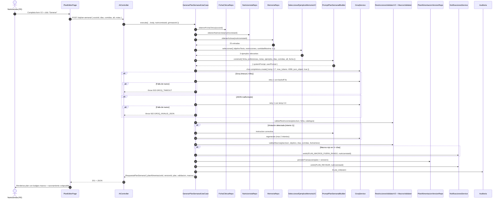
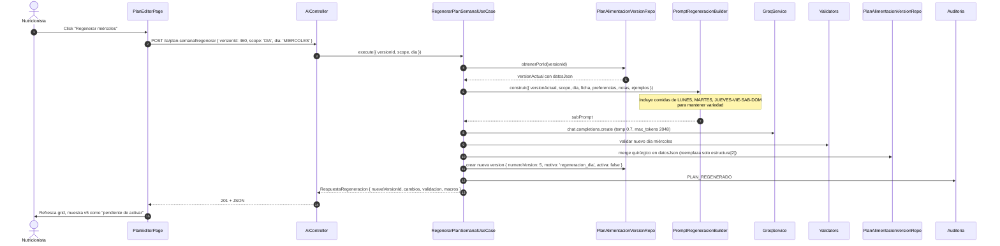
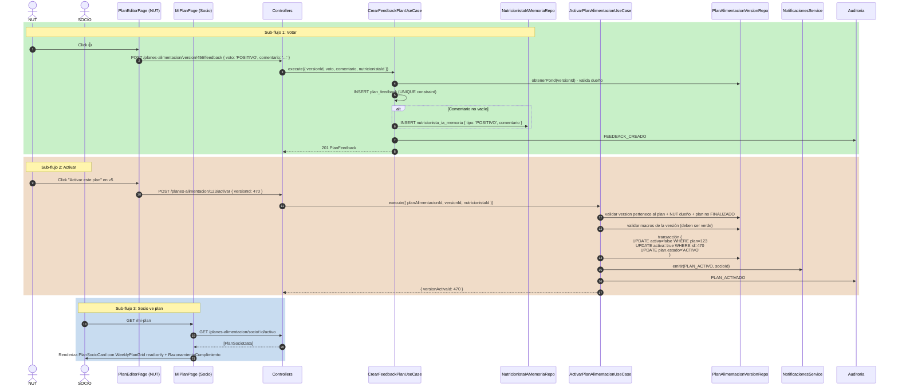
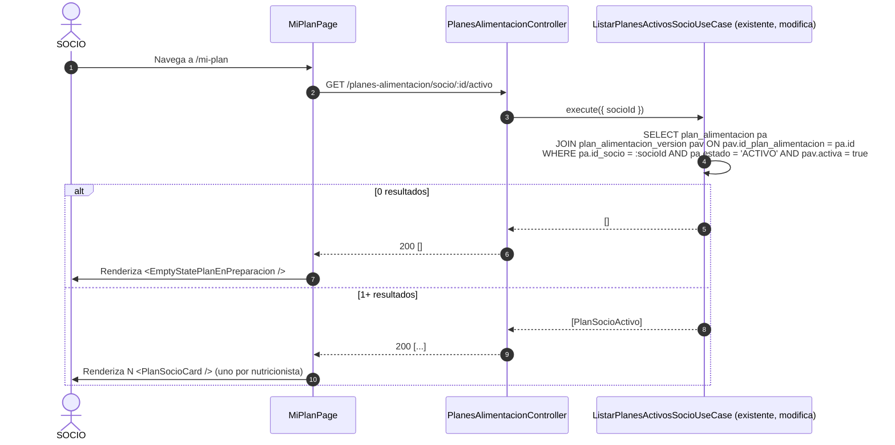

# Design: plan-alimentacion-ia-v2

**Change ID**: plan-alimentacion-ia-v2
**Phase**: design
**Date**: 2026-06-25
**Source artifacts**: `openspec/changes/plan-alimentacion-ia-v2/{proposal.md, explore.md, specs/*.md}`
**Persistence**: BOTH (OpenSpec + Engram)

---

## 1. Resumen de arquitectura

El feature reemplaza el módulo de generación de planes con IA por una versión completa: validación dura de restricciones, validación de macros, versionado inmutable, feedback con memoria persistente, regeneración granular por scope (PLAN/DÍA/ALTERNATIVA), notificaciones in-app y razonamiento de cumplimiento visible.

**Backend** sigue Clean Architecture en 4 capas:
- `domain/` — entidades puras (sin TypeORM), validadores (lógica pura), interfaces de repositorio.
- `application/` — use-cases con `BaseUseCase`, DTOs con `class-validator`, builders de prompt.
- `infrastructure/` — entidades TypeORM, implementaciones de repositorio, migración única con backfill.
- `presentation/` — controllers HTTP con `@Actions(...)` granular y DTOs Swagger.

**Frontend** sigue hook-first:
- Hooks TanStack Query para state del servidor (`useIa`, `useFeedbackPlan`, etc.).
- Componentes presentacionales (shadcn/ui + Tailwind v4).
- Páginas orquestan hooks + componentes.

**Multi-tenant** filtrado por `gimnasioId` del JWT vía `TenantContextService`. **RBAC granular** con 6 acciones nuevas aplicadas a cada endpoint vía `@Actions(...)` (cierra gap actual del `ActionsGuard`).

---

## 2. Backend — Modelo de datos

### 2.1 Entidades nuevas (TypeScript interfaces + TypeORM)

#### `PlanAlimentacionVersionEntity` (domain)

```typescript
// apps/backend/src/domain/entities/PlanAlimentacionVersion/plan-alimentacion-version.entity.ts
export class PlanAlimentacionVersionEntity {
  constructor(
    public readonly idPlanAlimentacionVersion: number,
    public readonly idPlanAlimentacion: number,
    public readonly numeroVersion: number,
    public readonly datosJson: PlanAlimentacionDatosJson,
    public readonly motivoCambio: MotivoCambio | null,
    public readonly activa: boolean,
    public readonly createdAt: Date,
    public readonly createdBy: number,
  ) {}

  // Regla de inmutabilidad: NO exponer setters ni métodos de mutación.
  // Para "modificar", se crea una nueva versión.
}
```

```typescript
// apps/backend/src/domain/entities/PlanAlimentacionVersion/plan-alimentacion-datos-json.ts
export interface PlanAlimentacionDatosJson {
  estructura: Array<{
    dia: DiaSemana;
    comidas: Array<{
      tipo: TipoComida;
      alternativas: Array<ItemComidaSnapshot>;
    }>;
  }>;
  macrosPorDia: Record<DiaSemana, ResumenMacrosDia>;
  razonamientoCumplimiento: {
    restriccionesCumplidas: Array<{ restriccion: string; detalle: string }>;
    restriccionesNoCumplidas: Array<{
      restriccion: string;
      detalle: string;
      comida?: string;
      alternativa?: number;
    }>;
  };
}

export interface ItemComidaSnapshot {
  nombre: string;
  alimentos: Array<{
    alimentoId: number;
    cantidad: number;
    unidad: string;
  }>;
  calorias: number;
  proteinas: number;
  carbohidratos: number;
  grasas: number;
}

export type MotivoCambio =
  | 'creacion_inicial'
  | 'regeneracion_completa'
  | 'regeneracion_dia'
  | 'regeneracion_alternativa'
  | 'edicion_manual';
```

**TypeORM entity**: `apps/backend/src/infrastructure/persistence/typeorm/entities/plan-alimentacion-version.entity.ts`

| Columna | TypeORM type | TS type | Nullable | Default | Constraints |
|---|---|---|---|---|---|
| `id_plan_alimentacion_version` | int @PrimaryGeneratedColumn | number | NO | auto | PK |
| `id_plan_alimentacion` | int | number | NO | — | FK a `plan_alimentacion.id_plan_alimentacion` |
| `numero_version` | int | number | NO | — | — |
| `datos_json` | json | PlanAlimentacionDatosJson | NO | — | — |
| `motivo_cambio` | varchar({ length: 255 }) | string \| null | YES | NULL | — |
| `activa` | boolean | boolean | NO | false | — |
| `created_at` | datetime | Date | NO | CURRENT_TIMESTAMP | — |
| `created_by` | int | number | NO | — | FK a `persona.id_persona` |

**Constraints:**
- `UNIQUE(id_plan_alimentacion, numero_version)`
- `INDEX(id_plan_alimentacion, activa)` para queries rápidas de versión activa

---

#### `PlanFeedbackEntity` (domain)

```typescript
// apps/backend/src/domain/entities/PlanFeedback/plan-feedback.entity.ts
export type VotoPlan = 'POSITIVO' | 'NEGATIVO';

export class PlanFeedbackEntity {
  constructor(
    public readonly idPlanFeedback: number,
    public readonly idPlanAlimentacionVersion: number,
    public readonly idNutricionista: number,
    public readonly voto: VotoPlan,
    public readonly comentario: string | null,
    public readonly createdAt: Date,
    public readonly updatedAt: Date,
  ) {}
}
```

**TypeORM entity**: `apps/backend/src/infrastructure/persistence/typeorm/entities/plan-feedback.entity.ts`

| Columna | TypeORM type | TS type | Nullable | Default | Constraints |
|---|---|---|---|---|---|
| `id_plan_feedback` | int @PrimaryGeneratedColumn | number | NO | auto | PK |
| `id_plan_alimentacion_version` | int | number | NO | — | FK CASCADE a `plan_alimentacion_version`, UNIQUE |
| `id_nutricionista` | int | number | NO | — | FK a `persona.id_persona` |
| `voto` | enum('POSITIVO','NEGATIVO') | VotoPlan | NO | — | — |
| `comentario` | varchar({ length: 500 }) | string \| null | YES | NULL | — |
| `created_at` | datetime | Date | NO | CURRENT_TIMESTAMP | — |
| `updated_at` | datetime | Date | NO | ON UPDATE CURRENT_TIMESTAMP | — |

**Constraint clave**: `UNIQUE(id_plan_alimentacion_version)` → garantiza 1 feedback por versión.

---

#### `NutricionistaIAMemoriaEntity` (domain)

```typescript
// apps/backend/src/domain/entities/NutricionistaIAPreferencias/nutricionista-ia-memoria.entity.ts
export type TipoEjemploIA = 'POSITIVO' | 'NEGATIVO';

export class NutricionistaIAMemoriaEntity {
  constructor(
    public readonly idNutricionistaIaMemoria: number,
    public readonly idNutricionista: number,
    public readonly tipoEjemplo: TipoEjemploIA,
    public readonly comentario: string,
    public readonly idPlanAlimentacionVersion: number | null,
    public readonly archivada: boolean,
    public readonly createdAt: Date,
  ) {}
}
```

**TypeORM entity**: `apps/backend/src/infrastructure/persistence/typeorm/entities/nutricionista-ia-memoria.entity.ts`

| Columna | TypeORM type | TS type | Nullable | Default | Constraints |
|---|---|---|---|---|---|
| `id_nutricionista_ia_memoria` | int @PrimaryGeneratedColumn | number | NO | auto | PK |
| `id_nutricionista` | int | number | NO | — | FK a `persona.id_persona` |
| `tipo_ejemplo` | enum('POSITIVO','NEGATIVO') | TipoEjemploIA | NO | — | — |
| `comentario` | varchar({ length: 500 }) | string | NO | — | — |
| `id_plan_alimentacion_version` | int | number \| null | YES | NULL | FK CASCADE a `plan_alimentacion_version` |
| `archivada` | boolean | boolean | NO | false | — |
| `created_at` | datetime | Date | NO | CURRENT_TIMESTAMP | — |

**Índices**: `(id_nutricionista, tipo_ejemplo, archivada)` para queries de selección adaptativa.

---

### 2.2 Entidades modificadas (delta)

#### `plan_alimentacion` (modificado)

| Columna nueva | TypeORM | TS | Nullable | Default | Propósito |
|---|---|---|---|---|---|
| `notas_generacion` | varchar({ length: 1000 }) | string \| null | YES | NULL | Notas del NUT para esta generación específica |

#### `nutricionista_orm` (modificado)

| Columna nueva | TypeORM | TS | Nullable | Default | Propósito |
|---|---|---|---|---|---|
| `preferencias_ia` | text | string \| null | YES | NULL | Notas persistentes privadas del NUT para la IA |

---

### 2.3 Migración TypeORM única

**Path**: `apps/backend/src/infrastructure/persistence/typeorm/migrations/1719331200000-PlanV2Cimientos.ts`

```typescript
import { MigrationInterface, QueryRunner } from 'typeorm';

export class PlanV2Cimientos1719331200000 implements MigrationInterface {
  name = 'PlanV2Cimientos1719331200000';

  public async up(queryRunner: QueryRunner): Promise<void> {
    // 1) Columnas nuevas en tablas existentes
    await queryRunner.query(`
      ALTER TABLE plan_alimentacion
      ADD COLUMN notas_generacion VARCHAR(1000) NULL
    `);

    await queryRunner.query(`
      ALTER TABLE nutricionista_orm
      ADD COLUMN preferencias_ia TEXT NULL
    `);

    // 2) Tabla plan_alimentacion_version
    await queryRunner.query(`
      CREATE TABLE plan_alimentacion_version (
        id_plan_alimentacion_version INT AUTO_INCREMENT PRIMARY KEY,
        id_plan_alimentacion INT NOT NULL,
        numero_version INT NOT NULL,
        datos_json JSON NOT NULL,
        motivo_cambio VARCHAR(255) NULL,
        activa BOOLEAN NOT NULL DEFAULT FALSE,
        created_at TIMESTAMP NOT NULL DEFAULT CURRENT_TIMESTAMP,
        created_by INT NOT NULL,
        CONSTRAINT fk_plan_version_plan
          FOREIGN KEY (id_plan_alimentacion) REFERENCES plan_alimentacion(id_plan_alimentacion),
        CONSTRAINT fk_plan_version_persona
          FOREIGN KEY (created_by) REFERENCES persona(id_persona),
        UNIQUE KEY uk_plan_version_numero (id_plan_alimentacion, numero_version),
        INDEX idx_plan_version_activa (id_plan_alimentacion, activa)
      ) ENGINE=InnoDB DEFAULT CHARSET=utf8mb4
    `);

    // 3) Tabla plan_feedback
    await queryRunner.query(`
      CREATE TABLE plan_feedback (
        id_plan_feedback INT AUTO_INCREMENT PRIMARY KEY,
        id_plan_alimentacion_version INT NOT NULL,
        id_nutricionista INT NOT NULL,
        voto ENUM('POSITIVO','NEGATIVO') NOT NULL,
        comentario VARCHAR(500) NULL,
        created_at TIMESTAMP NOT NULL DEFAULT CURRENT_TIMESTAMP,
        updated_at TIMESTAMP NOT NULL DEFAULT CURRENT_TIMESTAMP ON UPDATE CURRENT_TIMESTAMP,
        CONSTRAINT fk_feedback_version
          FOREIGN KEY (id_plan_alimentacion_version) REFERENCES plan_alimentacion_version(id_plan_alimentacion_version)
          ON DELETE CASCADE,
        CONSTRAINT fk_feedback_nutricionista
          FOREIGN KEY (id_nutricionista) REFERENCES persona(id_persona),
        UNIQUE KEY uk_feedback_version (id_plan_alimentacion_version)
      ) ENGINE=InnoDB DEFAULT CHARSET=utf8mb4
    `);

    // 4) Tabla nutricionista_ia_memoria
    await queryRunner.query(`
      CREATE TABLE nutricionista_ia_memoria (
        id_nutricionista_ia_memoria INT AUTO_INCREMENT PRIMARY KEY,
        id_nutricionista INT NOT NULL,
        tipo_ejemplo ENUM('POSITIVO','NEGATIVO') NOT NULL,
        comentario VARCHAR(500) NOT NULL,
        id_plan_alimentacion_version INT NULL,
        archivada BOOLEAN NOT NULL DEFAULT FALSE,
        created_at TIMESTAMP NOT NULL DEFAULT CURRENT_TIMESTAMP,
        CONSTRAINT fk_memoria_nutricionista
          FOREIGN KEY (id_nutricionista) REFERENCES persona(id_persona),
        CONSTRAINT fk_memoria_version
          FOREIGN KEY (id_plan_alimentacion_version) REFERENCES plan_alimentacion_version(id_plan_alimentacion_version)
          ON DELETE SET NULL,
        INDEX idx_memoria_seleccion (id_nutricionista, tipo_ejemplo, archivada)
      ) ENGINE=InnoDB DEFAULT CHARSET=utf8mb4
    `);

    // 5) Backfill: crear v1 para cada plan_alimentacion existente
    await queryRunner.query(`
      INSERT INTO plan_alimentacion_version
        (id_plan_alimentacion, numero_version, datos_json, motivo_cambio, activa, created_by, created_at)
      SELECT
        id_plan_alimentacion,
        1,
        JSON_OBJECT(
          'estructura', JSON_ARRAY(),
          'macrosPorDia', JSON_OBJECT(),
          'razonamientoCumplimiento', JSON_OBJECT('restriccionesCumplidas', JSON_ARRAY(), 'restriccionesNoCumplidas', JSON_ARRAY())
        ),
        'creacion_inicial_backfill',
        TRUE,
        id_nutricionista,
        created_at
      FROM plan_alimentacion
    `);
  }

  public async down(queryRunner: QueryRunner): Promise<void> {
    await queryRunner.query(`DROP TABLE IF EXISTS nutricionista_ia_memoria`);
    await queryRunner.query(`DROP TABLE IF EXISTS plan_feedback`);
    await queryRunner.query(`DROP TABLE IF EXISTS plan_alimentacion_version`);
    await queryRunner.query(`ALTER TABLE nutricionista_orm DROP COLUMN preferencias_ia`);
    await queryRunner.query(`ALTER TABLE plan_alimentacion DROP COLUMN notas_generacion`);
  }
}
```

---

## 3. Backend — Capas Clean Architecture

### 3.1 Domain

| Path | Exports | Propósito |
|---|---|---|
| `apps/backend/src/domain/entities/PlanAlimentacionVersion/plan-alimentacion-version.entity.ts` | `PlanAlimentacionVersionEntity` | Entidad inmutable |
| `apps/backend/src/domain/entities/PlanAlimentacionVersion/plan-alimentacion-datos-json.ts` | `PlanAlimentacionDatosJson`, `ItemComidaSnapshot`, `MotivoCambio` | Tipos del JSON |
| `apps/backend/src/domain/entities/PlanFeedback/plan-feedback.entity.ts` | `PlanFeedbackEntity`, `VotoPlan` | Feedback del NUT |
| `apps/backend/src/domain/entities/NutricionistaIAPreferencias/nutricionista-ia-memoria.entity.ts` | `NutricionistaIAMemoriaEntity`, `TipoEjemploIA` | Memoria IA |
| `apps/backend/src/domain/validators/restricciones-validator.ts` (existente) | `RestriccionesValidator` | Matching CSV (existente, NO se modifica) |
| `apps/backend/src/domain/validators/restricciones-validator-v2.ts` (NUEVO) | `RestriccionesValidatorV2 extends RestriccionesValidator`, `ResultadoValidacionRestricciones`, `CatalogosRestricciones` | Validación del plan completo + cross-check razonamiento |
| `apps/backend/src/domain/validators/macros-validator.ts` (NUEVO) | `MacrosValidator`, `ResultadoValidacionMacros`, `BandaMacro` | Lógica pura de macros |
| `apps/backend/src/domain/repositories/plan-alimentacion.repository.ts` (existente) | `PlanAlimentacionRepository` (abstract) | Sin cambios |
| `apps/backend/src/domain/repositories/plan-alimentacion-version.repository.ts` (NUEVO) | `PlanAlimentacionVersionRepository` (abstract) | Métodos: `crear`, `obtenerPorId`, `listarPorPlan`, `obtenerActiva`, `marcarActiva` (transaccional) |
| `apps/backend/src/domain/repositories/plan-feedback.repository.ts` (NUEVO) | `PlanFeedbackRepository` (abstract) | Métodos: `crear`, `actualizar`, `obtenerPorVersion` |
| `apps/backend/src/domain/repositories/nutricionista-ia-memoria.repository.ts` (NUEVO) | `NutricionistaIAMemoriaRepository` (abstract) | Métodos: `crear`, `obtenerPorId`, `listarPorNutricionista`, `marcarArchivada`, `contarActivas`, `obtenerActivasParaSeleccion` |

#### `RestriccionesValidatorV2`

```typescript
// apps/backend/src/domain/validators/restricciones-validator-v2.ts
export interface ResultadoValidacionRestricciones {
  restriccionesCumplidas: Array<{ restriccion: string; detalle: string }>;
  restriccionesNoCumplidas: Array<{
    restriccion: string;
    detalle: string;
    comida?: string;
    alternativa?: number;
    alimento?: string;
  }>;
  advertencias: string[];
}

export interface CatalogosRestricciones {
  patronesDietarios: Map<string /* 'vegano' */, string[] /* alimentos excluidos */>;
  patologias: Map<string /* 'diabetes' */, string[] /* alimentos restringidos */>;
  sinonimos: Map<string /* 'frutos_secos' */, string[] /* ['almendra','nuez',...] */>;
}

export class RestriccionesValidatorV2 extends RestriccionesValidator {
  static validarPlanCompleto(
    plan: PlanAlimentacionDatosJson,
    fichaClinica: FichaClinicaParaValidacion,
    catalogos: CatalogosRestricciones,
  ): ResultadoValidacionRestricciones;

  static generarInstruccionCorrectiva(
    violaciones: ResultadoValidacionRestricciones['restriccionesNoCumplidas'],
  ): string;

  static validarCoherenciaRazonamiento(
    razonamiento: PlanAlimentacionDatosJson['razonamientoCumplimiento'],
    validacion: ResultadoValidacionRestricciones,
  ): { coherente: boolean; contradicciones: Array<{...}> };
}
```

#### `MacrosValidator`

```typescript
// apps/backend/src/domain/validators/macros-validator.ts
export type BandaMacro = 'VERDE' | 'AMARILLO' | 'ROJO';

export interface ResumenMacrosDia {
  calorias: number;
  proteinas: number;
  carbohidratos: number;
  grasas: number;
  desvioPorcentaje: number;
  banda: BandaMacro;
  detallePorMacro: Record<'calorias' | 'proteinas' | 'carbohidratos' | 'grasas', {
    real: number;
    objetivo: number;
    desvio: number;
    banda: BandaMacro;
  }>;
}

export interface ResultadoValidacionMacros {
  cumpleEstructura: boolean;
  diasFaltantes: DiaSemana[];
  comidasFaltantes: Array<{ dia: DiaSemana; faltantes: TipoComida[] }>;
  advertencias: string[];
  macrosPorDia: Record<DiaSemana, ResumenMacrosDia>;
  bandaGlobal: BandaMacro;
  puedeAceptar: boolean;  // true SOLO si todos los días VERDE
}

export interface ObjetivoNutricional {
  caloriasDiarias: number;
  proteinasDiarias: number;
  carbohidratosDiarios: number;
  grasasDiarias: number;
}

export class MacrosValidator {
  static UMBRAL_VERDE = 5;    // ±5%
  static UMBRAL_AMARILLO = 10; // ±10%

  static validar(
    plan: PlanAlimentacionDatosJson,
    objetivo: ObjetivoNutricional,
    diasAGenerar: number,
    comidasPorDia: number,
    fechaInicio: Date,
  ): ResultadoValidacionMacros;

  static calcularBanda(desvioPorcentaje: number): BandaMacro;
}
```

---

### 3.2 Application — Use-cases

#### `GenerarPlanSemanalUseCase` (REEMPLAZA)

```typescript
// apps/backend/src/application/ai/use-cases/generar-plan-semanal.use-case.ts
export interface SolicitudPlanSemanal {
  socioId: number;
  nutricionistaId: number;       // desde JWT
  gimnasioId: number;            // desde JWT
  diasAGenerar?: number;         // default 7, range 1-14
  comidasPorDia?: number;        // default 4, range 1-5
  alternativasPorComida?: number;// default 3, range 1-5
  notasGeneracion?: string;      // max 1000
  fechaInicio?: Date;            // default lunes AR
}

export interface RespuestaPlanSemanal {
  planAlimentacionId: number;
  versionId: number;
  numeroVersion: 1;
  plan: PlanAlimentacionDatosJson;
  validacion: ResultadoValidacionRestricciones;
  macros: ResultadoValidacionMacros;
  advertencias: string[];
}

@Injectable()
export class GenerarPlanSemanalUseCase extends BaseUseCase<SolicitudPlanSemanal, RespuestaPlanSemanal> {
  // Dependencias inyectadas:
  // - FichaClinicaRepository
  // - NutricionistaRepository
  // - NutricionistaIAMemoriaRepository
  // - PlanAlimentacionRepository
  // - PlanAlimentacionVersionRepository
  // - GroqService (AI_PROVIDER_SERVICE token)
  // - AuditoriaService
  // - NotificacionesService
  // - PromptPlanSemanalBuilder
  // - SeleccionarEjemplosMemoriaUseCase
  // - Logger

  protected async execute(solicitud: SolicitudPlanSemanal): Promise<RespuestaPlanSemanal> {
    // 1. Validar parámetros (rango, presencia)
    // 2. Cargar ficha clínica del socio (verificar pertenece al gimnasio)
    // 3. Cargar nutricionista (con preferencias_ia)
    // 4. Cargar memoria IA (1-3 ejemplos adaptativos)
    // 5. Construir prompt via PromptPlanSemanalBuilder
    // 6. Loop de generación con reintentos:
    //    - Llamar Groq (temp 0.7, max_tokens 4096, json_object)
    //    - Si timeout (>30s): retry 1 con backoff 5s. Si falla → throw 503
    //    - Si JSON inválido: retry 1 con temp 0.3. Si falla → throw 502
    //    - Validar restricciones (RestriccionesValidatorV2)
    //    - Validar coherencia razonamiento
    //    - Si violación: regenerar con instrucción correctiva (max 2). Si sigue → warning
    // 7. Validar macros (MacrosValidator)
    //    - Si estructura inválida → throw 422
    //    - Si macros rojo → notificar PLAN_MACROS_FUERA_RANGO
    // 8. Persistir (transacción):
    //    - INSERT plan_alimentacion (BORRADOR)
    //    - INSERT plan_alimentacion_version (numeroVersion=1, motivo='creacion_inicial')
    // 9. Auditoría: PLAN_CREADO
  }
}
```

#### `RegenerarPlanSemanalUseCase` (NUEVO)

```typescript
// apps/backend/src/application/ai/use-cases/regenerar-plan-semanal.use-case.ts
export type ScopeRegeneracion = 'PLAN' | 'DIA' | 'ALTERNATIVA';

export interface SolicitudRegeneracionPlan {
  planAlimentacionVersionId: number;
  scope: ScopeRegeneracion;
  dia?: DiaSemana;
  comidaSlot?: TipoComida;
  alternativaIndex?: number;
  confirmarPerdidaEdicionManual?: boolean;
}

export interface RespuestaRegeneracionPlan {
  nuevaVersionId: number;
  numeroVersion: number;
  motivoCambio: 'regeneracion_completa' | 'regeneracion_dia' | 'regeneracion_alternativa';
  cambios: {
    dias_modificados?: DiaSemana[];
    comidas_modificadas?: Array<{ dia: DiaSemana; slot: TipoComida; alternativa: number }>;
  };
  validacion: ResultadoValidacionRestricciones;
  macros: ResultadoValidacionMacros;
  plan: PlanAlimentacionDatosJson;
}

@Injectable()
export class RegenerarPlanSemanalUseCase extends BaseUseCase<SolicitudRegeneracionPlan, RespuestaRegeneracionPlan> {
  // Mismas dependencias que GenerarPlanSemanalUseCase + PromptRegeneracionBuilder
  // Lógica:
  //   1. Cargar versión actual + verificar plan no está FINALIZADO
  //   2. Construir sub-prompt con contexto preservado según scope
  //   3. Loop de generación (idéntico a generar)
  //   4. Merge quirúrgico en datosJson según scope
  //   5. Re-validar restricciones y macros
  //   6. Persistir nueva versión (numeroVersion = anterior + 1, activa=false)
  //   7. Auditoría: PLAN_REGENERADO
}
```

#### Builders de prompt

```typescript
// apps/backend/src/application/ai/builders/prompt-plan-semanal.builder.ts
@Injectable()
export class PromptPlanSemanalBuilder {
  construir(contexto: {
    fichaClinica: FichaClinicaParaValidacion;
    nutricionista: { preferenciasIa: string | null };
    notasGeneracion: string | null;
    ejemplosMemoria: EjemploMemoria[];
    diasAGenerar: number;
    comidasPorDia: number;
    alternativasPorComida: number;
    fechaInicio: Date;
  }): {
    systemPrompt: string;
    userPrompt: string;
  };
}

// apps/backend/src/application/ai/builders/prompt-regeneracion.builder.ts
@Injectable()
export class PromptRegeneracionBuilder {
  construir(contexto: {
    fichaClinica: FichaClinicaParaValidacion;
    nutricionista: { preferenciasIa: string | null };
    notasGeneracion: string | null;
    ejemplosMemoria: EjemploMemoria[];
    versionActual: PlanAlimentacionDatosJson;
    scope: ScopeRegeneracion;
    dia?: DiaSemana;
    comidaSlot?: TipoComida;
    alternativaIndex?: number;
  }): {
    systemPrompt: string;
    userPrompt: string;
  };
}

// apps/backend/src/application/ai/builders/prompt-restricciones-instruction.builder.ts
@Injectable()
export class PromptRestriccionesInstructionBuilder {
  static generar(violaciones: ResultadoValidacionRestricciones['restriccionesNoCumplidas']): string;
}
```

#### `CrearPlanAlimentacionUseCase` (MODIFICADO)

Cambio mínimo: al final del `execute()`, además de persistir `plan_alimentacion`, también crea `plan_alimentacion_version v1` con `motivo_cambio='creacion_inicial'`, `activa=false`. **Importante**: este use-case existe para creación MANUAL (no IA). El flujo IA va por `GenerarPlanSemanalUseCase` que también crea v1. Si ambos llaman a la misma versión 1 → UNIQUE constraint `(id_plan_alimentacion, numero_version)` lo bloquea. Solución: el método `crearVersionInicial` es único y se llama desde ambos use-cases.

```typescript
// apps/backend/src/application/plan-alimentacion/use-cases/crear-plan-alimentacion.use-case.ts
// MODIFICADO: ahora delega a un helper crearVersionInicial
private async crearVersionInicial(planId: number, datos: PlanAlimentacionDatosJson, createdBy: number): Promise<number> {
  return this.planAlimentacionVersionRepository.crear({
    idPlanAlimentacion: planId,
    numeroVersion: 1,
    datosJson: datos,
    motivoCambio: 'creacion_inicial',
    activa: false,
    createdBy,
  });
}
```

#### `EditarPlanAlimentacionUseCase` (MODIFICADO)

Cambio: ya NO hace hard-delete de comidas. Crea nueva versión con `motivo_cambio='edicion_manual'`. La nueva versión es candidata a activar (no se activa automáticamente).

```typescript
// apps/backend/src/application/plan-alimentacion/use-cases/editar-plan-alimentacion.use-case.ts
// MODIFICADO: crea nueva versión en vez de mutar la actual
protected async execute(solicitud: SolicitudEditarPlan): Promise<RespuestaEditarPlan> {
  const versionActual = await this.planAlimentacionVersionRepository.obtenerActiva(planId);
  const nuevaVersion = await this.planAlimentacionVersionRepository.crear({
    idPlanAlimentacion: planId,
    numeroVersion: versionActual.numeroVersion + 1,
    datosJson: solicitud.datosEditados,
    motivoCambio: 'edicion_manual',
    activa: false,
    createdBy: nutricionistaId,
  });
  // Auditoría: PLAN_EDITADO
  return { nuevaVersionId: nuevaVersion.idPlanAlimentacionVersion };
}
```

#### `ActivarPlanAlimentacionUseCase` (NUEVO)

```typescript
// apps/backend/src/application/plan-alimentacion/use-cases/activar-plan-alimentacion.use-case.ts
export interface SolicitudActivarPlan {
  planAlimentacionId: number;
  versionId: number;
  nutricionistaId: number;
  gimnasioId: number;
}

@Injectable()
export class ActivarPlanAlimentacionUseCase extends BaseUseCase<SolicitudActivarPlan, { versionActivaId: number }> {
  protected async execute(solicitud: SolicitudActivarPlan): Promise<{ versionActivaId: number }> {
    // Validar que versión pertenece al plan (404/409 si no)
    // Validar que el NUT es dueño del plan (403)
    // Validar que plan no está FINALIZADO (409)
    // Validar que la versión tiene macros verde (422 si amarillo/rojo)
    // Transacción (dataSource.transaction):
    //   - UPDATE plan_alimentacion_version SET activa=false WHERE id_plan_alimentacion=:id
    //   - UPDATE plan_alimentacion_version SET activa=true WHERE id=:versionId
    //   - UPDATE plan_alimentacion SET estado='ACTIVO' WHERE id_plan_alimentacion=:id
    // Notificación al socio: PLAN_ACTIVO
    // Auditoría: PLAN_ACTIVADO
  }
}
```

#### `FinalizarPlanAlimentacionUseCase` (NUEVO)

```typescript
// apps/backend/src/application/plan-alimentacion/use-cases/finalizar-plan-alimentacion.use-case.ts
@Injectable()
export class FinalizarPlanAlimentacionUseCase extends BaseUseCase<{ planAlimentacionId: number; nutricionistaId: number }, { estado: 'FINALIZADO'; finalizadoAt: Date }> {
  protected async execute(solicitud): Promise<...> {
    // Validar plan existe, pertenece al NUT, está en ACTIVO (422 si no)
    // UPDATE plan_alimentacion SET estado='FINALIZADO', finalizado_at=NOW()
    // Notificación al NUT y al socio: PLAN_FINALIZADO
    // Auditoría: PLAN_FINALIZADO
  }
}
```

#### Use-cases de feedback

```typescript
// apps/backend/src/application/plan-alimentacion/use-cases/crear-feedback-plan.use-case.ts
@Injectable()
export class CrearFeedbackPlanUseCase extends BaseUseCase<SolicitudFeedback, PlanFeedbackEntity> {
  protected async execute(solicitud): Promise<PlanFeedbackEntity> {
    // Verificar versión existe y NUT es dueño
    // Verificar no existe feedback previo (UNIQUE) → 409
    // Crear plan_feedback
    // Si comentario no vacío → crear nutricionista_ia_memoria (POSITIVO o NEGATIVO)
    // Si hubo validación warning previo → limpiar warning
    // Auditoría: FEEDBACK_CREADO
  }
}

// apps/backend/src/application/plan-alimentacion/use-cases/editar-feedback-plan.use-case.ts
@Injectable()
export class EditarFeedbackPlanUseCase extends BaseUseCase<SolicitudFeedback, PlanFeedbackEntity> {
  protected async execute(solicitud): Promise<PlanFeedbackEntity> {
    // Verificar feedback existe (404)
    // Actualizar voto + comentario
    // Si voto cambió y comentario no vacío → nueva entrada en memoria
    // Auditoría: FEEDBACK_EDITADO
  }
}
```

#### Use-cases de memoria

```typescript
// apps/backend/src/application/ia-memoria/use-cases/seleccionar-ejemplos-memoria.use-case.ts
// LÓGICA PURA (sin TypeORM ni NestJS, recibe repositorio como dependencia)
// Implementa scoring por keywords:
//   score = 2 si POSITIVO
//         + 1 si NEGATIVO
//         + 0.5 * count_keywords(comentario, objetivoTexto)
//         + 0.3 * count_keywords(comentario, restricciones)
// Retorna top 3 por score.
@Injectable()
export class SeleccionarEjemplosMemoriaUseCase {
  ejecutar(solicitud: {
    nutricionistaId: number;
    contexto: { objetivoTexto: string; restricciones: string[] };
    cantidadMaxima: 3;
    repo: NutricionistaIAMemoriaRepository;
  }): Promise<EjemploMemoria[]>;
}

// apps/backend/src/application/ia-memoria/use-cases/listar-memoria.use-case.ts
@Injectable()
export class ListarMemoriaUseCase extends BaseUseCase<{ nutricionistaId: number }, { positivos: MemoriaDTO[]; negativos: MemoriaDTO[]; totalActivas: number; archivadas: number }> {
  protected async execute(solicitud): Promise<...> {
    // Listar memoria activa del NUT (no archivadas), agrupar por tipo_ejemplo
  }
}

// apps/backend/src/application/ia-memoria/use-cases/eliminar-memoria.use-case.ts
@Injectable()
export class EliminarMemoriaUseCase extends BaseUseCase<{ id: number; nutricionistaId: number }, void> {
  protected async execute(solicitud): Promise<void> {
    // Verificar dueño (403)
    // Marcar como archivada (no delete físico)
  }
}
```

#### Use-cases de preferencias

```typescript
// apps/backend/src/application/profesional/use-cases/obtener-preferencias-ia.use-case.ts
@Injectable()
export class ObtenerPreferenciasIaUseCase extends BaseUseCase<{ nutricionistaId: number }, { preferencias: string }> {
  // Retorna nutricionista.preferencias_ia o '' si null
}

// apps/backend/src/application/profesional/use-cases/actualizar-preferencias-ia.use-case.ts
@Injectable()
export class ActualizarPreferenciasIaUseCase extends BaseUseCase<{ nutricionistaId: number; preferencias: string }, { preferencias: string }> {
  // Sanitiza: trim + collapse + quitar HTML/scripts
  // Valida max 2000 chars
  // Persiste en nutricionista_orm.preferencias_ia
  // Auditoría: PREFERENCIAS_IA_EDITADAS
}
```

#### Use-cases de listado/obtención de versiones

```typescript
// apps/backend/src/application/plan-alimentacion/use-cases/listar-versiones-plan.use-case.ts
@Injectable()
export class ListarVersionesPlanUseCase extends BaseUseCase<{ planAlimentacionId: number }, VersionesListadasDTO[]> {
  // Usa QueryBuilder con loadEagerRelations: false para evitar cargar datos_json pesado
  // Ordena por numeroVersion DESC
}

// apps/backend/src/application/plan-alimentacion/use-cases/obtener-version-plan.use-case.ts
@Injectable()
export class ObtenerVersionPlanUseCase extends BaseUseCase<{ versionId: number; nutricionistaId: number }, PlanAlimentacionDatosJson> {
  // Verifica dueño
  // Retorna datosJson parseado
}
```

---

### 3.3 Infrastructure

#### Entidades TypeORM

| Path | Implementa |
|---|---|
| `apps/backend/src/infrastructure/persistence/typeorm/entities/plan-alimentacion.entity.ts` (MODIFICADO) | + columna `notas_generacion` |
| `apps/backend/src/infrastructure/persistence/typeorm/entities/nutricionista.entity.ts` (MODIFICADO) | + columna `preferencias_ia` |
| `apps/backend/src/infrastructure/persistence/typeorm/entities/plan-alimentacion-version.entity.ts` (NUEVO) | Mapeo TypeORM de `PlanAlimentacionVersionEntity` |
| `apps/backend/src/infrastructure/persistence/typeorm/entities/plan-feedback.entity.ts` (NUEVO) | Mapeo TypeORM de `PlanFeedbackEntity` |
| `apps/backend/src/infrastructure/persistence/typeorm/entities/nutricionista-ia-memoria.entity.ts` (NUEVO) | Mapeo TypeORM de `NutricionistaIAMemoriaEntity` |

#### Repositorios TypeORM

```typescript
// apps/backend/src/infrastructure/persistence/typeorm/repositories/plan-alimentacion-version.repository.impl.ts
@Injectable()
export class PlanAlimentacionVersionRepositoryImpl implements PlanAlimentacionVersionRepository {
  // crear(...) - INSERT simple
  // obtenerPorId(id) - SELECT WHERE id
  // listarPorPlan(planId) - SELECT WHERE id_plan_alimentacion ORDER BY numero_version DESC
  // obtenerActiva(planId) - SELECT WHERE id_plan_alimentacion AND activa=true
  // marcarActiva(planId, versionId) - transacción UPDATE todas + UPDATE una
  // obtenerParaSeleccionMemoria(nutricionistaId) - SELECT WHERE id_nutricionista AND archivada=false LIMIT 100 ORDER BY created_at DESC
}
```

```typescript
// apps/backend/src/infrastructure/persistence/typeorm/repositories/plan-feedback.repository.impl.ts
@Injectable()
export class PlanFeedbackRepositoryImpl implements PlanFeedbackRepository {
  // crear(...) - INSERT
  // actualizar(id, voto, comentario) - UPDATE
  // obtenerPorVersion(versionId) - SELECT
}
```

```typescript
// apps/backend/src/infrastructure/persistence/typeorm/repositories/nutricionista-ia-memoria.repository.impl.ts
@Injectable()
export class NutricionistaIAMemoriaRepositoryImpl implements NutricionistaIAMemoriaRepository {
  // crear(...) - INSERT
  // obtenerPorId(id) - SELECT
  // listarPorNutricionista(nutricionistaId, incluirArchivadas=false) - SELECT
  // marcarArchivada(id) - UPDATE
  // contarActivas(nutricionistaId) - SELECT COUNT
  // obtenerParaSeleccion(nutricionistaId, limit=100) - SELECT WHERE archivada=false ORDER BY created_at DESC
  // rotarSiExcede100(nutricionistaId) - UPDATE SET archivada=true WHERE id = (SELECT oldest id)
}
```

#### Migración

- `apps/backend/src/infrastructure/persistence/typeorm/migrations/1719331200000-PlanV2Cimientos.ts` (ver SQL completo en sección 2.3).

#### Module wiring

| Módulo NestJS | Providers a agregar |
|---|---|
| `apps/backend/src/application/ai/ai.module.ts` | `GenerarPlanSemanalUseCase` (reemplaza), `RegenerarPlanSemanalUseCase`, `PromptPlanSemanalBuilder`, `PromptRegeneracionBuilder`, `PromptRestriccionesInstructionBuilder`, `SeleccionarEjemplosMemoriaUseCase`, repos nuevos |
| `apps/backend/src/application/plan-alimentacion/planes-alimentacion.module.ts` | `ActivarPlanAlimentacionUseCase`, `FinalizarPlanAlimentacionUseCase`, `CrearFeedbackPlanUseCase`, `EditarFeedbackPlanUseCase`, `ListarVersionesPlanUseCase`, `ObtenerVersionPlanUseCase`, repos nuevos |
| `apps/backend/src/application/profesional/profesional.module.ts` | `ObtenerPreferenciasIaUseCase`, `ActualizarPreferenciasIaUseCase` |
| `apps/backend/src/application/ia-memoria/ia-memoria.module.ts` (NUEVO) | `ListarMemoriaUseCase`, `EliminarMemoriaUseCase`, `SeleccionarEjemplosMemoriaUseCase` |

---

### 3.4 Presentation — Controllers HTTP

#### `AiController` (MODIFICADO)

```typescript
@ApiTags('ai')
@ApiBearerAuth()
@UseGuards(JwtAuthGuard, RolesGuard, ActionsGuard)
@Controller('ia')
export class AiController {
  @Post('plan-semanal')
  @Actions('PLANES_IA_GENERAR')
  @Roles('NUTRICIONISTA', 'ADMIN', 'SUPERADMIN')
  async generarPlanSemanal(@Body() body: SolicitudPlanSemanalHttpDTO, @CurrentUser() user): Promise<RespuestaPlanSemanal> {
    return this.generarPlanSemanalUseCase.execute({ ...body, nutricionistaId: user.personaId, gimnasioId: user.gimnasioId });
  }

  @Post('plan-semanal/regenerar')
  @Actions('PLANES_IA_REGENERAR')
  @Roles('NUTRICIONISTA', 'ADMIN', 'SUPERADMIN')
  async regenerarPlanSemanal(@Body() body: SolicitudRegeneracionHttpDTO, @CurrentUser() user): Promise<RespuestaRegeneracionPlan> {
    return this.regenerarPlanSemanalUseCase.execute({ ...body, nutricionistaId: user.personaId });
  }
}
```

#### `PlanesAlimentacionController` (MODIFICADO)

```typescript
@Controller('planes-alimentacion')
@UseGuards(JwtAuthGuard, RolesGuard, ActionsGuard)
export class PlanesAlimentacionController {
  @Get(':id/versiones')
  @Roles('NUTRICIONISTA', 'ADMIN', 'SOCIO')
  async listarVersiones(@Param('id') id: number, @CurrentUser() user) {
    return this.listarVersionesUseCase.execute({ planAlimentacionId: id, user });
  }

  @Get('version/:versionId')
  @Roles('NUTRICIONISTA', 'ADMIN', 'SOCIO')
  async obtenerVersion(@Param('versionId') versionId: number, @CurrentUser() user) {
    return this.obtenerVersionUseCase.execute({ versionId, user });
  }

  @Post('version/:versionId/feedback')
  @Actions('PLANES_IA_FEEDBACK')
  @Roles('NUTRICIONISTA', 'ADMIN', 'SUPERADMIN')
  async crearFeedback(@Param('versionId') versionId: number, @Body() body: FeedbackHttpDTO, @CurrentUser() user) {
    return this.crearFeedbackUseCase.execute({ versionId, ...body, nutricionistaId: user.personaId });
  }

  @Put('version/:versionId/feedback')
  @Actions('PLANES_IA_FEEDBACK')
  @Roles('NUTRICIONISTA', 'ADMIN', 'SUPERADMIN')
  async editarFeedback(@Param('versionId') versionId: number, @Body() body: FeedbackHttpDTO, @CurrentUser() user) {
    return this.editarFeedbackUseCase.execute({ versionId, ...body, nutricionistaId: user.personaId });
  }

  @Post(':id/activar')
  @Actions('PLANES_ACTIVAR')
  @Roles('NUTRICIONISTA', 'ADMIN', 'SUPERADMIN')
  async activar(@Param('id') id: number, @Body() body: { versionId: number }, @CurrentUser() user) {
    return this.activarUseCase.execute({ planAlimentacionId: id, versionId: body.versionId, nutricionistaId: user.personaId, gimnasioId: user.gimnasioId });
  }

  @Post(':id/finalizar')
  @Actions('PLANES_FINALIZAR')
  @Roles('NUTRICIONISTA', 'ADMIN', 'SUPERADMIN')
  async finalizar(@Param('id') id: number, @CurrentUser() user) {
    return this.finalizarUseCase.execute({ planAlimentacionId: id, nutricionistaId: user.personaId });
  }
}
```

#### `ProfesionalController` (MODIFICADO)

```typescript
@Get('mi-perfil/preferencias-ia')
@Roles('NUTRICIONISTA')
async obtenerPreferenciasIa(@CurrentUser() user) {
  return this.obtenerPreferenciasIaUseCase.execute({ nutricionistaId: user.personaId });
}

@Put('mi-perfil/preferencias-ia')
@Actions('PLANES_IA_MEMORIA_EDITAR')
@Roles('NUTRICIONISTA')
async actualizarPreferenciasIa(@Body() body: { preferencias: string }, @CurrentUser() user) {
  return this.actualizarPreferenciasIaUseCase.execute({ nutricionistaId: user.personaId, preferencias: body.preferencias });
}
```

#### `NutricionistaIaMemoriaController` (NUEVO)

```typescript
@Controller('nutricionistai/memoria')
@UseGuards(JwtAuthGuard, RolesGuard, ActionsGuard)
@Roles('NUTRICIONISTA', 'ADMIN', 'SUPERADMIN')
export class NutricionistaIaMemoriaController {
  @Get()
  @Actions('PLANES_IA_MEMORIA_EDITAR')
  async listar(@CurrentUser() user) {
    return this.listarMemoriaUseCase.execute({ nutricionistaId: user.personaId });
  }

  @Delete(':id')
  @Actions('PLANES_IA_MEMORIA_EDITAR')
  @HttpCode(204)
  async eliminar(@Param('id') id: number, @CurrentUser() user) {
    await this.eliminarMemoriaUseCase.execute({ id, nutricionistaId: user.personaId });
  }
}
```

---

## 4. Frontend — Componentes y hooks

### 4.1 Estructura de carpetas

```
apps/frontend/src/
├── pages/
│   ├── PlanEditorPage.tsx (REFACTOR)
│   └── MiPlanPage.tsx (MODIFICADO)
├── components/
│   ├── ia/
│   │   ├── GeneradorPlanSemanal.tsx (REHECHO)
│   │   └── FeedbackModal.tsx (NUEVO)
│   ├── plan/
│   │   ├── WeeklyPlanGrid.tsx (EXTENDIDO)
│   │   ├── MacrosBadge.tsx (NUEVO)
│   │   ├── VersionHistory.tsx (NUEVO)
│   │   ├── RazonamientoCumplimiento.tsx (NUEVO)
│   │   ├── PlanSocioCard.tsx (NUEVO)
│   │   └── EmptyStatePlanEnPreparacion.tsx (NUEVO)
│   └── profesional/
│       └── PreferenciasIASection.tsx (NUEVO)
├── hooks/
│   ├── useIa.ts (EXTENDIDO)
│   ├── usePreferenciasIa.ts (NUEVO)
│   ├── useFeedbackPlan.ts (NUEVO)
│   └── useVersionesPlan.ts (NUEVO)
├── types/
│   └── ia.ts (EXTENDIDO)
└── schemas/
    └── ia-plan-semanal.schema.ts (NUEVO, Zod)
```

### 4.2 Hooks

```typescript
// apps/frontend/src/hooks/useIa.ts (MODIFICADO)
export function useIa() {
  const queryClient = useQueryClient();

  const generarPlanSemanalV2 = useMutation({
    mutationFn: (solicitud: SolicitudPlanSemanal) => apiRequest.post<RespuestaPlanSemanal>('/ia/plan-semanal', solicitud),
    onSuccess: (data) => {
      queryClient.invalidateQueries({ queryKey: ['planes-alimentacion'] });
      queryClient.invalidateQueries({ queryKey: ['planes-alimentacion', data.planAlimentacionId, 'versiones'] });
    },
  });

  const regenerarPlanSemanal = useMutation({
    mutationFn: (solicitud: SolicitudRegeneracion) => apiRequest.post<RespuestaRegeneracion>('/ia/plan-semanal/regenerar', solicitud),
    onSuccess: (data) => {
      queryClient.invalidateQueries({ queryKey: ['planes-alimentacion'] });
    },
  });

  return { generarPlanSemanalV2, regenerarPlanSemanal };
}

// apps/frontend/src/hooks/usePreferenciasIa.ts (NUEVO)
export function usePreferenciasIa() {
  const query = useQuery({
    queryKey: ['profesional', 'preferencias-ia'],
    queryFn: () => apiRequest.get<{ preferencias: string }>('/profesional/mi-perfil/preferencias-ia'),
  });

  const mutation = useMutation({
    mutationFn: (preferencias: string) => apiRequest.put<{ preferencias: string }>('/profesional/mi-perfil/preferencias-ia', { preferencias }),
    onSuccess: (data) => queryClient.setQueryData(['profesional', 'preferencias-ia'], data),
  });

  return { preferencias: query.data?.preferencias ?? '', isLoading: query.isLoading, guardar: mutation.mutate, isSaving: mutation.isPending };
}

// apps/frontend/src/hooks/useFeedbackPlan.ts (NUEVO)
export function useFeedbackPlan(versionId: number) {
  const mutation = useMutation({
    mutationFn: (solicitud: { voto: 'POSITIVO' | 'NEGATIVO'; comentario?: string }) =>
      apiRequest.post<PlanFeedback>(`/planes-alimentacion/version/${versionId}/feedback`, solicitud),
    onSuccess: () => queryClient.invalidateQueries({ queryKey: ['plan-feedback', versionId] }),
  });
  return { votar: mutation.mutate, isVoting: mutation.isPending };
}

// apps/frontend/src/hooks/useVersionesPlan.ts (NUEVO)
export function useVersionesPlan(planId: number) {
  return useQuery({
    queryKey: ['planes-alimentacion', planId, 'versiones'],
    queryFn: () => apiRequest.get<{ versiones: VersionPlan[] }>(`/planes-alimentacion/${planId}/versiones`),
    staleTime: 30_000,
  });
}
```

### 4.3 Componentes clave

#### `<MacrosBadge />` (NUEVO)

```typescript
interface MacrosBadgeProps {
  banda: 'VERDE' | 'AMARILLO' | 'ROJO';
  desvioPorcentaje: number;
  detalle?: { real: number; objetivo: number; desvio: number };
}

export function MacrosBadge({ banda, desvioPorcentaje, detalle }: MacrosBadgeProps) {
  const colorClass = banda === 'VERDE' ? 'bg-green-500' : banda === 'AMARILLO' ? 'bg-yellow-500' : 'bg-red-500';
  const label = banda === 'VERDE' ? 'Cumple' : banda === 'AMARILLO' ? 'Desvío menor' : 'Fuera de rango';
  return (
    <TooltipProvider>
      <Tooltip>
        <TooltipTrigger>
          <Badge className={colorClass}>{label} ({desvioPorcentaje > 0 ? '+' : ''}{desvioPorcentaje.toFixed(1)}%)</Badge>
        </TooltipTrigger>
        <TooltipContent>{detalle && `${detalle.real} kcal vs objetivo ${detalle.objetivo}`}</TooltipContent>
      </Tooltip>
    </TooltipProvider>
  );
}
```

#### `<FeedbackModal />` (NUEVO)

Dialog con Textarea para comentario y 2 botones grandes (👍/👎). Usa `useFeedbackPlan`. Cierra al éxito.

#### `<VersionHistory />` (NUEVO)

Sidebar/Dropdown que lista versiones ordenadas DESC. Click en versión → carga y muestra esa versión (cambia el plan activo en pantalla). Marca visualmente la activa.

#### `<RazonamientoCumplimiento />` (NUEVO)

`<Collapsible>` con `<CollapsibleTrigger>` que muestra el resumen (✓ X / ✗ Y) y expande para listar cada restricción con su detalle. Restricciones no cumplidas en rojo.

#### `<GeneradorPlanSemanal />` (REHECHO)

Form con React Hook Form + Zod. Campos:
- `socioId` (autoselect desde hook de socios con turno previo)
- `diasAGenerar` (number input, default 7, 1-14)
- `comidasPorDia` (select con los valores de TipoComida, default 4)
- `alternativasPorComida` (number input, default 3, 1-5)
- `notasGeneracion` (textarea, max 1000)
- `fechaInicio` (date picker, default lunes AR)

Submit → `useIa().generarPlanSemanalV2.mutate()`. Botón se deshabilita tras 1er click.

#### `<WeeklyPlanGrid />` (EXTENDIDO)

Renderiza `estructura` por día. Cada comida tiene N alternativas (selector de tabs). Cada alternativa tiene botón "regenerar esta alternativa" → confirm si fue editada manualmente. Header de cada día tiene `<MacrosBadge />` y botón "regenerar este día".

#### `<PlanEditorPage />` (REFACTOR MAYOR)

Compone:
- `<GeneradorPlanSemanal />` (form)
- `<WeeklyPlanGrid />` (resultado)
- `<MacrosBadge />` (por día)
- `<VersionHistory />` (sidebar)
- `<RazonamientoCumplimiento />` (colapsable)
- `<FeedbackModal />` (modal triggered)
- `<PreferenciasIASection />` (link a perfil)

Layout con `<ResizablePanelGroup>` (shadcn/ui) para editor + sidebar de versiones.

#### `<MiPlanPage />` (MODIFICADO)

Query `useQuery` para `GET /planes-alimentacion/socio/:id/activo`. Si 0 resultados → `<EmptyStatePlanEnPreparacion />`. Si N resultados → renderiza N `<PlanSocioCard />` (uno por nutricionista).

#### `<PlanSocioCard />` (NUEVO)

Card con info del nutricionista (nombre, gym), plan actual, `<WeeklyPlanGrid />` read-only, `<RazonamientoCumplimiento />` colapsable. Botón "Descargar PDF" (existente).

#### `<EmptyStatePlanEnPreparacion />` (NUEVO)

Mensaje amigable + ícono de espera. Si pasaron >7 días, muestra "Contactá a tu nutricionista".

#### `<PreferenciasIASection />` (NUEVO)

Sección en `MiPerfilPage` del NUT. Textarea editable con contador de caracteres (max 2000). Usa `usePreferenciasIa`.

---

### 4.4 Schemas y tipos

```typescript
// apps/frontend/src/schemas/ia-plan-semanal.schema.ts (NUEVO)
export const solicitudPlanSemanalSchema = z.object({
  socioId: z.number().int().positive(),
  diasAGenerar: z.number().int().min(1).max(14).default(7),
  comidasPorDia: z.number().int().min(1).max(5).default(4),
  alternativasPorComida: z.number().int().min(1).max(5).default(3),
  notasGeneracion: z.string().max(1000).optional(),
  fechaInicio: z.string().date().optional(),
});

export type SolicitudPlanSemanalForm = z.infer<typeof solicitudPlanSemanalSchema>;
```

```typescript
// apps/frontend/src/types/ia.ts (EXTENDIDO)
export interface SolicitudPlanSemanal { ... }
export interface RespuestaPlanSemanal {
  planAlimentacionId: number;
  versionId: number;
  numeroVersion: number;
  plan: PlanAlimentacionDatosJsonFE;
  validacion: {
    restriccionesCumplidas: Array<{ restriccion: string; detalle: string }>;
    restriccionesNoCumplidas: Array<{ restriccion: string; detalle: string; comida?: string }>;
    advertencias: string[];
  };
  macros: {
    macrosPorDia: Record<DiaSemana, ResumenMacrosDiaFE>;
    bandaGlobal: 'VERDE' | 'AMARILLO' | 'ROJO';
  };
}

export interface SolicitudRegeneracion {
  planAlimentacionVersionId: number;
  scope: 'PLAN' | 'DIA' | 'ALTERNATIVA';
  dia?: DiaSemana;
  comidaSlot?: TipoComida;
  alternativaIndex?: number;
}
```

---

## 5. Flujos técnicos detallados (sequence diagrams)

### 5.1 Flujo 1: Generar plan mejorado



### 5.2 Flujo 2: Regenerar día (scope=DIA)



### 5.3 Flujo 3: Votar y activar



### 5.4 Flujo 4: Socio abre plan en preparación



---

## 6. Decisiones arquitectónicas con rationale

| # | Decisión | Rationale | Alternativas descartadas |
|---|---|---|---|
| D1 | Tabla separada `plan_alimentacion_version` con snapshot JSON | Inmutabilidad real, queries eficientes (`INDEX(plan,activa)`), auditoría natural, backfill simple | JSON inline en `plan_alimentacion.datos_json`: queries lentas, sin UNIQUE constraint natural |
| D2 | `RestriccionesValidatorV2 extends RestriccionesValidator` | Reusa matching CSV existente, no duplica | Duplicar lógica: divergencia futura inevitable |
| D3 | `MacrosValidator` como lógica pura (estática, sin DI) | Testeable sin mocks, determinista, rápido | Service con DI: overkill para cálculos puros |
| D4 | Memoria IA: matching por keywords (sin embeddings) | Suficiente para v1, sin overhead de vector store | Embeddings + pgvector: requiere infra adicional |
| D5 | Reemplazo directo de `POST /ia/plan-semanal` (sin -v2) | Menos superficie de auditoría, menos deuda | Versionar endpoint: 2 endpoints paralelos durante meses |
| D6 | Snapshot inmutable en `datos_json` (no columnas normalizadas) | Flexibilidad para que la IA proponga cualquier estructura | Normalizar todo: rigidez, no escala a nuevos campos |
| D7 | Builder de prompt como servicio inyectable | Permite mockear en tests, separación de responsabilidades | Prompt inline en use-case: difícil de testear |
| D8 | `@Actions(...)` en TODOS los endpoints nuevos | Cierra gap actual del ActionsGuard | Dejar para después: riesgo de exponer endpoints sin permisos |
| D9 | Rotación FIFO a 100 entradas activas (soft archive) | Suficiente para memoria útil, evita crecimiento ilimitado | Hard delete: pierde auditoría; sin límite: tabla crece sin control |
| D10 | Frontend: React Hook Form + Zod + TanStack Query | Patrón establecido del proyecto, type-safe | Formik + Yup: legacy; useState puro: propenso a errores |
| D11 | `<MacrosBadge />` recibe banda calculada del backend | Single source of truth (validación server-side) | Calcular en frontend: divergencia UI vs datos |
| D12 | `EditableForm` con React Hook Form `reset()` después de submit | Evita doble submit, limpia estado | useState local: propenso a bugs |

---

## 7. Seguridad y auditoría

### Multi-tenant

- **Todos los use-cases** filtran por `gimnasioId` del JWT (pasado en la solicitud).
- `TenantContextService` se usa en controllers para inyectar `gimnasioId` en cada llamada.
- SUPERADMIN bypassea (chequea `user.rol === 'SUPERADMIN'`).

### RBAC granular

- **6 acciones nuevas** en `packages/shared/src/types/acciones.ts`:
  ```typescript
  PLANES_IA_GENERAR
  PLANES_IA_REGENERAR
  PLANES_IA_FEEDBACK
  PLANES_IA_MEMORIA_EDITAR
  PLANES_ACTIVAR
  PLANES_FINALIZAR
  ```
- Aplicadas con `@Actions(...)` en cada endpoint nuevo (ver sección 3.4).
- Seed actualizado para incluir las 6 acciones en permisos de NUTRICIONISTA y ADMIN.
- RECEPCIONISTA no tiene ninguna acción de planes.

### Ownership

- `NutricionistaOwnershipGuard` aplicado en endpoints que reciben `:planAlimentacionId` o `:versionId`.
- En use-cases, verificación adicional: `planAlimentacion.idNutricionista === user.personaId`.

### Auditoría

`AuditoriaService.registrar(...)` se invoca en:

| Acción | Acción auditoría |
|---|---|
| Generación inicial exitosa | `PLAN_CREADO` |
| Regeneración (cualquier scope) | `PLAN_REGENERADO` |
| Edición manual | `PLAN_EDITADO` |
| Activar versión | `PLAN_ACTIVADO` |
| Finalizar plan | `PLAN_FINALIZADO` |
| Crear feedback | `FEEDBACK_CREADO` |
| Editar feedback | `FEEDBACK_EDITADO` |
| Actualizar preferencias IA | `PREFERENCIAS_IA_EDITADAS` |

### Sanitización de inputs

- **Notas persistentes / por generación**: helper `SanitizadorTextoPlano` que:
  - Quita tags HTML/scripts (`<.*>`).
  - Quita markdown inyectable básico (`` ` ``, `**`).
  - Trim + collapse `\n{3,}` → `\n\n`.
  - Valida max 2000 chars (persistentes) o 1000 (generación).
- **Comentarios de feedback**: trim + max 500 chars. No requieren sanitización HTML porque React escapa por default.

### Rate limiting

**Decisión**: NO se aplica rate limiting en v1. La rotación FIFO de memoria y el UNIQUE constraint en feedback previenen abuso. Documentado para evaluación futura.

---

## 8. Performance y RNF

### Timeouts

| Operación | Timeout | Reintentos | Backoff |
|---|---|---|---|
| Generación Groq (primer intento) | 30s | 1 | 5s |
| Generación Groq (JSON malformado, retry) | 30s | — | — |
| Regeneración Groq | 20s | 1 | 5s |
| Generación Groq (retry con instrucción correctiva) | 30s | max 2 | 0s (inmediato) |

### Queries y carga

- `PlanAlimentacionVersionRepository.listarPorPlan(planId)`: usa `QueryBuilder` con `loadEagerRelations: false` y solo selecciona columnas necesarias (no `datos_json` para el listado; solo resumen).
- `obtenerActiva(planId)`: `SELECT WHERE activa=true LIMIT 1` con índice `(id_plan_alimentacion, activa)`.
- `obtenerParaSeleccionMemoria`: `SELECT WHERE id_nutricionista AND archivada=false ORDER BY created_at DESC LIMIT 100`.

### Frontend

- Lazy load de `<FeedbackModal />`, `<VersionHistory />` (React.lazy + Suspense) → reduce initial bundle.
- `useVersionesPlan` tiene `staleTime: 30s` para evitar refetch en cada navegación.
- TanStack Query deduplica requests en paralelo.

### Logging estructurado

Cada use-case loggea (vía `IAppLoggerService`):

```typescript
{
  contexto: 'GenerarPlanSemanalUseCase',
  socioId, nutricionistaId, gimnasioId,
  duracionMs, versionId,
  validacionResultado: { restriccionesCumplidas: N, noCumplidas: M, bandaGlobal: 'VERDE' },
  memoriaSize: 3,
  reintentos: 0
}
```

---

## 9. Estrategia de testing (resumen)

| Tipo | Cobertura target | Mocks / Fixtures |
|---|---|---|
| Unit backend (use-cases core) | 80% | Mock `GroqService` con respuestas fijas; mock repos |
| Unit backend (validators) | 90% | Fixtures de planes con/sin violaciones |
| Integration backend | Endpoints críticos | BD de test, mock Groq |
| Unit frontend (hooks) | 70% | Mock `apiRequest`, MSW |
| Unit frontend (componentes) | 60% | Testing Library |
| E2E (Playwright) | Flujo completo | Reusar setup `crear-plan.spec.ts`, mock Groq vía `route` |

### Fixtures de validación IA (en `apps/backend/test/fixtures/socios-con-restricciones.ts`)

```typescript
export const socioVeganoEstricto = { /* ficha con patron_dietario=VEGANO */ };
export const socioDiabetico = { /* ficha con patologia=DIABETES */ };
export const socioCeliaco = { /* ficha con patologia=CELIAQUIA */ };
export const socioMultiRestriccion = { /* vegano + soja + lactosa + diabetico */ };
export const socioSinRestricciones = { /* ficha limpia */ };
```

Cada fixture se usa en `ValidacionIAFixtures.spec.ts` que ejecuta la generación real con Groq (en CI contra una API key de test) y assertea invariantes.

---

## 10. Plan de implementación (overview → ver tasks.md)

| Packet | Alcance | Líneas estimadas | Dependencias |
|---|---|---|---|
| 1 — Cimientos | Migración BD + entidades nuevas + preferencias IA | ~600 | — |
| 2 — IA mejorada | Reescritura `GenerarPlanSemanalUseCase` + validadores + builders | ~800 | 1 |
| 3 — Versionado + feedback + memoria | Modificaciones a crear/editar + endpoints nuevos | ~700 | 1, 2 |
| 4 — Regeneración + máquina de estados | Regenerar scope + activar/finalizar | ~500 | 1-3 |
| 5 — Frontend PlanEditorPage | Refactor + 5 componentes + 4 hooks | ~1500 | 1-4 |
| 6 — Frontend MiPlanPage | Empty state + N cards | ~400 | 5 |
| 7 — E2E | Spec Playwright + 2 fixtures | ~500 | 1-6 |

**Total**: ~5000 líneas.

**Estrategia de entrega**: chained commits a `main`, uno por packet. Cada commit deja el repo en estado funcional. Si un packet falla, se puede rollbackear sin perder los anteriores.

---

## 11. Riesgos técnicos y mitigaciones

| # | Riesgo | Probabilidad | Impacto | Mitigación |
|---|---|---|---|---|
| T1 | El agente sdd-* falla al delegar (visto 2 veces en esta sesión) | Alta | Bajo | Fallback inline ya aplicado y funcionando. Documentado en observation #1490 |
| T2 | Migración de BD con backfill falla en producción con miles de planes | Baja | Alto | Backfill en batches de 500 con log de progreso. Test contra copia de BD productiva primero |
| T3 | La IA sigue ignorando instrucciones correctivas (Tasa > 30% falla tras 2 reintentos) | Media | Alto | Aumentar a 3 reintentos en iteración 2; warning visible al NUT ya implementado |
| T4 | Frontend bundle crece > 500 KB por los nuevos componentes | Media | Medio | React.lazy en `<FeedbackModal>`, `<VersionHistory>`; tree-shaking de shadcn/ui |
| T5 | Concurrencia: dos requests simultáneos activan versiones distintas del mismo plan | Baja | Alto | Transacción con `SELECT ... FOR UPDATE` en `marcarActiva` |
| T6 | Plan generado con `datos_json` que rompe JSON.parse | Baja | Medio | Validación con Zod schema ANTES de persistir; rechazar si inválido |
| T7 | Tests E2E flaky por timing de red a Groq | Media | Medio | Mockear Groq en tests E2E con `page.route()` |
| T8 | Selección de memoria con muchos ejemplos (>100) es lenta | Baja | Bajo | `LIMIT 100` en query + algoritmo de scoring O(n) |

---

## 12. Cierre

El diseño mantiene la convención Clean Architecture del proyecto, introduce 3 tablas nuevas con versionado inmutable, 2 validadores puros testeables, y 6 acciones RBAC granulares. La estrategia de regeneración por scope (3 niveles) preserva el trabajo del nutricionista y permite iteración quirúrgica. La memoria IA con matching por keywords prepara el terreno para embeddings futuros sin lock-in. Los 7 packets chained minimizan el riesgo de regresión y permiten rollback atómico por capa.