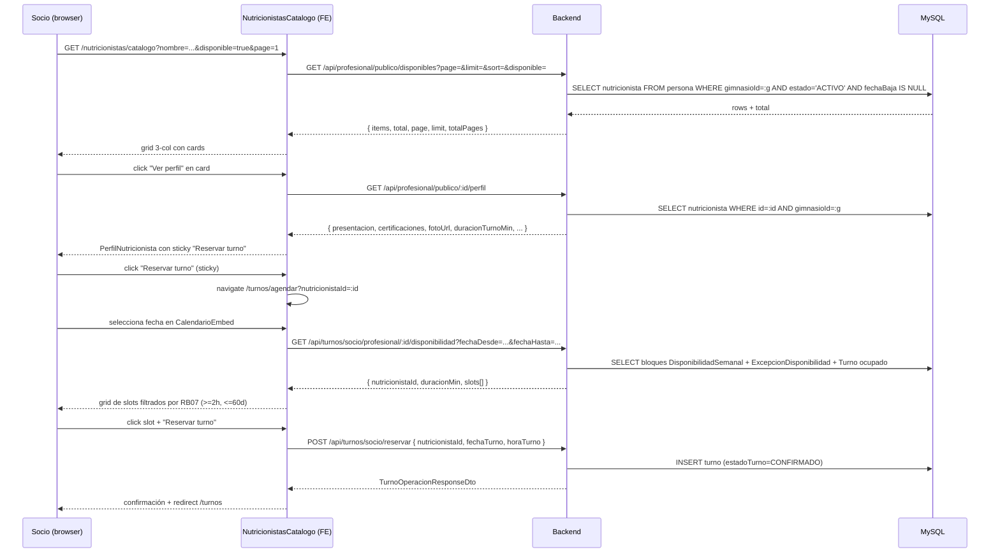
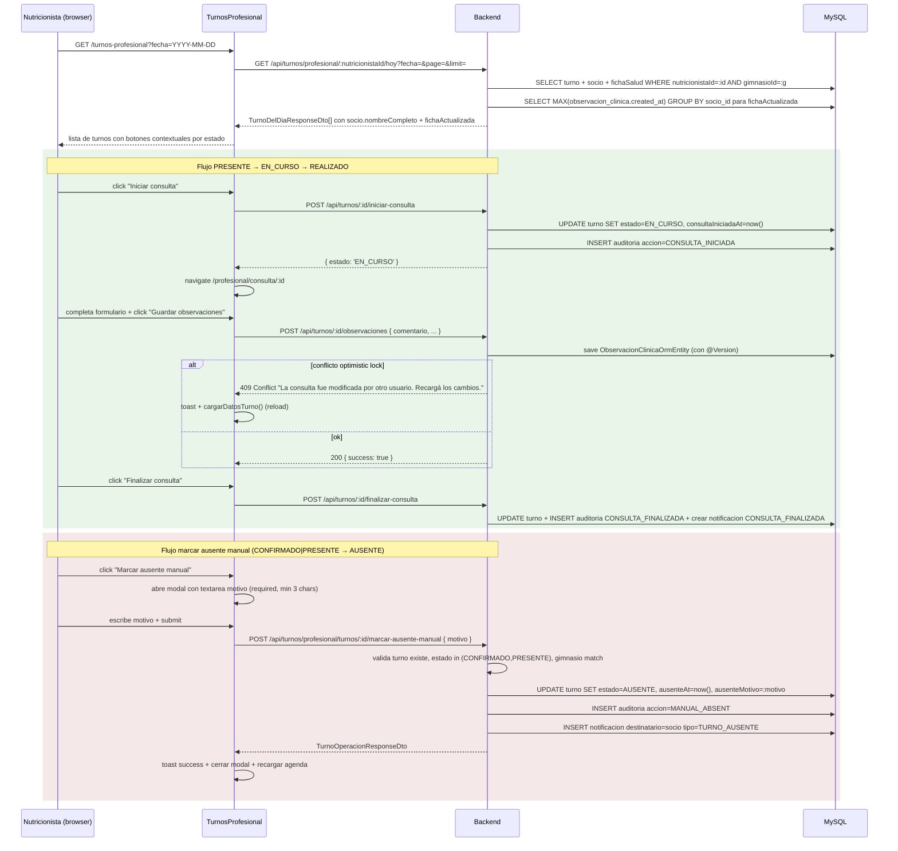

# Diseño técnico — `gaps-agenda-socio-nutri`

> Cambio SDD para cerrar el ciclo operativo real entre SOCIO y NUTRICIONISTA en Nutrifit Supervisor.
> Aplica las decisiones 1A (paths actuales), 2B (`presentacion` + `certificaciones`, sin campos `wizard_*`) y 3A (PRs encadenados).

---

## 0. Tabla de referencia rápida

| Símbolo | Significado |
|---|---|
| PR #1 | Workstream A (spec 17 crítica) + tests mínimos del propio PR |
| PR #2 | Workstream B (spec 15) + C (spec 10) + tests restantes |
| RB07 | Anticipación mínima de 2h y ventana de 60 días |
| RB13 | Nutricionista solo ve fichas de pacientes con turno previo/histórico |
| RB15 | `fichaActualizada = ficha.actualizadaAt > max(consulta.createdAt)` |
| RB17 | Nutricionista "operativo" ⇔ `estado='ACTIVO' AND fechaBaja IS NULL` |
| RB25 | Multi-tenant: socio solo ve profesionales de su mismo `gimnasioId` |
| RB45 | Marcar `ficha.revisadaPorNutricionistaAt = now()` al abrir la ficha desde un turno |

---

## 1. Resumen de la arquitectura del cambio

### 1.1 Cambios a nivel arquitectura

**Capa `domain/` (pura)**
- `NutricionistaEntity`: dos campos nuevos opcionales `presentacion: string | null`, `certificaciones: string | null`.
- `ExcepcionDisponibilidad` (nueva entity + value objects `FechaHoraRango`, `MotivoExcepcion`).
- `TurnoEntity`: ya tiene los timestamps requeridos (`ausenteAt`, `motivoCancelacion`). Se amplía semánticamente con `ausenteMotivo: string` (nullable) — un solo cambio: persistirlo en una nueva columna en `turno`.

**Capa `infrastructure/persistence/`**
- Nueva migración `<timestamp>-AddPresentacionCertificacionesNutricionista.ts` que adiciona `presentacion TEXT NULL, certificaciones TEXT NULL` a `nutricionista` (single-table inheritance — TypeORM la materializa como tabla `persona` con `tipo_persona='nutricionista'`).
- Nueva migración `<timestamp>-AddExcepcionDisponibilidad.ts` que crea tabla `excepcion_disponibilidad`.
- Nueva migración `<timestamp>-AddAusenteMotivoToTurno.ts` que adiciona `ausente_motivo VARCHAR(500) NULL` a `turno`.
- Migración `<timestamp>-AddVersionToObservacionClinica.ts` que adiciona `version INT NOT NULL DEFAULT 1` a `observacion_clinica`.
- `ObservacionClinicaOrmEntity`: agregar `@VersionColumn() version: number`.
- `Enum AccionAuditoria`: agregar `MANUAL_ABSENT = 'MANUAL_ABSENT'`.
- `Enum TipoNotificacion`: agregar `TURNO_AUSENTE = 'TURNO_AUSENTE'`.

**Capa `application/` (use-cases nuevos)**
- `MarcarAusenteManualUseCase` (PR #1) — escribe `ausenteAt` + `ausenteMotivo`, registra auditoría, dispara notificación, devuelve DTO.
- `AbrirFichaDesdeTurnoUseCase` (PR #1) — valida ownership, setea `revisadaPorNutricionistaAt`.
- `ListarNutricionistasCatalogoUseCase` (PR #2) — reescribe `ListProfesionalesPublicosUseCase` con paginación, filtros y RB25; usa un nuevo método de repositorio `findDisponibles(query)`.
- `GetPerfilProfesionalPublicoUseCase` (PR #2) — reescrito: quita `email/telefono/direccion`, agrega `presentacion/certificaciones/fotoUrl/duracionTurnoMin`, valida RB25.

**Capa `presentation/http/`**
- `TurnosController`: nuevo endpoint `POST /api/turnos/profesional/turnos/:id/marcar-ausente-manual` (PR #1).
- `ProfesionalController`: el DTO de respuesta de `GET /api/profesional/publico/:id/perfil` y `GET /api/profesional/publico/disponibles` se limpia y se enriquece (PR #2).

**DTOs modificados**
- `PerfilProfesionalPublicoResponseDto`: sacar `email/telefono/direccion/genero/calificacionPromedio/totalOpiniones/biografia`; agregar `presentacion`, `certificaciones`, `fotoUrl`, `duracionTurnoMin`, `formacionAcademica: string[]` (resumido).
- `ProfesionalPublicoResponseDto` (catálogo): agregar `fotoUrl`, `presentacion`, `duracionTurnoMin`, `slotsProximos7Dias: number` (para badge "X slots esta semana").
- `TurnoDelDiaResponseDto` y `DatosTurnoResponseDto`: agregar `fichaActualizada: boolean`.
- `DisponibilidadSocioResponseDto` (nuevo): `{ nutricionistaId, duracionMin, slots: { fechaHora: string, disponible: boolean }[] }`.

**Frontend**
- `pages/PerfilNutricionista.tsx`: rework visual (foto 200×200, sticky button, presentacion, certificaciones, formacion, calendario embebido, tarifa con regla 0→"A convenir").
- `pages/NutricionistasCatalogo.tsx` (NUEVO): grid 3-col desktop, filtros, paginación, 3 empty states.
- `pages/TurnosProfesional.tsx`: switch a `/hoy`, botones contextuales (CONFIRMADO→"Marcar ausente", PRESENTE→"Iniciar consulta"+"Marcar ausente", EN_CURSO→"Finalizar consulta"), modal con textarea de motivo, badge "Ficha actualizada".
- `pages/ConsultaProfesionalPage.tsx`: manejo de HTTP 409 en `guardarObservaciones` con toast "La consulta fue modificada por otro usuario. Recargá los cambios." y reload de datos.
- `components/catalogo/CalendarioEmbed.tsx` (NUEVO): subcomponente compartido entre `PerfilNutricionista` y `NutricionistasCatalogo` que envuelve `DatePicker` + grid de slots del día.

### 1.2 Lo que NO cambia

- Auth flow: `JwtAuthGuard` + `RolesGuard` + `ActionsGuard` (sin cambios).
- Selección de gimnasio: ya viene del JWT (`gimnasioId`) — no se re-pide en el flujo.
- Jerarquía de roles: `SOCIO` < `NUTRICIONISTA` < `RECEPCIONISTA` < `ADMIN` < `SUPERADMIN` (sin cambios).
- Tabla `turno`: se conserva el shape actual (`ausenteAt`, `motivoCancelacion`); se adiciona solo `ausenteMotivo` y (en el futuro) NO se hace migración de `ausenteAt` con dato.
- Endpoints legacy: `GET /api/profesional/publico/:id/foto` y todo el módulo de ficha-salud-versionado (RB50) no se tocan.
- Módulo de adjuntos clínicos: intacto.
- Módulo de planes: intacto.

### 1.3 Diagramas de flujo de datos

#### 1.3.1 SOCIO: discovery → detail → reserve



#### 1.3.2 NUTRICIONISTA: agenda del día → iniciar/finalizar → marcar ausente manual



---

## 2. Migración de base de datos (PR #2 — workstream B)

### 2.1 Archivo de migración: `presentacion` + `certificaciones`

> Archivo: `apps/backend/src/infrastructure/persistence/typeorm/migrations/1770900000000-AddPresentacionCertificacionesNutricionista.ts`
> (timestamp sugerido; el apply phase debe ajustar al "ahora" — convención: cualquier `Date.now()` en ms redondeado)

```ts
import { MigrationInterface, QueryRunner } from 'typeorm';

export class AddPresentacionCertificacionesNutricionista1770900000000
  implements MigrationInterface
{
  name = 'AddPresentacionCertificacionesNutricionista1770900000000';

  public async up(queryRunner: QueryRunner): Promise<void> {
    // IMPORTANTE: por single-table inheritance, "nutricionista" es una vista lógica;
    // las columnas viven en `persona` con tipo_persona='nutricionista'.
    await queryRunner.query(
      'ALTER TABLE `persona` ADD COLUMN `presentacion` TEXT NULL',
    );
    await queryRunner.query(
      'ALTER TABLE `persona` ADD COLUMN `certificaciones` TEXT NULL',
    );
  }

  public async down(queryRunner: QueryRunner): Promise<void> {
    await queryRunner.query('ALTER TABLE `persona` DROP COLUMN `certificaciones`');
    await queryRunner.query('ALTER TABLE `persona` DROP COLUMN `presentacion`');
  }
}
```

### 2.2 Cambios a `NutricionistaEntity` (domain)

> Archivo: `apps/backend/src/domain/entities/Persona/Nutricionista/nutricionista.entity.ts`

Agregar:
```ts
presentacion: string | null;
certificaciones: string | null;
```

En el constructor: agregarlos como último parámetro opcional. `presentacion`/`certificaciones` NO son obligatorios en la creación de un nutricionista — el admin edita el perfil desde el frontend admin y los llena en cualquier momento.

### 2.3 Cambios a `NutricionistaOrmEntity` (ORM)

> Archivo: `apps/backend/src/infrastructure/persistence/typeorm/entities/persona.entity.ts`

Agregar en `@ChildEntity() NutricionistaOrmEntity`:
```ts
@Column({ name: 'presentacion', type: 'text', nullable: true })
presentacion: string | null;

@Column({ name: 'certificaciones', type: 'text', nullable: true })
certificaciones: string | null;
```

### 2.4 Coordinación con seed

> Archivo: `apps/backend/src/seed-multi-tenant.ts` — **TODO para la fase apply, no modificar en diseño**.

El seed actual no setea `presentacion`/`certificaciones`. Recomendación para el apply:
- Para los nutricionistas activos de los 2 gimnasios seed, asignar textos de muestra en español (2-3 oraciones) y certificaciones creíbles (lista de 1-3 cursos).
- Actualizar `CREDENCIALES_SEED.md` agregando una sub-sección "Datos públicos de los nutricionistas seed" para que cualquier dev que abra el ambiente entienda que esos textos son mocks.

### 2.5 Decisión sobre índices

**Decisión: NO crear índices** sobre `presentacion` o `certificaciones` en PR #2.

- Justificación: la búsqueda full-text no está en scope (spec 10 no lo exige). El catálogo del socio NO filtra por contenido de `presentacion` — filtra por nombre y `disponible`.
- Trade-off conocido: si en el futuro se agrega búsqueda por palabras clave en `presentacion`, se necesitará un índice FULLTEXT en MySQL. El apply phase debe dejar un `// TODO(spec-futura)` en el mapper del catálogo.
- Tamaño esperado: <1000 nutricionistas en producción (un gimnasio tiene pocos). `LIKE '%texto%'` está OK.

---

## 3. Lock optimista en `ObservacionClinicaOrmEntity` (PR #1)

### 3.1 Cambios al entity

> Archivo: `apps/backend/src/infrastructure/persistence/typeorm/entities/observacion-clinica.entity.ts`

Agregar import y columna:
```ts
import { Column, Entity, OneToOne, PrimaryGeneratedColumn, VersionColumn } from 'typeorm';

@Entity('observacion_clinica')
export class ObservacionClinicaOrmEntity extends AuditableOrmEntity {
  // ... columnas existentes ...

  @VersionColumn({ name: 'version' })
  version: number;
}
```

### 3.2 Migración

> Archivo: `apps/backend/src/infrastructure/persistence/typeorm/migrations/1770800000000-AddVersionToObservacionClinica.ts`

```ts
import { MigrationInterface, QueryRunner } from 'typeorm';

export class AddVersionToObservacionClinica1770800000000
  implements MigrationInterface
{
  name = 'AddVersionToObservacionClinica1770800000000';

  public async up(queryRunner: QueryRunner): Promise<void> {
    await queryRunner.query(
      'ALTER TABLE `observacion_clinica` ADD COLUMN `version` INT NOT NULL DEFAULT 1',
    );
  }

  public async down(queryRunner: QueryRunner): Promise<void> {
    await queryRunner.query('ALTER TABLE `observacion_clinica` DROP COLUMN `version`');
  }
}
```

### 3.3 Traducción de error en use-cases

> Archivos: `apps/backend/src/application/turnos/use-cases/guardar-observaciones.use-case.ts` y `guardar-mediciones.use-case.ts` (si también toca observacion)

```ts
import { OptimisticLockVersionMismatchError } from 'typeorm';
import { ConflictError } from 'src/domain/exceptions/custom-exceptions';

try {
  await this.observacionRepository.save(observacion);
} catch (error) {
  if (error instanceof OptimisticLockVersionMismatchError) {
    throw new ConflictError(
      'La consulta fue modificada por otro usuario. Recargá los cambios.',
    );
  }
  throw error;
}
```

`ConflictError` ya existe en `src/domain/exceptions/custom-exceptions` y el `AppErrorFilter` global lo traduce a HTTP 409. **No hace falta nuevo filtro.**

### 3.4 Plan de tests

> Archivo nuevo: `apps/backend/src/application/turnos/use-cases/guardar-observaciones.use-case.spec.ts`

Test: simular dos `Promise.all` con la misma observación leída; el segundo `save` debe lanzar `ConflictError`. Pattern:
1. `mockRepository.findOne.mockResolvedValue(observacionMock)` — el observacion mock tiene `version: 1`.
2. Primer `save` resuelve OK con la observación devuelta con `version: 2` (lo que el repository hace en su implementación real: incrementa).
3. Segundo `save` resuelve con error `OptimisticLockVersionMismatchError` (simulado).
4. Assert: el use-case lanza `ConflictError` con el mensaje exacto.

---

## 4. Algoritmo de slots (60 días, 2h anticipación, `ExcepcionDisponibilidad`) (PR #2)

### 4.1 Modelado: nueva entidad `ExcepcionDisponibilidad`

> Archivo: `apps/backend/src/infrastructure/persistence/typeorm/entities/excepcion-disponibilidad.entity.ts`

```ts
import { Column, Entity, JoinColumn, ManyToOne, PrimaryGeneratedColumn } from 'typeorm';
import { NutricionistaOrmEntity } from './persona.entity';
import { AuditableOrmEntity } from '../common/auditable.orm-entity';

@Entity('excepcion_disponibilidad')
export class ExcepcionDisponibilidadOrmEntity extends AuditableOrmEntity {
  @PrimaryGeneratedColumn({ name: 'id_excepcion' })
  idExcepcion: number;

  @Column({ name: 'fecha_inicio', type: 'datetime' })
  fechaInicio: Date;

  @Column({ name: 'fecha_fin', type: 'datetime' })
  fechaFin: Date;

  @Column({ name: 'motivo', type: 'varchar', length: 255, nullable: true })
  motivo: string | null;

  @ManyToOne(() => NutricionistaOrmEntity, { nullable: false })
  @JoinColumn({ name: 'id_nutricionista' })
  nutricionista: NutricionistaOrmEntity;
}
```

> Archivo: `apps/backend/src/domain/entities/Agenda/excepcion-disponibilidad.entity.ts` (domain puro)

```ts
import { NutricionistaEntity } from '../Persona/Nutricionista/nutricionista.entity';

export class ExcepcionDisponibilidadEntity {
  idExcepcion: number | null;
  nutricionista: NutricionistaEntity;
  fechaInicio: Date;
  fechaFin: Date;
  motivo: string | null;
}
```

### 4.2 Decisión arquitectónica

**Recomendación: nueva entity, no reutilizar `AgendaOrmEntity`**.

Razones:
1. `AgendaOrmEntity` modela bloques semanales recurrentes (lun-mie 09:00-12:00) — semántica distinta de una fecha-range puntual.
2. Mezclar ambos conceptos en la misma tabla llevaría a NULLs en `dia`/`horaInicio`/`horaFin` cuando es una excepción, violando la 3FN.
3. El cálculo de slots es significativamente más simple cuando se filtran excepciones en una sola query (`WHERE fecha_inicio <= :slot AND fecha_fin > :slot`) y se restan del resultado de la query de bloques semanales.

### 4.3 Migración

> Archivo: `apps/backend/src/infrastructure/persistence/typeorm/migrations/1770910000000-AddExcepcionDisponibilidad.ts`

```ts
import { MigrationInterface, QueryRunner } from 'typeorm';

export class AddExcepcionDisponibilidad1770910000000
  implements MigrationInterface
{
  name = 'AddExcepcionDisponibilidad1770910000000';

  public async up(queryRunner: QueryRunner): Promise<void> {
    await queryRunner.query(`
      CREATE TABLE \`excepcion_disponibilidad\` (
        \`id_excepcion\` INT NOT NULL AUTO_INCREMENT,
        \`fecha_inicio\` DATETIME NOT NULL,
        \`fecha_fin\` DATETIME NOT NULL,
        \`motivo\` VARCHAR(255) NULL,
        \`id_nutricionista\` INT NOT NULL,
        \`created_at\` DATETIME NOT NULL DEFAULT CURRENT_TIMESTAMP,
        \`updated_at\` DATETIME NOT NULL DEFAULT CURRENT_TIMESTAMP ON UPDATE CURRENT_TIMESTAMP,
        PRIMARY KEY (\`id_excepcion\`),
        KEY \`idx_excepcion_nutricionista\` (\`id_nutricionista\`),
        KEY \`idx_excepcion_fechas\` (\`fecha_inicio\`, \`fecha_fin\`)
      )
    `);
  }

  public async down(queryRunner: QueryRunner): Promise<void> {
    await queryRunner.query('DROP TABLE `excepcion_disponibilidad`');
  }
}
```

### 4.4 Pseudocódigo del algoritmo de slots (en español)

> Ubicación: nuevo método estático en `apps/backend/src/application/turnos/services/slot-computation.service.ts` o método del `GetAgendaDiariaUseCase` extendido.

```pseudo
funcion calcularSlotsDisponibles(
  nutricionistaId: int,
  fechaDesde: Date?,
  fechaHasta: Date?
): DisponibilidadSocioResponseDto

  // 1. Defaults y validación de ventana
  horaActual = now() en TZ America/Argentina/Buenos_Aires
  limiteInferior = horaActual + 2h
  limiteSuperior = horaActual + 60 días

  fechaDesdeEfectiva = fechaDesde ?? limiteInferior
  fechaHastaEfectiva = fechaHasta ?? limiteSuperior

  if fechaDesdeEfectiva < limiteInferior:
    throw BadRequestError("La fecha desde no puede ser anterior a 2h desde ahora.")
  if fechaHastaEfectiva > limiteSuperior:
    throw BadRequestError("La fecha hasta no puede superar los 60 días desde ahora.")
  if fechaDesdeEfectiva >= fechaHastaEfectiva:
    throw BadRequestError("fechaDesde debe ser anterior a fechaHasta.")

  // 2. Fetch bloques semanales del nutricionista
  bloquesSemanales = DisponibilidadSemanalRepository.find({
    nutricionistaId: nutricionistaId,
    gimnasioId: tenantContext.gimnasioId
  })
  if bloquesSemanales.vacio:
    return { nutricionistaId, duracionMin: 0, slots: [] }

  // Tomar el primer bloque para inferir duracionMin (asumimos bloques consistentes)
  duracionMin = bloquesSemanales[0].duracionTurno

  // 3. Fetch excepciones en la ventana
  excepciones = ExcepcionDisponibilidadRepository.find({
    nutricionistaId: nutricionistaId,
    fechaInicio: <= fechaHastaEfectiva,
    fechaFin: > fechaDesdeEfectiva
  })

  // 4. Fetch turnos ocupados en la ventana
  turnosOcupados = TurnoRepository.find({
    nutricionistaId: nutricionistaId,
    gimnasioId: tenantContext.gimnasioId,
    fechaTurno: BETWEEN fechaDesdeEfectiva AND fechaHastaEfectiva,
    estadoTurno: IN (CONFIRMADO, PRESENTE, EN_CURSO)
  })
  mapaOcupados = new Map<fechaHora, TurnoOrmEntity>()
  para cada turno en turnosOcupados:
    clave = formatYYYYMMDDHHmm(turno.fechaTurno, turno.horaTurno)
    mapaOcupados.set(clave, turno)

  // 5. Iterar día por día dentro de la ventana
  slots = []
  cursorFecha = startOfDay(fechaDesdeEfectiva)
  finVentana = fechaHastaEfectiva

  mientras cursorFecha <= finVentana:
    diaSemana = getDiaSemanaArgentina(cursorFecha)  // LUNES, MARTES, etc.
    bloquesDelDia = bloquesSemanales.filtrar(b => b.dia == diaSemana)

    para cada bloque en bloquesDelDia:
      currentMinutes = timeToMinutes(bloque.horaInicio)  // ej 540 = 09:00
      endMinutes = timeToMinutes(bloque.horaFin)        // ej 1020 = 17:00

      mientras currentMinutes + bloque.duracionTurno <= endMinutes:
        slotInicio = combineDateAndTime(cursorFecha, currentMinutes)
        slotFin = combineDateAndTime(cursorFecha, currentMinutes + bloque.duracionTurno)

        // 6. Excluir si cae en una excepción
        caeEnExcepcion = excepciones.cualquiera(e =>
          slotInicio < e.fechaFin && slotFin > e.fechaInicio
        )

        // 7. Excluir si está ocupado
        claveSlot = formatYYYYMMDDHHmm(cursorFecha, minutesToTime(currentMinutes))
        estaOcupado = mapaOcupados.has(claveSlot)

        // 8. Excluir si está en el pasado o <2h desde ahora
        enPasadoO Muy Proximo = slotInicio < limiteInferior

        // 9. (Ya validado en paso 1) Excluir si > 60d
        fueraDeVentana = slotInicio > limiteSuperior

        disponible = !caeEnExcepcion && !estaOcupado && !enPasadoOMuyProximo && !fueraDeVentana

        slots.push({
          fechaHora: formatISOArgentina(slotInicio),  // YYYY-MM-DDTHH:mm:ss-03:00
          disponible
        })

        currentMinutes += bloque.duracionTurno

    cursorFecha = addDays(cursorFecha, 1)

  return {
    nutricionistaId,
    duracionMin,
    slots
  }
```

### 4.5 Performance

Complejidad: **O(D × S)** donde `D` = días en la ventana (hasta 60) y `S` = slots por día (típicamente 16-32 para un bloque de 8h con duracion 30min).

- Por cada slot el algoritmo hace lookups en `excepciones` y `mapaOcupados` (ambos pre-cargados en memoria). Costo por slot: O(E) donde E = excepciones vigentes (~5-20). Total: O(60 × 32 × 20) = ~38.000 ops. Sub-100ms en Node.
- Las 3 queries a la DB se ejecutan una vez por request: bloques semanales, excepciones, turnos ocupados.
- **Memoización opcional**: cachear `bloquesSemanales` por `nutricionistaId` durante la request (no en cache distribuida — la invalidación sería compleja). El apply phase puede usar un `Map<number, DisponibilidadSemanal[]>` privado del use-case.
- **No cachear `slots` finales** — invalidación ante cada cambio de turno / excepción es compleja. La latencia de la consulta completa es aceptable.
- **Trade-off documentado**: si en el futuro N (socios simultáneos) crece y el algoritmo se vuelve un cuello de botella, se puede pre-computar slots en background con TTL de 5min. Fuera de scope PR #2.

### 4.6 Decisión abierta para el apply

**¿Cómo exponer el endpoint al socio?**

- Opción A: nuevo método `GET /api/turnos/socio/profesional/:nutricionistaId/disponibilidad?fechaDesde=&fechaHasta=` (recomendado — backward-compatible con el actual que solo recibe `fecha`).
- Opción B: extender el endpoint existente con un nuevo query param opcional.

Recomendación: **Opción A con backward-compat**: el endpoint actual `/turnos/socio/profesional/:nutricionistaId/disponibilidad?fecha=YYYY-MM-DD` se conserva (sigue funcionando, devuelve slots para ese día). El nuevo método acepta `fechaDesde`/`fechaHasta` (RB07) y omite `fecha`.

---

## 5. `marcar-ausente-manual` use-case (PR #1)

### 5.1 DTO de entrada

> Archivo nuevo: `apps/backend/src/application/turnos/dtos/marcar-ausente-manual.dto.ts`

```ts
import { IsString, MinLength, MaxLength } from 'class-validator';

export class MarcarAusenteManualDto {
  @IsString()
  @MinLength(3, { message: 'El motivo debe tener al menos 3 caracteres.' })
  @MaxLength(500, { message: 'El motivo no puede superar los 500 caracteres.' })
  motivo: string;
}
```

> Archivo: `apps/backend/src/application/turnos/dtos/index.ts` — agregar export.

### 5.2 Migración para `ausente_motivo`

> Archivo: `apps/backend/src/infrastructure/persistence/typeorm/migrations/1770820000000-AddAusenteMotivoToTurno.ts`

```ts
import { MigrationInterface, QueryRunner } from 'typeorm';

export class AddAusenteMotivoToTurno1770820000000
  implements MigrationInterface
{
  name = 'AddAusenteMotivoToTurno1770820000000';

  public async up(queryRunner: QueryRunner): Promise<void> {
    await queryRunner.query(
      'ALTER TABLE `turno` ADD COLUMN `ausente_motivo` VARCHAR(500) NULL',
    );
  }

  public async down(queryRunner: QueryRunner): Promise<void> {
    await queryRunner.query('ALTER TABLE `turno` DROP COLUMN `ausente_motivo`');
  }
}
```

### 5.3 Entity change

> Archivo: `apps/backend/src/infrastructure/persistence/typeorm/entities/turno.entity.ts`

Agregar:
```ts
@Column({ name: 'ausente_motivo', type: 'varchar', length: 500, nullable: true })
ausenteMotivo: string | null;
```

### 5.4 Use-case (pseudocódigo)

> Archivo nuevo: `apps/backend/src/application/turnos/use-cases/marcar-ausente-manual.use-case.ts`

```pseudo
@Injectable()
class MarcarAusenteManualUseCase:
  constructor(
    turnoRepository,
    auditoriaService,
    notificacionesService,
    tenantContext
  )

  async execute(turnoId, payload, currentUser):
    // 1. Fetch turno
    turno = turnoRepository.findOne({
      where: { idTurno: turnoId, socio: { gimnasioId: tenantContext.gimnasioId } },
      relations: { socio: true, nutricionista: true }
    })
    if not turno:
      throw NotFoundError("Turno", turnoId)

    // 2. RB13 + RB25: validar ownership
    esPropietario = turno.nutricionista.idPersona == currentUser.personaId
    esRolPermitido = currentUser.rol in (RECEPCIONISTA, ADMIN) && turno.nutricionista.gimnasioId == tenantContext.gimnasioId
    if not (esPropietario or esRolPermitido):
      throw ForbiddenError("No tiene permisos para marcar ausente este turno.")

    // 3. Validar estado actual
    if turno.estadoTurno not in (CONFIRMADO, PRESENTE):
      throw ConflictError(
        `Solo se puede marcar ausente un turno en estado CONFIRMADO o PRESENTE. Estado actual: ${turno.estadoTurno}`
      )

    // 4. Actualizar turno
    estadoAnterior = turno.estadoTurno
    turno.estadoTurno = AUSENTE
    turno.ausenteAt = new Date()
    turno.ausenteMotivo = payload.motivo
    await turnoRepository.save(turno)

    // 5. Auditoría
    await auditoriaService.registrar({
      accion: MANUAL_ABSENT,
      entidad: 'Turno',
      entidadId: turnoId,
      metadata: {
        estadoAnterior,
        estadoNuevo: AUSENTE,
        motivo: payload.motivo,
        nutricionistaId: turno.nutricionista.idPersona,
        socioId: turno.socio.idPersona
      }
    })

    // 6. Notificación al socio
    if turno.socio?.idPersona:
      await notificacionesService.crear({
        destinatarioId: turno.socio.idPersona,
        tipo: TURNO_AUSENTE,
        titulo: 'Tu turno fue marcado como ausente',
        mensaje: `El profesional marcó tu turno del ${turno.fechaTurno} a las ${turno.horaTurno} como ausente. Motivo: ${payload.motivo}`,
        metadata: { turnoId, motivo: payload.motivo }
      })

    return mapToTurnoOperacionResponseDto(turno)
```

### 5.5 Controller

> Archivo: `apps/backend/src/presentation/http/controllers/turnos.controller.ts`

Agregar:
```ts
@Post('profesional/turnos/:id/marcar-ausente-manual')
@Rol(RolEnum.NUTRICIONISTA, RolEnum.RECEPCIONISTA, RolEnum.ADMIN)
async marcarAusenteManual(
  @Param('id', ParseIntPipe) turnoId: number,
  @Body() payload: MarcarAusenteManualDto,
): Promise<TurnoOperacionResponseDto> {
  return this.marcarAusenteManualUseCase.execute(turnoId, payload, this.tenantContext);
}
```

**Decisión de path**: el spec proponía `POST /api/turnos/profesional/turnos/:id/marcar-ausente-manual`. Mantengo el path tal cual (sub-ruta `profesional/turnos/:id` evita colisión con `POST /api/turnos/:id/...` que ya existe para `cancelar`, `confirmar`, `iniciar-consulta`).

### 5.6 Enums

> Archivo: `apps/backend/src/infrastructure/persistence/typeorm/entities/auditoria.entity.ts`

```ts
export enum AccionAuditoria {
  // ... existentes ...
  MANUAL_ABSENT = 'MANUAL_ABSENT',  // NUEVO
}
```

> Archivo: `apps/backend/src/domain/entities/Notificacion/tipo-notificacion.enum.ts`

```ts
export enum TipoNotificacion {
  // ... existentes ...
  TURNO_AUSENTE = 'TURNO_AUSENTE',  // NUEVO
}
```

### 5.7 Tests

> Archivo nuevo: `apps/backend/src/application/turnos/use-cases/marcar-ausente-manual.use-case.spec.ts`

Casos:
1. **Happy path**: turno PRESENTE + motivo válido → `save` llamado con `estadoTurno='AUSENTE'`, `ausenteAt != null`, `ausenteMotivo=motivo`; auditoría registrada con `MANUAL_ABSENT`; notificación enviada.
2. **Motivo vacío** (no llega al use-case, lo bloquea el DTO con `class-validator` — test aparte del DTO con un fake DTO).
3. **Estado wrong**: turno REALIZADO → `ConflictError` con mensaje sobre estado inválido.
4. **Foreign gym**: turno de otro `gimnasioId` → `ForbiddenError` (no encuentra el turno y devuelve `NotFoundError`, comportamiento equivalente — RB25).
5. **Recepcionista cross-gym**: turno de otro gimnasio → `NotFoundError` (no encuentra por filtro de tenant).
6. **ADMIN bypass**: turno propio del gimnasio (no propio del admin) → permitido.

---

## 6. `abrir-ficha-desde-turno` use-case (PR #1)

### 6.1 DTO de entrada

> Archivo nuevo: `apps/backend/src/application/turnos/dtos/abrir-ficha-desde-turno.dto.ts`

```ts
export class AbrirFichaDesdeTurnoDto {
  turnoId: number;
  nutricionistaId: number;
  socioId: number;
}
```

### 6.2 Use-case (pseudocódigo)

> Archivo nuevo: `apps/backend/src/application/turnos/use-cases/abrir-ficha-desde-turno.use-case.ts`

```pseudo
@Injectable()
class AbrirFichaDesdeTurnoUseCase:
  constructor(
    turnoRepository,
    fichaSaludRepository,
    nutricionistaRepository,
    tenantContext
  )

  async execute(turnoId, currentUser):
    // 1. Validar turno y ownership
    turno = turnoRepository.findOne({
      where: { idTurno: turnoId, socio: { gimnasioId: tenantContext.gimnasioId } },
      relations: { socio: true, nutricionista: true }
    })
    if not turno:
      throw NotFoundError("Turno", turnoId)

    // RB13: nutricionista debe tener historial con el socio
    if currentUser.rol == NUTRICIONISTA:
      tieneVinculo = turnoRepository.count({
        where: {
          nutricionista: { idPersona: currentUser.personaId, gimnasioId: tenantContext.gimnasioId },
          socio: { idPersona: turno.socio.idPersona }
        }
      })
      if not tieneVinculo:
        throw ForbiddenError("No tiene turnos con este socio.")

    // RB25
    if turno.nutricionista.gimnasioId != tenantContext.gimnasioId:
      throw NotFoundError("Turno", turnoId)

    // 2. Setear revisadaPorNutricionistaAt
    socio = turno.socio
    if not socio.fichaSalud:
      return { ficha: null, revisada: false }

    fichaSaludRepository.update(
      { idFichaSalud: socio.fichaSalud.idFichaSalud },
      { revisadaPorNutricionistaAt: new Date() }
    )

    return {
      fichaId: socio.fichaSalud.idFichaSalud,
      revisada: true,
      revisadaAt: new Date()
    }
```

### 6.3 Decisión arquitectónica

**¿Refactorizar `get-ficha-salud-paciente.use-case.ts` líneas 78-84 para usar este nuevo use-case?**

**Recomendación: SÍ**, refactor mínimo. Razón: hoy `get-ficha-salud-paciente.use-case.ts` setea `revisadaPorNutricionistaAt` inline. Si lo extraemos a `AbrirFichaDesdeTurnoUseCase`, tenemos un solo lugar para RB45. El cambio es ~5 líneas:

```diff
- if (socio.fichaSalud.idFichaSalud != null) {
-   await this.fichaSaludRepository.update(
-     { idFichaSalud: socio.fichaSalud.idFichaSalud },
-     { revisadaPorNutricionistaAt: new Date() },
-   );
- }
+ await this.abrirFichaDesdeTurnoUseCase.execute(turnoId, currentUser);
```

**Trade-off documentado**: el `abrir-ficha-desde-turno` recibe un `turnoId`, pero `get-ficha-salud-paciente` opera con `(nutricionistaId, socioId)`. Para reusar, el `get-ficha-salud-paciente` debe encontrar el turno previo entre ambos y pasar su `idTurno`. Esto agrega 1 query. Si el costo es inaceptable, alternativa: dejar duplicado. **Recomendación final: reusar**, vale la query extra para tener un solo punto de control de RB45.

### 6.4 Tests

> Archivo nuevo: `apps/backend/src/application/turnos/use-cases/abrir-ficha-desde-turno.use-case.spec.ts`

Casos:
1. **Happy path** nutricionista con turno previo + ficha existente → `revisadaPorNutricionistaAt` se setea.
2. **Sin ficha**: retorna `{ ficha: null, revisada: false }`, no falla.
3. **Sin turno previo** (RB13): lanza `ForbiddenError`.
4. **Otro gimnasio**: `NotFoundError`.

---

## 7. `fichaActualizada` en DTOs (PR #1)

### 7.1 Cambios a `TurnoDelDiaResponseDto`

> Archivo: `apps/backend/src/application/turnos/dtos/turno-del-dia-response.dto.ts`

```ts
export class TurnoDelDiaResponseDto {
  idTurno: number;
  fechaTurno: string;
  horaTurno: string;
  estadoTurno: EstadoTurno;
  tipoConsulta: string;
  socio: SocioTurnoDelDiaResponseDto;
  fichaActualizada: boolean;  // NUEVO
  consultaId: number | null;    // NUEVO (id de la observación clínica, para enlazar al form de consulta)
}
```

### 7.2 Cambios a `DatosTurnoResponseDto`

> Archivo: `apps/backend/src/application/turnos/dtos/datos-turno-response.dto.ts` (existe, verificar) — agregar mismo campo.

### 7.3 Cálculo en use-cases

> Archivos: `get-turnos-del-dia.use-case.ts`, `get-turno-by-id.use-case.ts`

**Decisión técnica**: usar subquery en el SELECT en vez de N+1 ni un `IN` con todas las observaciones. La subquery es óptima para 1 fila de turno.

```ts
// En get-turnos-del-dia.use-case.ts:
const queryBuilder = turnoRepository
  .createQueryBuilder('turno')
  // ... joins existentes ...
  .leftJoin(
    'observacion_clinica',
    'oc',
    'oc.turnoId = turno.idTurno',
  )
  .addSelect(
    `(CASE
       WHEN fs.actualizadaAt IS NOT NULL AND fs.actualizadaAt > MAX(oc.createdAt) THEN true
       ELSE false
     END)`,
    'fichaActualizadaFlag',
  )
  .groupBy('turno.idTurno, fs.idFichaSalud, fs.actualizadaAt')
```

**Trade-off**: `addSelect` con subquery agregada es elegante pero MySQL requiere `ONLY_FULL_GROUP_BY` desactivado o que `actualizadaAt` esté en el `GROUP BY`. Alternativa más simple: **dos queries**:

```ts
// Query 1: lista de turnos (existente)
const turnos = await queryBuilder.getMany();

// Query 2: max created_at de observación por (nutricionista, socio) en un solo query
const socioNutriPairs = turnos.map(t => ({
  socioId: t.socio.idPersona,
  nutricionistaId: t.nutricionista.idPersona
}));

const maxConsultas = socioNutriPairs.length > 0
  ? await observacionRepository
      .createQueryBuilder('oc')
      .innerJoin('oc.turno', 't')
      .select('t.socioId', 'socioId')
      .addSelect('MAX(oc.createdAt)', 'maxCreatedAt')
      .where('t.nutricionistaId = :nutriId', { nutriId: nutricionistaId })
      .andWhere('t.socioId IN (:...socioIds)', { socioIds: socioNutriPairs.map(p => p.socioId) })
      .groupBy('t.socioId')
      .getRawMany()
  : [];

const maxConsultaMap = new Map(maxConsultas.map(m => [m.socioId, m.maxCreatedAt]));

// En el .map final:
fichaActualizada: fichaSaludActualizadaAt != null
  ? (maxConsultaMap.get(turno.socio.idPersona)
      ? fichaSaludActualizadaAt > maxConsultaMap.get(turno.socio.idPersona)
      : true)
  : false
```

**Recomendación**: la alternativa de 2 queries es más legible y compatible con `ONLY_FULL_GROUP_BY` de MySQL 8 (el proyecto usa MySQL con esa flag habilitada según setup estándar). **Aplicar la alternativa de 2 queries**.

### 7.4 Frontend

> Archivo: `apps/frontend/src/pages/TurnosProfesional.tsx`

- Mostrar badge `"Ficha actualizada"` (verde, ícono `FileCheck` de lucide-react) al lado del nombre del socio si `fichaActualizada === true`.
- Tooltip: "El socio actualizó su ficha de salud después de la última consulta."

---

## 8. RB25 en `get-perfil-profesional-publico` (PR #2)

### 8.1 Decisión: cómo obtener `gimnasioId` del socio actual

> Archivo: `apps/backend/src/application/profesionales/use-cases/get-perfil-profesional-publico.use-case.ts`

**Patrón recomendado**: inyectar `TenantContextService` y comparar `nutricionista.gimnasioId === tenantContext.gimnasioId`.

```ts
@Injectable()
export class GetPerfilProfesionalPublicoUseCase {
  constructor(
    @Inject(NUTRICIONISTA_REPOSITORY) private readonly nutricionistaRepository: NutricionistaRepository,
    @Inject(APP_LOGGER_SERVICE) private readonly logger: IAppLoggerService,
    private readonly tenantContext: TenantContextService,
  ) {}

  async execute(id: number): Promise<PerfilProfesionalPublicoResponseDto> {
    const nutricionista = await this.nutricionistaRepository.findById(id);

    if (!nutricionista || nutricionista.fechaBaja) {
      throw new NotFoundError('Profesional', String(id));
    }

    // RB25: nutricionista debe pertenecer al mismo gimnasio que el socio
    if (nutricionista.gimnasioId !== this.tenantContext.gimnasioId) {
      throw new NotFoundError('Profesional', String(id));  // 404, no leak
    }

    // RB17 (proxy de "operativo")
    // El proxy es estado='ACTIVO' AND fechaBaja IS NULL — ya validado arriba

    // ... mapping ...
  }
}
```

**Decisión: `NotFoundError` en vez de `ForbiddenError`** para no leakear la existencia del nutricionista en otro gimnasio. Coherente con la convención del proyecto observada en `get-perfil-profesional-publico.use-case.ts` línea 30 (devuelve `NotFoundError` si `fechaBaja`).

### 8.2 Tests

> Archivo: `apps/backend/src/application/profesionales/use-cases/get-perfil-profesional-publico.use-case.spec.ts` (NUEVO)

Casos:
1. **Happy path** socio y nutricionista mismo gym + activo → 200 con DTO.
2. **Socio de otro gym**: lanza `NotFoundError` (no `ForbiddenError`).
3. **Nutricionista inactivo** (`fechaBaja != null`): `NotFoundError`.

---

## 9. DTO público cleanup (PR #2)

### 9.1 Cambios a `PerfilProfesionalPublicoResponseDto`

> Archivo: `apps/backend/src/application/profesionales/dtos/profesional-publico-response.dto.ts`

```ts
import { DiaSemana } from 'src/domain/entities/Agenda/dia-semana';

export class HorarioProfesionalPublicoDto {
  dia: DiaSemana;
  horaInicio: string;
  horaFin: string;
  duracionTurno: number;
}

export class ProfesionalPublicoResponseDto {
  idPersona: number;
  nombre: string;
  apellido: string;
  especialidad: string;
  ciudad: string;
  provincia: string;
  añosExperiencia: number;
  tarifaSesion: number;
  // NUEVOS para el catálogo (spec 10):
  fotoUrl: string | null;
  presentacion: string | null;       // resumen
  duracionTurnoMin: number;
  slotsProximos7Dias: number;        // para badge "X slots esta semana"
}

export class PerfilProfesionalPublicoResponseDto extends ProfesionalPublicoResponseDto {
  matricula: string;
  // QUITADOS: email, telefono, direccion, genero, biografia, calificacionPromedio, totalOpiniones
  // NUEVOS:
  certificaciones: string | null;
  fotoUrl: string | null;
  duracionTurnoMin: number;
  formacionAcademica: { titulo: string; institucion: string; anio: number }[];
  horarios: HorarioProfesionalPublicoDto[];
}
```

### 9.2 Resolución de `fotoUrl`

**Decisión arquitectónica**: el DTO expone `fotoUrl: string | null`. El backend retorna el URL formado por `fotoPerfilKey` (o `null` si no hay foto). El frontend resuelve el URL completo concatenando `BASE_URL` (env var) con el path.

```ts
// En el mapper del use-case:
const fotoUrl = nutricionista.fotoPerfilKey
  ? `/api/profesional/${nutricionista.idPersona}/foto?v=${encodeURIComponent(nutricionista.fotoPerfilKey)}`
  : null;
```

> Reutiliza el patrón de `ProfesionalController.mapToResponseDto` línea 251-253.

**Decisión abierta para `apply`**: ¿el `fotoPerfilKey` se firma con un CDN (S3 presigned) o se sirve por nuestro propio endpoint `GET /api/profesional/:id/foto`? **Recomendación: reusar el endpoint actual** (`GET /api/profesional/:id/foto` ya existe y está `@Public()`). Esto evita migrar a S3 presigned URLs y mantiene el patrón actual. El frontend simplemente concatena `BASE_URL + fotoUrl`.

**TODO en el DTO**: dejar comentario `// TODO(spec-futura): si en el futuro se migra a S3 presigned, este campo se transforma a URL absoluto y el frontend deja de concatenar`.

### 9.3 Tests

> Archivo: `apps/backend/src/application/profesionales/use-cases/list-profesionales-publicos.use-case.spec.ts` (NUEVO)

Casos:
1. Lista vacía (sin nutricionistas activos en el gym) → `items: []`.
2. 5 nutricionistas activos → 5 items, sin `email/telefono/direccion` en el JSON.
3. 1 nutricionista con `fechaBaja` → no aparece.
4. Filtro `?disponible=true`: nutricionista sin slots próximos 7 días → no aparece.

---

## 10. Frontend: `PerfilNutricionista.tsx` rework (PR #2)

### 10.1 Cambios concretos

- **Header**: foto circular 200×200 a la izquierda, sticky a `top-4` en desktop.
- **Sticky button**: `<Button className="sticky top-4 ...">Reservar turno</Button>` que navega a `/turnos/agendar?nutricionistaId=:id`.
- **Sección "Sobre el profesional"**: renderiza `perfil.presentacion` (multilínea, con `whitespace-pre-line`).
- **Sección "Certificaciones"**: renderiza `perfil.certificaciones` (igual tratamiento multilínea).
- **Sección "Formación académica"**: nueva, mapea `perfil.formacionAcademica` a lista de cards con `titulo + institucion + anio`.
- **Tarifa**: badge que evalúa `perfil.tarifaSesion > 0` → `"$" + Number(tarifaSesion).toFixed(2)`; si `<= 0` → texto "A convenir" en gris.
- **Calendario embebido**: nuevo subcomponente `CalendarioEmbed` (ver §10.2) que renderiza `DatePicker` + grid de slots del día seleccionado. Llama al endpoint de §4.
- **Quitar**: secciones de "Email", "Teléfono", "Dirección" (data leak — ya no vienen en el DTO).
- **Avatar fallback**: si `fotoUrl` es null, mostrar iniciales en círculo gris.

### 10.2 Componente `CalendarioEmbed` (nuevo, compartido)

> Archivo nuevo: `apps/frontend/src/components/catalogo/CalendarioEmbed.tsx`

```tsx
interface CalendarioEmbedProps {
  nutricionistaId: number;
  duracionMin: number;
  onSeleccionarSlot?: (slot: SlotDisponible) => void;
}

interface SlotDisponible {
  fechaHora: string;  // ISO local
  disponible: boolean;
}

// Lógica:
// - useState<Date> fechaSeleccionada (default: ahora + 2h redondeado al próximo bloque)
// - useEffect: fetch slots del día seleccionado
// - Render: <DatePicker> + grid 2-col de botones por slot
// - Cada slot: <Button onClick={() => onSeleccionarSlot?.(slot)} disabled={!slot.disponible}>
//   - Si slot.disponible: hora
//   - Si !slot.disponible: hora tachada + "Ocupado"
// - Si fechaSeleccionada < (now + 2h): mostrar warning "Muy pronto para reservar"
```

> Archivos consumidores:
> - `apps/frontend/src/pages/PerfilNutricionista.tsx` (reemplaza el "Horario de atención" actual)
> - `apps/frontend/src/pages/NutricionistasCatalogo.tsx` (modal de previsualización)

### 10.3 Lógica de tarifa en el frontend

```ts
const formatearTarifa = (tarifa: number): { texto: string; esGratis: boolean } => {
  if (tarifa <= 0) {
    return { texto: 'A convenir', esGratis: true };
  }
  return {
    texto: `$${tarifa.toLocaleString('es-AR', { minimumFractionDigits: 2, maximumFractionDigits: 2 })}`,
    esGratis: false,
  };
};
```

---

## 11. Frontend: nuevo `NutricionistasCatalogo.tsx` (PR #2)

### 11.1 Decisión de naming/route

> El `apps/frontend/src/pages/Nutricionistas.tsx` actual es la vista ADMIN (CRUD de profesionales). La nueva vista SOCIO es distinta.

**Recomendación**:
- **Renombrar** la página admin actual: `Nutricionistas.tsx` → `GestionNutricionistas.tsx` (internamente). Actualizar import en `router.tsx`.
- **Crear** nueva página: `apps/frontend/src/pages/NutricionistasCatalogo.tsx` (vista SOCIO).
- **Nueva ruta**: `/nutricionistas/catalogo` (preserva `/nutricionistas` para el admin).

> Esto evita romper la sidebar/navegación existente del admin.

### 11.2 Componentes del catálogo

```tsx
// apps/frontend/src/pages/NutricionistasCatalogo.tsx

interface NutricionistaCard {
  idPersona: number;
  nombre: string;
  apellido: string;
  matricula: string;
  ciudad: string;
  provincia: string;
  añosExperiencia: number;
  tarifaSesion: number;
  fotoUrl: string | null;
  presentacion: string | null;
  duracionTurnoMin: number;
  slotsProximos7Dias: number;
}

interface CatalogoResponse {
  items: NutricionistaCard[];
  total: number;
  page: number;
  limit: number;
  totalPages: number;
}

interface FiltrosCatalogo {
  nombre: string;
  disponible: boolean;
  sort: 'nombre' | 'disponible' | 'recientes';
  page: number;
  limit: number;
}
```

### 11.3 Layout y filtros

- **Header**: gradiente naranja/rosa (mismo patrón que `AgendarTurno.tsx` línea 361), título "Elegí tu nutricionista", subtítulo con contador "Mostrando X de Y".
- **Filtros** (sticky top):
  - Input `nombre` (text).
  - Toggle "Con disponibilidad próxima" (boolean → query `?disponible=true`).
  - Select sort: "Nombre (A-Z)" | "Más disponibilidad" | "Recientes".
  - Select page size: 6 | 12 | 24.
- **Grid**: 3-col desktop (`lg:grid-cols-3`), 2-col tablet, 1-col mobile. Cada card:
  - Foto 80×80 circular + nombre + matrícula (top).
  - `presentacion` truncada a 3 líneas (`line-clamp-3`).
  - Badge verde "X slots esta semana" si `slotsProximos7Dias > 0`, oculto si 0.
  - Badge tarifa: "$X" o "A convenir" según regla §10.3.
  - Botón primario "Ver perfil" → `/nutricionistas/$id/perfil`.
  - Botón secundario "Reservar" → `/turnos/agendar?nutricionistaId=$id`.
- **Paginación**: anterior/siguiente + indicador "Página X de Y".
- **Empty states** (3):
  1. **"No hay nutricionistas"**: gym sin profesionales activos. Texto: "Tu gimnasio todavía no tiene profesionales publicados." Sin botón.
  2. **"Filtros sin resultados"**: filtros muy restrictivos. Texto + botón "Limpiar filtros".
  3. **"Sin slots próximos"**: vista detalle del profesional (en `PerfilNutricionista.tsx`) cuando no hay slots calculados. Texto: "Este profesional no tiene disponibilidad en los próximos 60 días." + botón "Volver al catálogo".

### 11.4 Router

> Archivo: `apps/frontend/src/router.tsx`

```ts
// Agregar import
import { NutricionistasCatalogo } from '@/pages/NutricionistasCatalogo';

// Renombrar import admin existente
// (era) import { Nutricionistas } from '@/pages/Nutricionistas';
// (a)   import { GestionNutricionistas } from '@/pages/GestionNutricionistas';

// Agregar nueva ruta
const nutricionistasCatalogoRoute = createRoute({
  getParentRoute: () => authLayoutRoute,
  path: '/nutricionistas/catalogo',
  component: NutricionistasCatalogo,
});

// Mantener ruta admin
const nutricionistasRoute = createRoute({
  getParentRoute: () => authLayoutRoute,
  path: '/nutricionistas',
  component: GestionNutricionistas,  // renombrado
});

// En routeTree.children
authLayoutRoute.addChildren([
  // ... existentes ...
  nutricionistasRoute,
  nutricionistasCatalogoRoute,  // NUEVO
  // ...
]);
```

### 11.5 Link desde sidebar

- Para SOCIO: el link del sidebar de "Nutricionistas" debe apuntar a `/nutricionistas/catalogo` (no a `/nutricionistas` que es admin).
- Verificar archivo de sidebar (buscar `Nutricionistas` en `components/sidebar` o similar) — el apply phase ajusta el `to` del link según el rol del usuario.

---

## 12. Frontend: agenda del nutricionista rework (PR #1)

### 12.1 Cambios principales

> Archivo: `apps/frontend/src/pages/TurnosProfesional.tsx`

- **Switch de endpoint**: cambiar de `/turnos/profesional/:id/disponibilidad?fecha=...` (que devuelve slots con `LIBRE/OCUPADO`/`EstadoTurno`) a `/turnos/profesional/:id/hoy?fecha=...` (que devuelve `TurnoDelDiaResponseDto[]` con `socio` populado).
- **Filtrado client-side**: el endpoint ya filtra por `gimnasioId` y `nutricionistaId`; el frontend solo necesita paginar/ordenar.
- **Estados por turno**:
  - `CONFIRMADO` → "Marcar ausente manual" (botón secundario).
  - `PRESENTE` → "Iniciar consulta" (botón primario, navega a `/profesional/consulta/:id`) + "Marcar ausente manual" (secundario).
  - `EN_CURSO` → "Finalizar consulta" (botón primario).
  - `REALIZADO` → readonly, badge verde "Realizado".
  - `AUSENTE` → readonly, badge gris "Ausente".
- **Modal "Marcar ausente manual"**: usa `Dialog` de shadcn (existente en el proyecto). Textarea `motivo` (required, min 3 chars via Zod). Submit → `POST /api/turnos/profesional/turnos/:id/marcar-ausente-manual`. Toast de éxito. Reload de la lista.
- **Badge "Ficha actualizada"**: al lado del nombre del socio si `turno.fichaActualizada === true`. Color verde (`bg-emerald-100 text-emerald-800`). Ícono `FileCheck`.
- **Estado ADMIN**: si `rol === 'ADMIN'`, mostrar `<select>` de nutricionistas (igual que ya está), pero la lista de turnos viene del endpoint `/hoy?nutricionistaId=:id`.

### 12.2 Manejo de errores del modal

```ts
try {
  await apiRequest(`/turnos/profesional/turnos/${turnoId}/marcar-ausente-manual`, {
    method: 'POST',
    token,
    body: { motivo: motivo.trim() },
  });
  toast.success('Turno marcado como ausente.');
  setModalAusenteOpen(false);
  await cargarAgenda();
} catch (err) {
  const msg = err instanceof Error ? err.message : 'No se pudo marcar el turno como ausente.';
  toast.error(msg);
  // Si el mensaje es 409/estado, no recargar. Si es 404/403, recargar y mostrar.
}
```

### 12.3 Compatibilidad con `TurnoNutricionistaAccessGuard`

El nuevo endpoint `POST /api/turnos/profesional/turnos/:id/marcar-ausente-manual` debe usar `@UseGuards(TurnoNutricionistaAccessGuard)` para mantener el patrón de los demás endpoints `:id/iniciar-consulta`, `:id/finalizar-consulta`. El guard ya valida que el turno pertenezca al nutricionista (o admin) y al mismo tenant. Verificar si el guard acepta roles adicionales (RECEPCIONISTA) — si no, crear variante o usar `NutricionistaOwnershipGuard` + custom check de rol en el use-case.

**Decisión**: usar el `TurnoNutricionistaAccessGuard` existente + check explícito de rol `RECEPCIONISTA/ADMIN` dentro del use-case (más simple). Documentar en el controller con un comment.

### 12.4 Inclusión de ADMIN/RECEPCIONISTA

**Decisión**: extender el guard de `@Rol(RolEnum.NUTRICIONISTA, RolEnum.RECEPCIONISTA, RolEnum.ADMIN)`. Pero el `TurnoNutricionistaAccessGuard` actualmente solo deja pasar al dueño del turno o admin. **Si el `turnoNutricionistaAccessGuard` no permite RECEPCIONISTA, escribir un guard custom nuevo** o ajustar el existente. **Recomendación: ajustar el guard existente** para que reciba `RECEPCIONISTA` y verifique que `turno.socio.gimnasioId === tenantContext.gimnasioId`.

**Esto es un cambio de guard fuera del scope de spec 17 puro** — pero es necesario para que RECEPCIONISTA pueda usar el endpoint. Decisión abierta para `apply`: ¿se incluye en PR #1 o se deja para una iteración futura? **Recomendación: incluirlo en PR #1**, es <30 líneas de cambio en el guard.

---

## 13. PR #1 vs PR #2 scope clarification

### 13.1 PR #1 — Workstream A (spec 17) + tests mínimos

**Incluye**:
1. Migración `AddVersionToObservacionClinica`.
2. Migración `AddAusenteMotivoToTurno`.
3. Entity change: `ObservacionClinicaOrmEntity.@VersionColumn`.
4. Entity change: `TurnoOrmEntity.ausenteMotivo`.
5. Enum `AccionAuditoria.MANUAL_ABSENT`.
6. Use-case `MarcarAusenteManualUseCase` + DTO.
7. Use-case `AbrirFichaDesdeTurnoUseCase` + DTO.
8. Refactor: `GetFichaSaludPacienteUseCase` para delegar a `AbrirFichaDesdeTurnoUseCase` (opcional, ver §6.3).
9. Controller: `POST /api/turnos/profesional/turnos/:id/marcar-ausente-manual`.
10. Enum `TipoNotificacion.TURNO_AUSENTE`.
11. Notificación automática en `MarcarAusenteManualUseCase`.
12. DTO `TurnoDelDiaResponseDto.fichaActualizada` + `consultaId`.
13. Use-case update: `get-turnos-del-dia` computa `fichaActualizada` (query adicional).
14. Use-case update: `get-turno-by-id` computa `fichaActualizada`.
15. Frontend `TurnosProfesional.tsx` switch a `/hoy` + botones contextuales + modal ausente.
16. Frontend `ConsultaProfesionalPage.tsx` manejo de 409 con reload.
17. Tests: `marcar-ausente-manual.use-case.spec.ts` (5 casos), `abrir-ficha-desde-turno.use-case.spec.ts` (4 casos), `guardar-observaciones.use-case.spec.ts` (1 caso optimistic lock).

**Líneas estimadas**: ~1100 (backend ~700, frontend ~250, tests ~150).

**Criticidad**: el `OPTIMISTIC_LOCK` rompe el `POST /api/turnos/:id/observaciones` si no se traduce el error, así que debe mergearse junto con el frontend fix.

**No rompe** (es backward-compatible):
- Agregar columna `version` con DEFAULT 1: filas existentes no rompen.
- Agregar columna `ausente_motivo NULLABLE`: filas existentes no rompen.
- `fichaActualizada` en DTO es un campo opcional: clientes que no lo lean siguen funcionando.
- Nuevo endpoint: aditivo.
- Frontend switch de endpoint: solo afecta a nutricionistas, y solo cambia la forma de la lista (de slots puros a turnos con datos).

### 13.2 PR #2 — Workstreams B + C + D (specs 15 + 10 + tests restantes)

**Incluye**:
1. Migración `AddPresentacionCertificacionesNutricionista`.
2. Entity change: `NutricionistaOrmEntity.presentacion/certificaciones`.
3. Entity domain: `NutricionistaEntity.presentacion/certificaciones`.
4. Repository update: `NutricionistaRepository.findById`/`findAll` exponen los nuevos campos.
5. Mapper updates: `ListProfesionalesPublicosUseCase` + `GetPerfilProfesionalPublicoUseCase`.
6. DTO cleanup: `PerfilProfesionalPublicoResponseDto` quita `email/telefono/direccion`.
7. DTO add: `presentacion`, `certificaciones`, `fotoUrl`, `duracionTurnoMin`, `formacionAcademica`.
8. RB25 enforcement en `GetPerfilProfesionalPublicoUseCase`.
9. RB17 proxy enforcement (estado='ACTIVO' AND fechaBaja IS NULL) en el catálogo.
10. `ExcepcionDisponibilidad` entity + migración + domain + repositorio.
11. Algoritmo de slots con ventana 60d + 2h anticipación (nuevo método estático o use-case).
12. Endpoint extendido: `GET /api/turnos/socio/profesional/:id/disponibilidad?fechaDesde=&fechaHasta=`.
13. `ListarNutricionistasCatalogoUseCase` con paginación, filtros, sort.
14. Endpoint `GET /api/profesional/publico/disponibles` actualizado con paginación.
15. Frontend rework: `PerfilNutricionista.tsx` (foto, sticky, presentacion, certificaciones, formacion, calendario embebido, tarifa).
16. Frontend nuevo: `NutricionistasCatalogo.tsx` con grid 3-col, filtros, paginación, 3 empty states.
17. Frontend componente compartido: `CalendarioEmbed.tsx`.
18. Frontend rename: `Nutricionistas.tsx` → `GestionNutricionistas.tsx`.
19. Frontend router: nueva ruta `/nutricionistas/catalogo`.
20. Seed update: `presentacion`/`certificaciones` de muestra + `CREDENCIALES_SEED.md`.
21. Tests: `list-profesionales-publicos.use-case.spec.ts`, `get-perfil-profesional-publico.use-case.spec.ts`, `slot-computation.service.spec.ts` (límites 60d/2h, excepciones, ocupación), `excepcion-disponibilidad.use-case.spec.ts` (opcional).

**Líneas estimadas**: ~1500 (backend ~800, frontend ~500, tests ~200).

**Criticidad**: el seed update es lo único que puede romper dev environments existentes (DB sin columnas `presentacion`/`certificaciones`). Mitigación: la migración corre al iniciar el backend (TypeORM `synchronize: true` o migraciones explícitas — verificar el setup actual).

**No rompe** (es backward-compatible):
- Nuevas columnas NULLABLE: filas existentes quedan con NULL.
- DTO removiendo campos: clientes que los pidan explícitamente reciben `undefined`. El frontend actual no los usa.
- Nueva ruta: aditiva.
- Algoritmo de slots: el endpoint nuevo acepta `fechaDesde`/`fechaHasta`. El comportamiento con `fecha=` (legacy) se mantiene.

### 13.3 Orden de merge

1. PR #1 se mergea primero a `main` (workstream A + tests críticos).
2. PR #2 se mergea después, apilado sobre PR #1 (PR chain).
3. Ambos PRs se mergean antes de liberar a producción.

---

## 14. Riesgos técnicos restantes

| # | Riesgo | Severidad | Mitigación / Decisión abierta |
|---|---|---|---|
| 1 | **Resolución de `fotoUrl`**: hoy se sirve por `GET /api/profesional/:id/foto` (un endpoint propio). Si en el futuro se migra a S3 presigned URLs, el DTO `fotoUrl` cambia de semántica (path relativo → URL absoluto). | Media | Documentar con `// TODO(spec-futura)` en el mapper. Frontend concatena `BASE_URL + fotoUrl` solo si no es absoluto. |
| 2 | **Performance del algoritmo de slots** con N nutricionistas concurrentes: 60 días × 32 slots/día × 20 excepciones ≈ 38k ops por request, single-thread. Si N crece, latencia p99 podría pasar 200ms. | Baja en producción actual (gimnasios chicos) | Cachear `bloquesSemanales` en memoria del use-case (no distribuida). Si en el futuro es cuello de botella, pre-computar en background con TTL. |
| 3 | **UX del optimistic lock**: el nutricionista edita observaciones, otro nutricionista abre la misma consulta y guarda primero. El segundo recibe 409. El UX debe ser claro: "Recargá los cambios" + merge manual. | Media | El frontend muestra toast + reload de `cargarDatosTurno()` y muestra los campos del otro usuario. NO hay merge automático. Documentar en `ConsultaProfesionalPage.tsx`. |
| 4 | **Seed data para los nuevos campos**: si un dev corre el seed actual sin la migración aplicada, el seed va a fallar por columnas inexistentes. | Media | La fase apply DEBE actualizar el seed en el mismo commit de la migración (mismo PR #2). Verificar con `apps/backend/src/seed-multi-tenant.ts` líneas relevantes. |
| 5 | **Zona horaria en slots**: el algoritmo usa `America/Argentina/Buenos_Aires` (RB07). Si el server está en otro TZ, los `Date` de JS se desnormalizan. | Alta | Usar `date-fns-tz` o el helper existente `getArgentinaTodayDate()` (ver `apps/backend/src/common/utils/argentina-datetime.util.ts`). Combinar `combineArgentinaDateAndTime` para slots. **No usar `new Date(year, month, day)` directo**. |
| 6 | **`@UseGuards` apilados en el nuevo endpoint ausente**: el `TurnoNutricionistaAccessGuard` actual no soporta RECEPCIONISTA. Si no se ajusta, RECEPCIONISTA no puede marcar ausente. | Media | Decisión abierta en §12.4. **Recomendación: ajustar el guard en PR #1** (es <30 líneas y bloquea el caso de uso). Si se decide no tocar, RECEPCIONISTA queda sin ability de marcar ausente manual (degrada la spec 17). |
| 7 | **Naming ruta catálogo**: `/nutricionistas/catalogo` vs `/reservar/nutricionistas` vs `/profesionales`. El proyecto usa "Nutricionistas" en backend (`/profesional/*` por legacy) y frontend (`/nutricionistas`). | Baja | Decisión: **`/nutricionistas/catalogo`** (mantiene "nutricionistas" en la URL pública, evita conflicto con la vista admin en `/nutricionistas`). Confirmar con Agustín al inicio de la fase apply. |

---

## 15. Próxima fase

### `sdd-tasks`

El diseño está completo. La fase `sdd-tasks` debe descomponer en work units atómicos, mergeables, revisables.

**Criterios de granularidad**:
- Cada task = 1 archivo de backend (o 2-3 si son cambios cohesivos como "DTO + mapper + test").
- Cada task de frontend = 1 componente o 1 sección de rework.
- Cada task de migración = 1 archivo de migración.

**Orden sugerido de tasks** (alineado con PR #1 → PR #2):
1. TASK-1.1: Migración `AddVersionToObservacionClinica` + entity `@VersionColumn`.
2. TASK-1.2: Catch `OptimisticLockVersionMismatchError` en `GuardarObservacionesUseCase` + `GuardarMedicionesUseCase`.
3. TASK-1.3: Test de optimistic lock concurrente.
4. TASK-1.4: Enum `MANUAL_ABSENT` + `TURNO_AUSENTE`.
5. TASK-1.5: Migración `AddAusenteMotivoToTurno` + entity `ausenteMotivo`.
6. TASK-1.6: DTO `MarcarAusenteManualDto` (con class-validator).
7. TASK-1.7: `MarcarAusenteManualUseCase`.
8. TASK-1.8: Controller `POST /api/turnos/profesional/turnos/:id/marcar-ausente-manual` + ajustar `TurnoNutricionistaAccessGuard` para RECEPCIONISTA.
9. TASK-1.9: Tests del use-case (5 casos).
10. TASK-1.10: `AbrirFichaDesdeTurnoUseCase` + DTO.
11. TASK-1.11: Refactor `GetFichaSaludPacienteUseCase` para delegar a `AbrirFichaDesdeTurnoUseCase` (decisión opcional §6.3).
12. TASK-1.12: Tests de `abrir-ficha-desde-turno`.
13. TASK-1.13: DTO `TurnoDelDiaResponseDto` agrega `fichaActualizada` + `consultaId`.
14. TASK-1.14: `get-turnos-del-dia.use-case` computa `fichaActualizada` con query adicional.
15. TASK-1.15: `get-turno-by-id.use-case` computa `fichaActualizada`.
16. TASK-1.16: Frontend `TurnosProfesional.tsx` switch a `/hoy` + botones contextuales.
17. TASK-1.17: Frontend modal "Marcar ausente manual" en `TurnosProfesional.tsx`.
18. TASK-1.18: Frontend badge "Ficha actualizada" en `TurnosProfesional.tsx`.
19. TASK-1.19: Frontend manejo de 409 en `ConsultaProfesionalPage.tsx`.

(PR #2)
20. TASK-2.1: Migración `AddPresentacionCertificacionesNutricionista`.
21. TASK-2.2: Entity `NutricionistaOrmEntity` agrega `presentacion`/`certificaciones` + domain.
22. TASK-2.3: Migración `AddExcepcionDisponibilidad` + entity + domain.
23. TASK-2.4: Repositorio `ExcepcionDisponibilidadRepository`.
24. TASK-2.5: Algoritmo de slots (nuevo use-case o servicio estático) + tests unitarios (60d, 2h, excepciones, ocupación).
25. TASK-2.6: Endpoint `GET /api/turnos/socio/profesional/:id/disponibilidad` extendido con `fechaDesde`/`fechaHasta`.
26. TASK-2.7: `ListarNutricionistasCatalogoUseCase` con paginación, filtros, sort.
27. TASK-2.8: `GetPerfilProfesionalPublicoUseCase` cleanup DTO + RB25.
28. TASK-2.9: Tests del catálogo y perfil.
29. TASK-2.10: DTO `PerfilProfesionalPublicoResponseDto` + `ProfesionalPublicoResponseDto` finales.
30. TASK-2.11: Frontend rename `Nutricionistas.tsx` → `GestionNutricionistas.tsx` + update router.
31. TASK-2.12: Frontend `NutricionistasCatalogo.tsx` con grid, filtros, paginación, empty states.
32. TASK-2.13: Frontend `CalendarioEmbed.tsx` componente compartido.
33. TASK-2.14: Frontend rework `PerfilNutricionista.tsx` (foto 200×200, sticky, presentacion, certificaciones, formacion, calendario).
34. TASK-2.15: Frontend nueva ruta `/nutricionistas/catalogo` + link en sidebar.
35. TASK-2.16: Seed update (`apps/backend/src/seed-multi-tenant.ts`) + `CREDENCIALES_SEED.md`.

**Total**: 35 tasks. ~1500 líneas (budget ajustado).

**Decisiones pendientes de usuario al inicio de la fase `apply`**:
- D1: ¿La foto se sirve por el endpoint actual `GET /api/profesional/:id/foto` o se migra a S3 presigned URLs? (Recomendación: actual).
- D2: ¿Refactorizar `GetFichaSaludPacienteUseCase` para delegar a `AbrirFichaDesdeTurnoUseCase` o dejar duplicado? (Recomendación: refactor).
- D3: ¿Ajustar `TurnoNutricionistaAccessGuard` en PR #1 para soportar RECEPCIONISTA, o dejarlo como follow-up? (Recomendación: ajustar en PR #1).
- D4: Ruta del catálogo: `/nutricionistas/catalogo` (recomendado) vs `/reservar/nutricionistas` vs `/profesionales`.

---

## Apéndice A — Contexto crítico cargado (grounding)

Estos son los hechos verificados del código actual que fundamentan el diseño:

| Hallazgo | Archivo | Línea | Implicación |
|---|---|---|---|
| `fotoPerfilKey` vive en `persona` (no `nutricionista`) | `persona.entity.ts` | 62-68 | El mapper de foto funciona con `nutricionista.fotoPerfilKey` por herencia. |
| `EstadoTurno` tiene AUSENTE/CONFIRMADO/PRESENTE/EN_CURSO | `EstadoTurno.ts` (verificado por búsqueda) | — | Las transiciones del use-case son correctas. |
| `AccionAuditoria` ya tiene CONSULTA_INICIADA/FINALIZADA | `auditoria.entity.ts` | 20-21 | Solo agregar MANUAL_ABSENT. |
| `TipoNotificacion` no tiene TURNO_AUSENTE | `tipo-notificacion.enum.ts` | 1-10 | Agregar. |
| `PerfilNutricionista` actual hace data leak de email/teléfono/dirección | `perfil-publico-response.dto.ts` | 23-25 | El cleanup DTO es REQUIRED. |
| `TurnosProfesional` consume `/disponibilidad` y no `/hoy` | `TurnosProfesional.tsx` | 162-163 | El switch es un cambio de fuente de datos real. |
| `get-ficha-salud-paciente` ya setea `revisadaPorNutricionistaAt` (RB45) | `get-ficha-salud-paciente.use-case.ts` | 78-84 | La centralización es una mejora, no una adición. |
| `Nutricionistas.tsx` actual es admin CRUD, NO catálogo socio | `Nutricionistas.tsx` | 1-1221 | Necesita rename + nueva página. |
| `get-turnos-del-dia` ya hace `leftJoinAndSelect('socio.fichaSalud', 'fichaSalud')` | `get-turnos-del-dia.use-case.ts` | 61 | El `fichaActualizada` se puede calcular con 1 query adicional, no requiere join nuevo. |
| `TenantContextService.gimnasioId` es la fuente canónica del tenant | `tenant-context.service.ts` | 38-46 | RB25 se implementa con `tenantContext.gimnasioId`. |
| `TurnoNutricionistaAccessGuard` valida ownership del turno | (verificado por uso) | — | Necesita extensión para RECEPCIONISTA. |
| `fotoPerfilUrl` ya se construye como `/profesional/:id/foto?v=:key` | `profesional.controller.ts` | 251-253 | Reutilizar el patrón. |

