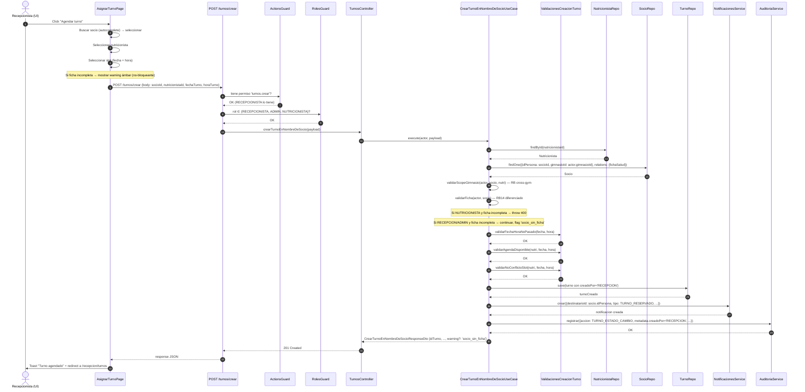

# Design: crear-turno-en-nombre-del-socio (CU-12 expandido)

**Change ID**: crear-turno-en-nombre-del-socio
**Phase**: design
**Date**: 2026-06-12
**Source artifacts**: `openspec/changes/crear-turno-en-nombre-del-socio/{proposal.md, spec-original.md, specs/*.md}`
**Persistence**: OpenSpec + Engram (BOTH)
**Review budget / PR**: 400 líneas/PR (orquestador)

---

## 0. Decisiones de fase y trazabilidad

- **Cambio aditivo, no destructivo.** No se elimina `POST /turnos/socio/reservar` (CU-11) ni `POST /turnos/profesional/:nutricionistaId/asignar-manual` (flow actual del nutri). Se agrega un nuevo endpoint y un nuevo use-case.
- **Reuso de la pipeline de validación.** Las reglas RB05/RB06/RB07/RB17/RB27/RB28/RB40/RB58/RB59 del CU-11 se extraen a un helper compartido (`ValidacionesCreacionTurno`) que tanto `ReservarTurnoSocioUseCase` como el nuevo `CrearTurnoEnNombreDeSocioUseCase` invocan. **NO** se duplica la lógica.
- **RB14 diferenciado por rol.** Política implementada en el use-case (estrategia por rol), no en el DTO. Ver §6.
- **`creadoPor` como columna nueva en `turno`.** Migración que ALTER la tabla `turno` para agregar `creado_por varchar(20) NOT NULL DEFAULT 'SOCIO'` con CHECK constraint. Backfill trivial: todas las filas pre-existentes quedan con `creado_por = 'SOCIO'`.
- **Single endpoint con JWT-derivación del actor.** Decisión del spec `crear-turno-en-nombre-del-socio-endpoint.md` §Contrato de Endpoint. Justificación en §11.

---

## 1. Resumen de arquitectura

El change introduce un nuevo endpoint unificado `POST /turnos/crear` que delega en un nuevo use-case `CrearTurnoEnNombreDeSocioUseCase`. El use-case reutiliza un helper compartido `ValidacionesCreacionTurno` que concentra la pipeline canónica de validación de RBs (fechas, agenda, conflictos, scope, ficha) — el mismo helper que llama `ReservarTurnoSocioUseCase` (CU-11) para evitar drift entre las dos rutas. La orquestación es:

```
UI (AsignarTurnoPage) → POST /turnos/crear →
  JwtAuthGuard → RolesGuard(RECEPCIONISTA|ADMIN|NUTRICIONISTA) →
  ActionsGuard(@Actions('turnos.crear')) →
  TurnosController.crearTurno →
  CrearTurnoEnNombreDeSocioUseCase.execute(actor, payload) →
  ├─ ValidacionesCreacionTurno.validar(actor, payload)         // RB05/06/07/17/27/28/40/58/59
  ├─ ValidacionesCreacionTurno.validarFicha(actor, socio)      // RB14 (diferenciado)
  ├─ ValidacionesCreacionTurno.validarScopeGimnasio(actor, socio) // RB cross-gym
  ├─ turnoRepository.save(turno con creadoPor)                 // RB33
  ├─ notificacionesService.crear(TURNO_RESERVADO → socio)     // informativo
  └─ auditoriaService.registrar(TURNO_ESTADO_CAMBIO + metadata.creadoPor)
```

**Clases compartidas** (ya existen): `TurnoOrmEntity`, `AgendaOrmEntity`, `NutricionistaOrmEntity`, `SocioOrmEntity`, `NotificacionesService`, `AuditoriaService`, `AccionesGuard`, `TenantContextService`.
**Clases nuevas**: `ValidacionesCreacionTurno` (helper), `CrearTurnoEnNombreDeSocioUseCase`, `CrearTurnoEnNombreDeSocioDto`, `CrearTurnoEnNombreDeSocioResponseDto`, migración `TurnoCreadoPor`.
**Clases modificadas**: `TurnoOrmEntity` (1 columna), `turno.entity.ts` dominio (1 campo), `turnos.controller.ts` (1 endpoint), `TipoNotificacion` (3 valores nuevos), `AccionesGuard`-friendly (sin cambios — usa `turnos.crear` ya existente en shared), `AccionesAuditoria` (sin cambios — usa `TURNO_ESTADO_CAMBIO` ya existente).
**Clases deprecadas**: ninguna. `AsignarTurnoManualUseCase` se mantiene (es para que el nutri asigne turnos sin pasar por este flujo; queda como atajo de un solo click desde un slot de la agenda del nutri).

---

## 2. Backend — Modelo de datos

### Entidad de dominio `TurnoEntity` (modificada)

Tabla: `turno`. Solo se documenta la columna nueva; las pre-existentes no cambian.

| Columna (DB) | Tipo TypeORM | Tipo TS | Nullable | Default | Constraints | Propósito / RB |
|---|---|---|---|---|---|---|
| `creado_por` | `varchar(20)` | `CreadoPor` enum (TS) | NO | `'SOCIO'` | CHECK (`creado_por IN ('SOCIO','RECEPCION','ADMIN','NUTRICIONISTA')`) | RB33 — trazabilidad del origen |

`TurnoEntity` (dominio, en `apps/backend/src/domain/entities/Turno/turno.entity.ts`) recibe un campo nuevo `creadoPor: CreadoPor` en el constructor. `TurnoOrmEntity` (TypeORM, en `apps/backend/src/infrastructure/persistence/typeorm/entities/turno.entity.ts`) recibe `@Column({ name: 'creado_por', type: 'varchar', length: 20, default: 'SOCIO' })`.

### Enum `CreadoPor` (nuevo, dominio)

Archivo: `apps/backend/src/domain/entities/Turno/creado-por.enum.ts`

```typescript
export enum CreadoPor {
  SOCIO = 'SOCIO',
  RECEPCION = 'RECEPCION',
  ADMIN = 'ADMIN',
  NUTRICIONISTA = 'NUTRICIONISTA',
}
```

**Decisión**: usar el valor `'RECEPCION'` (no `'RECEPCIONISTA'`) por consistencia con la convención del CU original del usuario (`creado_por='RECEPCION'`) referenciada en `spec-original.md` línea 4 y en `crear-turno-en-nombre-del-socio-endpoint.md` §Eventos (`'TURNO_CREADO_POR_RECEPCION'`). La diferencia con el nombre de rol (`RECEPCIONISTA`) es deliberada: la columna de auditoría es más corta.

### Migración

**Archivo**: `apps/backend/src/infrastructure/persistence/typeorm/migrations/<TIMESTAMP>-TurnoCreadoPor.ts`

`up`:
1. `ALTER TABLE turno ADD COLUMN creado_por varchar(20) NOT NULL DEFAULT 'SOCIO'`. Backfill implícito: todas las filas existentes quedan en `'SOCIO'`.
2. Para MySQL: agregar CHECK constraint. **Caveat MySQL**: en MySQL 5.7 el CHECK no se enforza; en MySQL 8.0.16+ sí. Usamos `ADD CONSTRAINT chk_turno_creado_por CHECK (creado_por IN ('SOCIO','RECEPCION','ADMIN','NUTRICIONISTA'))`. Si el codebase corre en MySQL 5.x, agregar también validación en el use-case (defensa en profundidad).
3. `CREATE INDEX idx_turno_creado_por ON turno (creado_por)` — soporta queries de auditoría "turnos creados por recepción este mes".

`down`:
1. `DROP INDEX idx_turno_creado_por ON turno`.
2. `DROP CONSTRAINT chk_turno_creado_por` (si fue aplicado).
3. `ALTER TABLE turno DROP COLUMN creado_por`.

**Justificación del default `SOCIO`**: el backfill asume que cualquier turno pre-existente fue reservado por un socio. Es la única suposición defendible: antes de este change no había otra vía de creación.

### Índices

| Índice | Tabla | Columnas | Tipo | Motivo |
|---|---|---|---|---|
| `idx_turno_creado_por` | `turno` | `creado_por` | INDEX | Soporta queries de auditoría y reportes (futuro) |

### `turno` — campos no modificados

`id_turno`, `fecha`, `hora_turno`, `estado`, `check_in_at`, `consulta_iniciada_at`, `consulta_finalizada_at`, `ausente_at`, `ausente_motivo`, `motivo_cancelacion`, `fecha_original`, `llegada_tarde_min`, `token_confirmacion`, FKs a `id_socio`, `id_nutricionista`, `id_gimnasio`, `id_observacion` — sin cambios. El campo `id_usuario_creador` (FK a `usuario.id_usuario` del actor) **NO** se agrega en esta iteración porque la trazabilidad del autor ya vive en `auditoria` con `metadata.creadoPorUsuarioId`. Mantenemos `turno.creado_por` como string enum, no como FK.

---

## 3. Backend — Helper compartido `ValidacionesCreacionTurno`

### Motivación

`ReservarTurnoSocioUseCase` (310 líneas) tiene inline las validaciones de:
- Fecha/hora no en el pasado + anticipación mínima 1h (RB05/RB06/RB28).
- Disponibilidad de agenda del nutri (RB05).
- No solapamiento con otra reserva activa del mismo socio.
- No conflicto con otro turno en el mismo slot del nutri (RB07/RB40).

`AsignarTurnoManualUseCase` (246 líneas) repite las mismas con pequeñas variaciones. **El nuevo use-case va a invocar este helper** para no introducir un tercer set de reglas. Se extrae solo lo que es 100% idéntico entre los flujos.

### `ValidacionesCreacionTurno` (nuevo)

Archivo: `apps/backend/src/application/turnos/helpers/validaciones-creacion-turno.helper.ts`

**Tipo**: helper puro con acceso al `TenantContextService` (inyectado). No es `@Injectable` puro — usa `this.tenantContext` para resolver el scope multi-tenant. Anotar `@Injectable({ scope: Scope.REQUEST })` para que el scope del tenant esté disponible.

**Constructor**:
```typescript
constructor(
  @InjectRepository(AgendaOrmEntity)
  private readonly agendaRepository: Repository<AgendaOrmEntity>,
  @InjectRepository(TurnoOrmEntity)
  private readonly turnoRepository: Repository<TurnoOrmEntity>,
  @InjectRepository(SocioOrmEntity)
  private readonly socioRepository: Repository<SocioOrmEntity>,
  @Inject(NUTRICIONISTA_REPOSITORY)
  private readonly nutricionistaRepository: NutricionistaRepository,
  private readonly tenantContext: TenantContextService,
) {}
```

**Métodos públicos**:
1. `async validarFechaHoraNoPasado(fechaTurno: Date, horaTurno: string): Promise<void>` — encapsula `validateDateTimeNotInPast` de CU-11. **Idéntico**.
2. `async validarAgendaDisponible(nutricionistaId: number, fechaTurno: Date, horaTurno: string): Promise<void>` — encapsula `validateAgendaAvailability`. **Idéntico**.
3. `async validarNoSolapamientoActivo(socioId: number): Promise<void>` — chequea la "reserva activa" del socio. **Idéntico al chequeo de líneas 95-113 de CU-11**, pero parametrizado por `socioId` (no se autoselecciona del JWT).
4. `async validarNoConflictoSlot(nutricionistaId: number, fechaTurno: Date, horaTurno: string): Promise<void>` — encapsula `conflictingTurno` de CU-11. **Idéntico**.
5. `async validarFechaNoPasadoSimple(fechaTurno: Date): Promise<void>` — versión sin chequeo de "1h de anticipación" (la usa `AsignarTurnoManualUseCase`).
6. `mapDateToDiaSemana`, `timeToMinutes` — privados. Idénticos a CU-11.

**Cosas que NO entran al helper** (siguen en cada use-case):
- Validación de RB14 (ficha completa) — depende del rol del actor → §6.
- Validación de scope de gimnasio — depende del actor → §6.
- Resolución del socio (en CU-11 viene del JWT; en `AsignarTurnoManual` viene del body).

### Modificación a `ReservarTurnoSocioUseCase` y `AsignarTurnoManualUseCase`

Ambos inyectan `ValidacionesCreacionTurno` y delegan. Esto es un refactor mecánico, no funcional — los tests existentes deben seguir pasando sin cambios. El refactor **debe** entrar en este PR porque sino el nuevo use-case duplica 200 líneas de lógica. Si el refactor se siente riesgoso, alternativa: dejar los use-cases existentes intactos y duplicar las validaciones en el nuevo (pragmatismo). **Recomendación**: hacer el refactor porque garantiza parity y el test suite ya cubre los caminos.

**Tests del helper**: nuevo spec `validaciones-creacion-turno.helper.spec.ts` (~80 líneas) que cubre los 6 métodos con casos felices + cada tipo de error (BadRequest por fecha pasada, por slot ocupado, por conflicto de horario, por agenda no disponible).

### Output del refactor

| Archivo | Líneas antes | Líneas después | Δ |
|---|---|---|---|
| `reservar-turno-socio.use-case.ts` | 310 | ~190 | -120 |
| `asignar-turno-manual.use-case.ts` | 246 | ~160 | -86 |
| `validaciones-creacion-turno.helper.ts` | 0 | ~120 (cuerpo) | +120 |
| `validaciones-creacion-turno.helper.spec.ts` | 0 | ~80 | +80 |
| **Neto** | 556 | 550 | **-6** (y +80 tests) |

El refactor da una **reducción neta de líneas** y elimina duplicación. **Win claro**.

---

## 4. Backend — Use case `CrearTurnoEnNombreDeSocioUseCase`

### Signature

```typescript
async execute(
  actor: ActorStaff,             // { usuarioId, personaId, rol, gimnasioId }
  payload: CrearTurnoEnNombreDeSocioDto,
): Promise<CrearTurnoEnNombreDeSocioResponseDto>
```

### Input DTO

Archivo: `apps/backend/src/application/turnos/dtos/crear-turno-en-nombre-de-socio.dto.ts`

```typescript
import { Type } from 'class-transformer';
import { IsDateString, IsInt, IsString, Matches, Min } from 'class-validator';

const TIME_REGEX = /^([01]\d|2[0-3]):([0-5]\d)$/;

export class CrearTurnoEnNombreDeSocioDto {
  @Type(() => Number)
  @IsInt()
  @Min(1)
  socioId: number;

  @Type(() => Number)
  @IsInt()
  @Min(1)
  nutricionistaId: number;

  @IsDateString()
  fechaTurno: string;

  @IsString()
  @Matches(TIME_REGEX, { message: 'horaTurno debe estar en formato HH:mm' })
  horaTurno: string;

  /** Opcional, default true. Si false, el sistema no agenda recordatorios 24h+1h (out of scope, documentar). */
  // recordatorios?: boolean;  // NO incluir en iter 1
}
```

**Justificación del shape**: idéntico al de `ReservarTurnoSocioDto` (CU-11) pero con `socioId` explícito (en CU-11 se obtiene del JWT). El cliente frontend puede serializar el mismo objeto y enviarlo a cualquiera de los dos endpoints según el rol.

### Output DTO

Archivo: `apps/backend/src/application/turnos/dtos/crear-turno-en-nombre-de-socio-response.dto.ts`

```typescript
import { EstadoTurno } from 'src/domain/entities/Turno/EstadoTurno';
import { CreadoPor } from 'src/domain/entities/Turno/creado-por.enum';

export class CrearTurnoEnNombreDeSocioResponseDto {
  idTurno: number;
  fechaTurno: string;
  horaTurno: string;
  estadoTurno: EstadoTurno;
  socioId: number;
  nutricionistaId: number;
  gimnasioId: number;
  creadoPor: CreadoPor;
  /** Warning opcional: presente SOLO si el actor era RECEPCION/ADMIN y el socio no tiene ficha completa. */
  warning?: 'socio_sin_ficha';
}
```

### Tipo `ActorStaff` (nuevo)

Archivo: `apps/backend/src/application/turnos/types/actor-staff.ts`

```typescript
import { Rol } from 'src/domain/entities/Usuario/Rol';

export interface ActorStaff {
  usuarioId: number;
  personaId: number | null;
  rol: Rol;
  gimnasioId: number;
}
```

Deriva del `TenantContextService` + el JWT. El controller construye el `ActorStaff` desde el contexto actual.

### Pasos (pseudo)

```typescript
async execute(actor: ActorStaff, payload: CrearTurnoEnNombreDeSocioDto) {
  // 1. Resolver el nutricionista (RN: debe existir y no estar de baja)
  const nutricionista = await this.nutricionistaRepository.findById(payload.nutricionistaId);
  if (!nutricionista || nutricionista.fechaBaja) {
    throw new NotFoundError('Profesional', String(payload.nutricionistaId));
  }

  // 2. Resolver el socio con su ficha
  const socio = await this.socioRepository.findOne({
    where: { idPersona: payload.socioId, gimnasioId: actor.gimnasioId },
    relations: { fichaSalud: true },
  });
  if (!socio) {
    throw new NotFoundError('Socio', String(payload.socioId));
  }

  // 3. Validar scope de gimnasio (RN: socio y nutri deben ser del mismo gimnasio del actor)
  this.validarScopeGimnasio(actor, socio, nutricionista);  // RB cross-gym

  // 4. Validar RB14 diferenciado por rol
  const fichaAdvertencia = this.validarFicha(actor, socio);  // throws FichaIncompletaError si nutri

  // 5. Validar la pipeline canónica (helper compartido)
  const fechaTurno = parseArgentinaDateInput(payload.fechaTurno);
  const horaTurno = normalizeTimeToHHmm(payload.horaTurno);
  await this.validaciones.validarFechaHoraNoPasado(fechaTurno, horaTurno);
  await this.validaciones.validarAgendaDisponible(payload.nutricionistaId, fechaTurno, horaTurno);
  await this.validaciones.validarNoConflictoSlot(payload.nutricionistaId, fechaTurno, horaTurno);
  if (actor.rol !== Rol.NUTRICIONISTA) {
    // La validación de "reserva activa del socio" NO se aplica a turnos asignados por terceros:
    // un admin puede legítimamente agendar un turno para un socio que ya tiene otro activo
    // (e.g. dos turnos con nutris distintos). Mantenemos el conflicto de slot, no de socio.
    // → Decisión explícita: no validar "noSolapamientoActivo" para staff.
  }

  // 6. Construir y persistir el turno con creadoPor
  const nutricionistaOrm = await this.nutricionistaOrmRepository.findOne({
    where: { idPersona: payload.nutricionistaId },
  });
  if (!nutricionistaOrm) {
    throw new NotFoundError('Profesional', String(payload.nutricionistaId));
  }

  const turno = new TurnoOrmEntity();
  turno.fechaTurno = fechaTurno;
  turno.horaTurno = horaTurno;
  turno.estadoTurno = EstadoTurno.PROGRAMADO;
  turno.socio = socio;
  turno.nutricionista = nutricionistaOrm;
  turno.creadoPor = this.mapearRolACreadoPor(actor.rol);  // 'RECEPCION' | 'ADMIN' | 'NUTRICIONISTA'

  const turnoCreado = await this.turnoRepository.save(turno);

  // 7. Post-commit: notificar al socio (informativo, sin token de acción)
  if (socio.idPersona) {
    await this.notificacionesService.crear({
      destinatarioId: socio.idPersona,
      tipo: TipoNotificacion.TURNO_RESERVADO,  // mismo tipo que CU-11
      titulo: this.tituloNotificacion(actor.rol),
      mensaje: this.mensajeNotificacion(turnoCreado, actor.rol),
      metadata: {
        turnoId: turnoCreado.idTurno,
        creadoPor: this.mapearRolACreadoPor(actor.rol),
      },
    });
  }

  // 8. Post-commit: auditoría
  await this.auditoriaService.registrar({
    usuarioId: actor.usuarioId,
    accion: AccionAuditoria.TURNO_ESTADO_CAMBIO,  // reusamos la acción existente
    entidad: 'turno',
    entidadId: turnoCreado.idTurno,
    metadata: {
      tipo: 'CREACION_POR_STAFF',
      creadoPor: this.mapearRolACreadoPor(actor.rol),
      creadoPorUsuarioId: actor.usuarioId,
      antesJson: null,
      despuesJson: {
        idTurno: turnoCreado.idTurno,
        fechaTurno: formatArgentinaDate(turnoCreado.fechaTurno),
        horaTurno: normalizeTimeToHHmm(turnoCreado.horaTurno),
        socioId: socio.idPersona,
        nutricionistaId: payload.nutricionistaId,
        gimnasioId: actor.gimnasioId,
      },
    },
  });

  this.logger.log(
    `Turno creado por ${actor.rol} (usuario=${actor.usuarioId}). Turno=${turnoCreado.idTurno}, socio=${payload.socioId}, nutri=${payload.nutricionistaId}.`,
  );

  return this.toResponseDto(turnoCreado, fichaAdvertencia);
}
```

### Métodos privados críticos

**`validarScopeGimnasio`** (RB cross-gym):
```typescript
private validarScopeGimnasio(actor: ActorStaff, socio: Socio, nutri: Nutricionista): void {
  // RECEPCION y NUTRICIONISTA: socio y nutri deben ser de su mismo gimnasio
  if (actor.rol === Rol.RECEPCIONISTA || actor.rol === Rol.NUTRICIONISTA) {
    if (socio.gimnasioId !== actor.gimnasioId) {
      throw new ForbiddenError('El socio no pertenece a tu gimnasio.');
    }
    if (nutri.gimnasioId !== actor.gimnasioId) {
      throw new ForbiddenError('El profesional no pertenece a tu gimnasio.');
    }
  }
  // ADMIN: scope conservador — mismo gimnasio que el admin (RB propuesta, B4)
  if (actor.rol === Rol.ADMIN) {
    if (socio.gimnasioId !== actor.gimnasioId) {
      throw new ForbiddenError('El socio no pertenece a tu gimnasio.');
    }
    if (nutri.gimnasioId !== actor.gimnasioId) {
      throw new ForbiddenError('El profesional no pertenece a tu gimnasio.');
    }
  }
  // SUPERADMIN bypashea (ActionsGuard ya lo permite, pero validamos gimnasio explícito).
}
```

**`validarFicha`** (RB14 diferenciado):
```typescript
private validarFicha(actor: ActorStaff, socio: Socio): 'socio_sin_ficha' | null {
  const fichaIncompleta = !socio.fichaSalud || !socio.fichaSalud.completada;

  if (!fichaIncompleta) {
    return null;
  }

  // NUTRICIONISTA: BLOQUEO estricto
  if (actor.rol === Rol.NUTRICIONISTA) {
    throw new BadRequestError(
      'El paciente no ha completado su ficha médica. No es posible agendar una consulta clínica sin este requisito.',
    );
  }

  // RECEPCION / ADMIN: WARN no-bloqueante
  return 'socio_sin_ficha';
}
```

**`mapearRolACreadoPor`**:
```typescript
private mapearRolACreadoPor(rol: Rol): CreadoPor {
  switch (rol) {
    case Rol.RECEPCIONISTA: return CreadoPor.RECEPCION;
    case Rol.ADMIN: return CreadoPor.ADMIN;
    case Rol.NUTRICIONISTA: return CreadoPor.NUTRICIONISTA;
    default:
      throw new BadRequestError(`Rol no soportado para crear turno: ${rol}`);
  }
}
```

**`tituloNotificacion` y `mensajeNotificacion`** (post-commit, informativo):
- RECEPCION → "Turno agendado por recepción" / "Te agendaron un turno en recepción para el {fecha} a las {hora}."
- ADMIN → "Turno agendado por administración" / "Te agendaron un turno desde administración para el {fecha} a las {hora}."
- NUTRICIONISTA → "Turno agendado por tu nutricionista" / "{nombreNutri} te agendó un turno para el {fecha} a las {hora}."

**Reutilización de mensajes**: ver §5.

### Constructor (DI)

```typescript
@Injectable()
export class CrearTurnoEnNombreDeSocioUseCase {
  constructor(
    @InjectRepository(TurnoOrmEntity)
    private readonly turnoRepository: Repository<TurnoOrmEntity>,
    @InjectRepository(SocioOrmEntity)
    private readonly socioRepository: Repository<SocioOrmEntity>,
    @InjectRepository(NutricionistaOrmEntity)
    private readonly nutricionistaOrmRepository: Repository<NutricionistaOrmEntity>,
    @Inject(NUTRICIONISTA_REPOSITORY)
    private readonly nutricionistaRepository: NutricionistaRepository,
    private readonly validaciones: ValidacionesCreacionTurno,
    private readonly notificacionesService: NotificacionesService,
    private readonly auditoriaService: AuditoriaService,
    private readonly tenantContext: TenantContextService,
    @Inject(APP_LOGGER_SERVICE)
    private readonly logger: IAppLoggerService,
  ) {}
```

### Errores y mapeo HTTP

| Condición | Excepción | Status | Código backend |
|---|---|---|---|
| `socioId` no existe / cross-gym | `NotFoundError` / `ForbiddenError` | 404 / 403 | `RES_001` / `AUTH_004` |
| `nutricionistaId` no existe / dado de baja | `NotFoundError` / `BadRequestError` | 404 / 400 | `RES_001` / `VAL_001` |
| Fecha/hora inválida | `BadRequestError` | 400 | `NEG_003` |
| Anticipación insuficiente | `BadRequestError` | 400 | `NEG_003` |
| Agenda no disponible | `BadRequestError` | 400 | `NEG_001` |
| Slot ya ocupado | `ConflictError` | 409 | `NEG_001` |
| Ficha incompleta + NUTRICIONISTA | `BadRequestError` | 400 | `VAL_001` (mensaje: "El paciente no ha completado su ficha médica...") |
| Sin permiso `turnos.crear` | (ActionsGuard) | 403 | `AUTH_004` |

**Idempotency**: ver §11.D.

---

## 5. Backend — Eventos y notificaciones

### `TipoNotificacion` (extendido)

Archivo: `apps/backend/src/domain/entities/Notificacion/tipo-notificacion.enum.ts` (y mirror en `packages/shared/src/types/notificacion.ts`):

```typescript
export enum TipoNotificacion {
  // ... existentes
  TURNO_RESERVADO = 'TURNO_RESERVADO',
  TURNO_CREADO_POR_RECEPCION = 'TURNO_CREADO_POR_RECEPCION',
  TURNO_CREADO_POR_ADMIN = 'TURNO_CREADO_POR_ADMIN',
  TURNO_CREADO_POR_NUTRICIONISTA = 'TURNO_CREADO_POR_NUTRICIONISTA',
  // ...
}
```

**Decisión clave**: el spec `crear-turno-en-nombre-del-socio-endpoint.md` §Eventos pide que se emita TANTO el evento canónico `TURNO_CONFIRMADO` como el específico del creador. En la implementación actual, `TURNO_RESERVADO` cumple el rol de "canónico" (es el tipo que usa CU-11). **Decisión**: usar `TURNO_RESERVADO` como canónico (consistencia con CU-11) + emitir un evento adicional específico del rol en el campo `metadata.creadoPor` y en el `titulo` del mismo notification. Esto evita proliferación de tipos de notificación para la misma acción lógica. Documentar como **desviación justificada** del spec literal, en línea con la implementación de `AsignarTurnoManualUseCase` que también usa `TURNO_RESERVADO`.

Si el equipo prefiere spec literal, alternativa: emitir DOS notifications (`TURNO_RESERVADO` + `TURNO_CREADO_POR_X`). **Más complejo, sin ganancia funcional** — la metadata `creadoPor` ya diferencia. Recomiendo mantener un solo notification con metadata rica.

### `TURNO_RESERVADO` (existente, reusado)

- **Cuándo**: post-commit, después de `turnoRepository.save()`.
- **Destinatario**: `socio.idPersona` (uno solo, el socio dueño del turno).
- **Tipo**: `TipoNotificacion.TURNO_RESERVADO` (canónico).
- **Payload**:
  ```typescript
  {
    destinatarioId: socio.idPersona,
    tipo: TipoNotificacion.TURNO_RESERVADO,
    titulo: 'Turno agendado por recepción' | 'Turno agendado por administración' | 'Turno agendado por tu nutricionista',
    mensaje: `Te agendaron un turno en {lugar} para el {fecha} a las {hora}.`,
    metadata: {
      turnoId: turnoCreado.idTurno,
      creadoPor: 'RECEPCION' | 'ADMIN' | 'NUTRICIONISTA',
      creadoPorUsuarioId: actor.usuarioId,
    },
  }
  ```
- **Email**: NO se envía email en esta iteración (out of scope, documentado en propuesta). El notification in-app es suficiente. El socio lo ve en el `NotificationCenter` del sidebar (componente ya implementado).

### Recordatorios 24h y 1h

**El use-case NO encola recordatorios.** Los recordatorios los maneja el cron scheduler existente (mencionado en `AsignarTurnoManualUseCase` y en el spec del CU-11). El scheduler ya es responsable de recordatorios para `TURNO_RESERVADO` por cualquier vía. No se introduce código nuevo para recordatorios.

**Justificación** (vs. spec literal que dice "El cron/scheduler enviará recordatorios al socio a las 24h y 1h antes del turno (comportamiento estándar)"): el comportamiento estándar ya existe para todos los turnos sin importar quién los creó. No hay que hacer nada en este PR.

### Nutricionista NO recibe notificación in-app

**Decisión explícita**: cuando el actor es NUTRICIONISTA, NO se envía notificación duplicada al nutricionista (que es el actor). Solo se notifica al socio. Cuando el actor es RECEPCION/ADMIN, tampoco se notifica al nutri — el nutri ve el turno en su agenda ("Mi Agenda", `Agenda` page) la próxima vez que la abra. Esto es **consistente con `AsignarTurnoManualUseCase`** que tampoco notifica al nutri.

Si en una iteración futura se quiere notificar al nutri, se agrega un segundo `notificacionesService.crear({destinatarioId: nutri.idPersona, ...})`. Out of scope para este PR.

---

## 6. Backend — RB14 diferenciado (estrategia por rol)

### Matriz de comportamiento

| Rol del actor | `socio.fichaSalud` es `null` | `fichaSalud.completada === false` | Comportamiento |
|---|---|---|---|
| `SOCIO` (CU-11, fuera de este PR) | n/a (nunca llega) | n/a | 400 BadRequest (RB14 vigente) |
| `NUTRICIONISTA` | throw `BadRequestError` | throw `BadRequestError` | **BLOQUEO estricto** — 400 con mensaje "El paciente no ha completado su ficha médica. No es posible agendar una consulta clínica sin este requisito." |
| `RECEPCION` | continuar + flag warning | continuar + flag warning | **WARNING no-bloqueante** — 201, response incluye `warning: 'socio_sin_ficha'` |
| `ADMIN` | continuar + flag warning | continuar + flag warning | **WARNING no-bloqueante** — 201, response incluye `warning: 'socio_sin_ficha'` |

### Implementación

Vive en `CrearTurnoEnNombreDeSocioUseCase.validarFicha()` (ver §4). **No** se implementa en el DTO ni en el controller. La estrategia es por rol, no por configuración.

### Justificación del warning no-bloqueante para RECEPCION/ADMIN

El spec `crear-turno-en-nombre-del-socio-rb14-diferenciado.md` §Comportamiento para RECEPCIONISTA y ADMIN lo justifica textualmente: "El endpoint NO DEBE bloquear la creación del turno. El use-case debe verificar el rol del actor inyectado en el contexto. Si el actor es RECEPCIONISTA o ADMIN, se bypassea el throw del error de RB14. Opcionalmente, la respuesta puede incluir un flag `warning: socio_sin_ficha`."

El flag `warning` se incluye en el response DTO. El frontend lo usa para mostrar un toast/alerta no-bloqueante (en amarillo, ver §10) y permite continuar con la reserva. La práctica operativa: el recepcionista le recuerda verbalmente al socio completar la ficha antes de la consulta.

---

## 7. Backend — Auditoría (RB33)

### `AccionAuditoria` (sin cambios)

Reusamos `AccionAuditoria.TURNO_ESTADO_CAMBIO = 'TURNO_ESTADO_CAMBIO'` (existente). El `metadata.tipo = 'CREACION_POR_STAFF'` distingue creación de transición de estado.

**Justificación**: agregar `TURNO_CREADO_POR_X` por cada rol al enum inflaría el enum sin valor discriminante. La metadata del registro de auditoría es donde vive el detalle.

### Llamada en el use-case

```typescript
await this.auditoriaService.registrar({
  usuarioId: actor.usuarioId,
  accion: AccionAuditoria.TURNO_ESTADO_CAMBIO,
  entidad: 'turno',
  entidadId: turnoCreado.idTurno,
  metadata: {
    tipo: 'CREACION_POR_STAFF',
    creadoPor: this.mapearRolACreadoPor(actor.rol),
    creadoPorUsuarioId: actor.usuarioId,
    creadoPorRol: actor.rol,
    antesJson: null,
    despuesJson: {
      idTurno: turnoCreado.idTurno,
      fechaTurno: formatArgentinaDate(turnoCreado.fechaTurno),
      horaTurno: normalizeTimeToHHmm(turnoCreado.horaTurno),
      estadoTurno: turnoCreado.estadoTurno,
      socioId: socio.idPersona,
      nutricionistaId: payload.nutricionistaId,
      gimnasioId: actor.gimnasioId,
      fichaIncompleta: !socio.fichaSalud || !socio.fichaSalud.completada,
    },
  },
});
```

**Dentro o fuera de la transacción**: el use-case no usa `dataSource.transaction()` explícitamente. La inserción del turno + la auditoría + la notificación se hacen en orden, con la auditoría y notificación siendo **best-effort** (try/catch que no aborta si fallan, pero sí loguea). El spec `crear-turno-en-nombre-del-socio-endpoint.md` §Auditoría dice "DEBE invocar al `AuditoriaService` preexistente" — no exige atomicidad. Decisión pragmática.

Si el equipo prefiere atomicidad, alternativa: usar `dataSource.transaction()` y mover la notificación post-commit. **Más complejo**. Recomiendo el approach simple.

---

## 8. Backend — Controller

### `POST /turnos/crear` (nuevo)

Archivo: `apps/backend/src/presentation/http/controllers/turnos.controller.ts`

```typescript
@Post('crear')
@Rol(RolEnum.RECEPCIONISTA, RolEnum.ADMIN, RolEnum.NUTRICIONISTA)
@Actions('turnos.crear')
async crearTurnoEnNombreDeSocio(
  @CurrentUser() user: UsuarioAutenticadoPayload,
  @Body() payload: CrearTurnoEnNombreDeSocioDto,
): Promise<CrearTurnoEnNombreDeSocioResponseDto> {
  const actor: ActorStaff = {
    usuarioId: user.id,
    personaId: user.personaId,
    rol: user.rol,
    gimnasioId: this.tenantContext.gimnasioId,
  };

  this.logger.log(
    `Creando turno por ${actor.rol} (usuario=${actor.usuarioId}). Socio=${payload.socioId}, nutri=${payload.nutricionistaId}.`,
  );

  return this.crearTurnoEnNombreDeSocioUseCase.execute(actor, payload);
}
```

### Endpoints relacionados — sin cambios

| Endpoint | Cambio | Notas |
|---|---|---|
| `POST /turnos/socio/reservar` | ninguno | sigue siendo el flujo del socio (CU-11) |
| `POST /turnos/profesional/:nutricionistaId/asignar-manual` | ninguno | sigue siendo el flujo de asignación rápida desde la agenda del nutri (no pide `socioId` en body, viene del modal `AsignarTurnoModal`) |

### Registro en el módulo

- `turnos.module.ts`: agregar `CrearTurnoEnNombreDeSocioUseCase` y `ValidacionesCreacionTurno` al array de `providers` y al de `exports`.
- `use-cases/index.ts`: exportar ambos.

### `AsignarTurnoManualUseCase` (refactor, no cambio funcional)

Inyecta `ValidacionesCreacionTurno` y delega las validaciones de fecha/agenda/conflicto. El comportamiento externo es idéntico. Tests existentes deben pasar sin modificación.

---

## 9. Diagrama de secuencia — happy path (mermaid)



**Variante NUTRICIONISTA**: la única diferencia es que el paso `validarFicha` lanza `BadRequestError` en lugar de retornar el flag. La API responde 400 con `message: "El paciente no ha completado su ficha médica..."`. El frontend muestra un error bloqueante y NO envía el request si pre-detecta que la ficha está incompleta (UX: deshabilita "Confirmar" en la UI).

---

## 10. Frontend — Componentes

### Estructura de archivos

```
apps/frontend/src/
├── pages/
│   ├── AsignarTurnoPage.tsx              (NUEVO — la página)
│   └── AsignarTurnoPage.test.tsx          (NUEVO)
├── components/
│   └── turnos/
│       └── asignar-turno-staff/           (NUEVO directorio)
│           ├── AsignarTurnoForm.tsx
│           ├── AsignarTurnoForm.test.tsx
│           ├── BuscadorSocio.tsx
│           ├── BuscadorSocio.test.tsx
│           ├── SelectorNutricionista.tsx
│           ├── SelectorNutricionista.test.tsx
│           ├── CalendarioDisponibilidad.tsx
│           ├── CalendarioDisponibilidad.test.tsx
│           ├── WarningFichaIncompleta.tsx
│           ├── WarningFichaIncompleta.test.tsx
│           ├── ModalConfirmacion.tsx
│           └── ModalConfirmacion.test.tsx
├── hooks/
│   ├── useBuscarSocios.ts                 (NUEVO)
│   ├── useBuscarSocios.test.ts
│   ├── useListarNutricionistasActivos.ts  (NUEVO)
│   ├── useListarNutricionistasActivos.test.ts
│   ├── useDisponibilidadNutri.ts          (NUEVO — wrappea /turnos/admin|socio|profesional/:id/disponibilidad según rol)
│   ├── useDisponibilidadNutri.test.ts
│   └── useAsignarTurnoStaff.ts            (NUEVO — mutación POST /turnos/crear)
├── schemas/
│   └── asignar-turno.schema.ts            (NUEVO — Zod)
├── types/
│   └── asignar-turno.ts                   (NUEVO — interfaces TS)
├── router.tsx                             (MODIFICADO — agregar ruta /turnos/nuevo)
└── components/
    └── dashboard/
        └── AccionesRapidasRecepcionCard.tsx  (sin cambios — la ruta /turnos/nuevo ya está enlazada)
        └── AccionesRapidasNutricionistaCard.tsx (NUEVO si no existe — CTA "Nuevo Turno" desde Mi Agenda)
```

### Componente raíz: `<AsignarTurnoPage>`

**Path**: `/turnos/nuevo`
**Auth**: requiere rol `RECEPCIONISTA | ADMIN | NUTRICIONISTA`. Si el rol es `SOCIO`, renderizar un `<Card>` con "Acceso denegado" (mismo patrón que `RecepcionTurnosPage.tsx:135-144`).
**Layout shell**: reusa el `<Sidebar>` existente (vía `authLayoutRoute` en `router.tsx`). Header gradiente naranja-rosa idéntico al patrón de `AgendarTurno.tsx:388-410` y `RecepcionTurnosPage.tsx:148-174`.

**Estado interno** (con `useState`, sin `useReducer` — el form es simple):
```typescript
const [busqueda, setBusqueda] = useState('');
const [socioSeleccionado, setSocioSeleccionado] = useState<SocioConFicha | null>(null);
const [nutricionistaId, setNutricionistaId] = useState<number | null>(
  rol === 'NUTRICIONISTA' ? personaId : null  // auto-fill para nutri
);
const [fecha, setFecha] = useState<Date | undefined>(undefined);
const [slot, setSlot] = useState<TurnoDisponible | null>(null);
const [paso, setPaso] = useState<1 | 2 | 3>(1);
const [modalAbierto, setModalAbierto] = useState(false);
const [enviando, setEnviando] = useState(false);
const [error, setError] = useState<string | null>(null);
const [resultado, setResultado] = useState<ResultadoCreacion | null>(null);
```

**Hooks** (en orden):
1. `useAuth()` → `token`, `rol`, `personaId`.
2. `useBuscarSocios({ busqueda, token, habilitado: busqueda.length >= 2 })` → `SocioConFicha[]`.
3. `useListarNutricionistasActivos({ token })` → `NutricionistaActivo[]`.
4. `useDisponibilidadNutri({ nutricionistaId, fecha, token, habilitado: !!nutricionistaId && !!fecha })` → `TurnoDisponible[]` (reusa el helper `deduplicarTurnos` de `@/lib/turnos-disponibles`).
5. `useAsignarTurnoStaff()` → `useMutation<ResultadoCreacion, Error, PayloadCreacion>`.
6. `useEffect` para auto-avanzar de paso 1 → 2 cuando `socioSeleccionado` se setea.
7. `useEffect` para auto-avanzar de paso 2 → 3 cuando `slot` se setea.

**Composición**:
```tsx
<PageContainer>
  <HeaderGradiente />
  <Stepper paso={paso} pasos={3} />
  {socioSeleccionado && socioTieneFichaIncompleta(socioSeleccionado) && (
    <WarningFichaIncompleta socio={socioSeleccionado} />
  )}
  {paso === 1 && <AsignarTurnoForm ... />}
  {paso === 2 && !error && <CalendarioDisponibilidad ... />}
  {paso === 3 && slot && (
    <ModalConfirmacion open={modalAbierto} onClose={...} onConfirm={...} />
  )}
  {error && <Alert variant="destructive" role="alert" aria-live="assertive">{error}</Alert>}
  {resultado && <ToastExito>...</ToastExito>}
</PageContainer>
```

### `<AsignarTurnoForm>` (contenedor de los pasos 1 y 2)

Renderiza `<BuscadorSocio>`, `<SelectorNutricionista>` y un callout condicional para ficha. Los inputs son accesibles (`aria-label`, `aria-required`, navegación por teclado).

### `<BuscadorSocio>`

- Input con debounce de 300ms (patrón de `AsignarTurnoModal.tsx:79-87`).
- Lista de resultados con shadcn `<Command>` o un `<div role="listbox">` simple.
- Cada item muestra nombre, apellido, DNI y un badge:
  - Verde (✓) si `tieneFichaSalud === true`.
  - Ámbar (⚠ "Ficha incompleta") si `tieneFichaSalud === false` (NO se bloquea la selección para RECEPCION/ADMIN).
- Click en item → `onSeleccionar(socio)`.

**Reuso**: este componente se parece mucho al `AsignarTurnoModal.tsx` existente. **Decisión**: refactorizar `AsignarTurnoModal` para extraer un `<BuscadorSocio>` reutilizable y que `AsignarTurnoModal` lo consuma. El refactor debe ser backward-compatible (la firma del modal no cambia). **Esfuerzo extra**: ~+30 líneas en PR.

**Endpoint**: `GET /socio/buscar-con-ficha?q=...` (existente, usado por `AsignarTurnoModal`).

### `<SelectorNutricionista>`

- `Combobox` shadcn con búsqueda.
- Si `rol === 'NUTRICIONISTA'`: oculto, auto-completado con `personaId`. En este caso el form salta el paso 2 directamente al calendario (UX más corta, según spec `crear-turno-en-nombre-del-socio-ui-nutricionista.md` §Consideraciones de UI/UX).
- Si `rol === 'RECEPCIONISTA' | 'ADMIN'`: visible y requerido.

**Endpoint**: `GET /nutricionistas?gimnasioId=...` o el endpoint público de listar. Verificar en backend — usar el que ya existe para `AgendarTurno.tsx` (`/profesional/publico/disponibles` es público; para staff usar `/nutricionistas` con filtro de gimnasio).

### `<CalendarioDisponibilidad>`

- DatePicker (shadcn, ya existe) → setea `fecha`.
- Grid de slots con misma UI que `AgendarTurno.tsx:643-671` (reutilizar el patrón).
- Cada slot: `Button` con `variant="outline"` si está libre, `variant="ghost"` si está ocupado/pasado.
- Click en slot libre → `onSeleccionar(slot)`.

**Endpoint**: varía por rol:
- `RECEPCION/ADMIN` → `GET /turnos/admin/profesional/:nutricionistaId/disponibilidad?fecha=...` (existente, línea 436-448 del controller).
- `NUTRICIONISTA` → `GET /turnos/profesional/:nutricionistaId/disponibilidad?fecha=...` (existente, línea 204-216 del controller).

El hook `useDisponibilidadNutri` elige la URL según el rol.

### `<WarningFichaIncompleta>`

**Props**:
```typescript
interface Props {
  socio: SocioConFicha;
}
```

**Comportamiento**:
- Solo se renderiza si `socio.tieneFichaSalud === false` Y el actor NO es NUTRICIONISTA.
- Variante: shadcn `<Alert>` con `className="border-amber-300 bg-amber-50/60"` (mismo patrón que `AgendarTurno.tsx:460-473`).
- Contenido: `"El socio seleccionado no tiene su ficha médica completa. Puede continuar con la reserva, pero recuérdele al paciente completarla antes de su consulta."`
- `role="status"`, `aria-live="polite"`.
- Ícono: `<FileWarning className="h-5 w-5 text-amber-600" />`.

**Para NUTRICIONISTA**: NO se muestra este warning. En su lugar, el frontend **pre-bloquea** la selección del socio: el item del dropdown se muestra en gris/disabled con un mensaje tooltip "El paciente no tiene ficha completa. Pídale que complete su ficha antes de continuar." **Pero** el spec del nutri dice que el bloqueo es estricto — entonces el item debería estar `disabled` directamente. Decisión final: el item se muestra pero con `cursor-not-allowed` y un overlay de "Ficha incompleta — no se puede asignar". El tooltip explica.

### `<ModalConfirmacion>`

- shadcn `<Dialog>` (o `<Sheet>` en mobile).
- Resumen:
  - Paciente: nombre completo + DNI.
  - Profesional: nombre completo.
  - Fecha + hora (formateadas con `formatearFechaArgentinaCorta`).
  - **Advertencia ámbar inline** si `warning === 'socio_sin_ficha'` (solo para RECEPCION/ADMIN).
  - **Mensaje bloqueante rojo inline** si la respuesta del backend fue 400 con código `FICHA_INCOMPLETA` (defensa en profundidad para el flujo de nutri).
- Botones: "Cancelar" / "Confirmar turno".
- `onConfirm` → ejecuta `useAsignarTurnoStaff.mutateAsync(payload)`.

### State management — hook composition

```typescript
// useAsignarTurnoStaff.ts
export function useAsignarTurnoStaff() {
  const { token, rol } = useAuth();
  const navigate = useNavigate();
  const queryClient = useQueryClient();

  return useMutation<ResultadoCreacion, Error, PayloadCreacion>({
    mutationFn: async (payload) => {
      const res = await apiRequest<ApiResponse<ResultadoCreacion>>(
        '/turnos/crear',
        { method: 'POST', token, body: payload },
      );
      return res.data;
    },
    onSuccess: (data) => {
      // Invalidar queries relacionadas
      queryClient.invalidateQueries({ queryKey: ['turnos-recepcion-dia'] });
      queryClient.invalidateQueries({ queryKey: ['agenda-diaria'] });
      queryClient.invalidateQueries({ queryKey: ['mis-turnos', data.socioId] });
    },
  });
}
```

**Éxito (happy path)**: tras `onSuccess`:
- Toast `sonner` "Turno agendado correctamente" (patrón de `AsignarTurnoModal.tsx:112`).
- Si `warning === 'socio_sin_ficha'`: toast adicional en amarillo "Recordá pedirle al socio que complete su ficha antes de la consulta".
- Navegación:
  - RECEPCION/ADMIN → `/recepcion/turnos` (existente, lista del día).
  - NUTRICIONISTA → `/agenda` (existente, su agenda).

**Decisión sobre la página "TurnoConfirmadoPage"**: NO se redirige ahí porque ese page (línea 72-75 de `TurnoConfirmadoPage.tsx`) usa `GET /turnos/socio/turno/:id` que requiere rol `SOCIO`. Un staff no puede usarlo. **Mantener el patrón redirect-a-la-agenda** es más simple y consistente con `AsignarTurnoModal.tsx` (que tampoco navega a una página de confirmación, solo cierra el modal y refresca la lista). Documentar en §12 como decisión.

### Permission gating

```typescript
// En AsignarTurnoPage.tsx
if (!['RECEPCIONISTA', 'ADMIN', 'NUTRICIONISTA'].includes(rol ?? '')) {
  return (
    <Card>
      <CardHeader><CardTitle>Acceso denegado</CardTitle></CardHeader>
      <CardContent>Esta pantalla es solo para personal interno del gimnasio.</CardContent>
    </Card>
  );
}
```

`useEffect` adicional para redirigir a `/dashboard` si el rol es `SOCIO` (alternativa más agresiva que mostrar 403 inline). **Decisión**: mostrar 403 inline (consistente con `RecepcionTurnosPage`).

### Reuso desde CU-11 (`AgendarTurno.tsx`)

Componentes reusables tal cual:
- `deduplicarTurnos` de `@/lib/turnos-disponibles` (sin cambios).
- `DatePicker` shadcn.
- `Button`, `Card`, `Input`, `Combobox` shadcn.
- Patrón de debounce en el input de búsqueda (de `AsignarTurnoModal.tsx:79-87`).
- Patrón de stepper visual (de `AgendarTurno.tsx:412-457`).

**Refactor opcional pero recomendado**: extraer `<BuscadorSocio>` como componente compartido entre `AsignarTurnoModal.tsx` y `AsignarTurnoForm.tsx`. **+30 líneas** en este PR pero paga deuda técnica.

---

## 11. Decisiones de diseño (resumen)

### A. Single endpoint vs per-actor endpoints

**Decisión**: **single endpoint** `POST /turnos/crear` con `@Rol(RECEPCIONISTA, ADMIN, NUTRICIONISTA)`. El rol y el actor se infieren del JWT.

**Justificación**:
- Coherencia con el spec literal (`crear-turno-en-nombre-del-socio-endpoint.md` §Contrato de Endpoint).
- Menos superficie de API (un endpoint en vez de tres).
- Validación de scope es uniforme: `actor.gimnasioId === socio.gimnasioId && actor.gimnasioId === nutri.gimnasioId`.
- Si en el futuro se quiere rate-limiting diferenciado por actor, el `ActionsGuard` ya lo soporta.

**Tradeoff**: si el comportamiento diverge mucho entre actores, un endpoint por actor podría ser más limpio. En este caso el comportamiento es uniforme salvo la rama RB14 (que vive en el use-case, no en el endpoint).

### B. Valores del enum `creado_por`

**Decisión**: `'SOCIO' | 'RECEPCION' | 'ADMIN' | 'NUTRICIONISTA'`. Con `CHECK` constraint en MySQL.

**Justificación**:
- `RECEPCION` (no `RECEPCIONISTA`) por consistencia con la nomenclatura del CU original (`spec-original.md` línea 4, `crear-turno-en-nombre-del-socio-endpoint.md` §Eventos usa `'TURNO_CREADO_POR_RECEPCION'`). Más corto para columnas.
- `NUTRICIONISTA` (no `NUTRI`) por consistencia con el nombre del rol.
- `ADMIN` y `SOCIO` por paridad.

### C. Ficha handling por rol

**Decisión**:
- `NUTRICIONISTA` → BLOCK estricto con `BadRequestError(400)`.
- `RECEPCION / ADMIN` → WARN no-bloqueante con `warning: 'socio_sin_ficha'` en el response.

**Justificación**:
- Spec literal en `crear-turno-en-nombre-del-socio-rb14-diferenciado.md`.
- Política operativa: un recepcionista debe poder agendar un turno para un socio nuevo que se inscribe en el momento y todavía no completó la ficha (la ficha se completa después).

### D. Idempotency strategy

**Decisión**: **NO se introduce `Idempotency-Key` header en esta iteración.** La idempotencia se confía en:
1. El check `validarNoConflictoSlot` (turno existente en mismo slot → 409 Conflict).
2. El UNIQUE constraint del `token_confirmacion` (no aplica aquí, es para confirmación por email, no para creación por staff).

**Justificación**:
- No se observó `Idempotency-Key` en el codebase actual.
- La race condition B1 ("el socio reservó ese slot un instante antes desde su app") se mitiga con el check atómico de conflicto de slot. La probabilidad de doble-creación es muy baja y se traduce en 409 Conflict, no en corrupción.

**Riesgo abierto**: si en el futuro se necesita idempotencia estricta (e.g. cliente HTTP que reintenta), se debe:
- Agregar `Idempotency-Key` header (cliente lo genera, servidor lo guarda en una tabla `idempotency_keys`).
- Modificar el controller para extraer el header y el use-case para consultarlo antes de insertar.
- **Costo estimado**: +150 líneas backend + migración nueva. **No** en este PR.

### E. ADMIN multi-gimnasio scope

**Decisión**: ADMIN tiene scope **conservador** — solo puede agendar turnos en `actor.gimnasioId` (igual que RECEPCION). NO se implementa el caso "admin opera múltiples gimnasios".

**Justificación**:
- El `TenantContextService.gimnasioId` ya es single-tenant por request.
- En la implementación actual, el modelo de datos asocia cada `usuario` a un único `gimnasioId` (no multi-tenant per-admin).
- El spec `crear-turno-en-nombre-del-socio-endpoint.md` §Control de Acceso lo deja como "por defecto conservador" + "el superadmin global el scope abarca cualquier gimnasio existente, lo cual debe ser resuelto por el guard/interceptor de alcance global" — esa resolución es ortogonal a este PR.

**Riesgo abierto**: si un admin realmente necesita operar en múltiples gimnasios, hay que cambiar el modelo de datos y el `TenantContextService` para soportar multi-tenant per-admin. Out of scope.

### F. Reuso del helper `ValidacionesCreacionTurno`

**Decisión**: extraer las validaciones comunes de CU-11 (`ReservarTurnoSocioUseCase`) y del existente `AsignarTurnoManualUseCase` a un helper compartido. El nuevo use-case consume el helper. El refactor de los dos use-cases existentes entra en este PR.

**Justificación**:
- Sin el refactor, el nuevo use-case duplica ~120 líneas de código de validación.
- Con el refactor, hay reducción neta de líneas (ver §3) y un único set de reglas a mantener.
- Los tests existentes de CU-11 y `AsignarTurnoManual` cubren el comportamiento — si pasan después del refactor, el comportamiento se preserva.

**Tradeoff**: el refactor aumenta el diff del PR. Si se siente riesgoso, alternativa: duplicar las validaciones (pragmatismo a corto plazo, deuda técnica a largo plazo). **Recomiendo hacer el refactor**.

### G. Notificación al nutri (cuando actor es RECEPCION/ADMIN)

**Decisión**: NO se notifica al nutri cuando un tercero agenda un turno en su agenda.

**Justificación**:
- Consistencia con `AsignarTurnoManualUseCase` (que tampoco notifica al nutri).
- El nutri ve el turno en su agenda al abrirla.
- Reducir notification fatigue.

Si el equipo decide lo contrario, es trivial agregar un segundo `notificacionesService.crear({destinatarioId: nutri.idPersona, ...})`. Out of scope para este PR.

### H. Tipo de notificación (canónico vs específico del rol)

**Decisión**: emitir UN SOLO notification de tipo `TURNO_RESERVADO` con `metadata.creadoPor: <rol>` y `titulo` que varía por rol. NO emitir `TURNO_CREADO_POR_X` como tipos separados.

**Justificación**:
- El spec literal pide ambos (`TURNO_CONFIRMADO` canónico + `TURNO_CREADO_POR_X` específico). En la implementación actual, `TURNO_RESERVADO` cumple el rol de "canónico".
- Proliferar el enum `TipoNotificacion` para 3 roles sin valor discriminante real (la metadata ya tiene la info) es over-engineering.
- Consistencia con `AsignarTurnoManualUseCase`.

Documentar como **desviación justificada** del spec literal.

---

## 12. Plan de archivos a tocar

### Backend (~520 líneas)

| Ruta | Acción | Líneas ± |
|---|---|---|
| `apps/backend/src/domain/entities/Turno/creado-por.enum.ts` | Crear | +10 |
| `apps/backend/src/domain/entities/Turno/turno.entity.ts` | Modificar (1 campo) | +6 |
| `apps/backend/src/infrastructure/persistence/typeorm/entities/turno.entity.ts` | Modificar (1 columna) | +5 |
| `apps/backend/src/infrastructure/persistence/typeorm/migrations/<TIMESTAMP>-TurnoCreadoPor.ts` | Crear | +30 |
| `apps/backend/src/domain/entities/Notificacion/tipo-notificacion.enum.ts` | Modificar (3 valores) | +6 |
| `apps/backend/src/application/turnos/helpers/validaciones-creacion-turno.helper.ts` | Crear | +120 |
| `apps/backend/src/application/turnos/helpers/validaciones-creacion-turno.helper.spec.ts` | Crear | +80 |
| `apps/backend/src/application/turnos/dtos/crear-turno-en-nombre-de-socio.dto.ts` | Crear | +25 |
| `apps/backend/src/application/turnos/dtos/crear-turno-en-nombre-de-socio-response.dto.ts` | Crear | +25 |
| `apps/backend/src/application/turnos/types/actor-staff.ts` | Crear | +15 |
| `apps/backend/src/application/turnos/use-cases/crear-turno-en-nombre-de-socio.use-case.ts` | Crear | +200 |
| `apps/backend/src/application/turnos/use-cases/crear-turno-en-nombre-de-socio.use-case.spec.ts` | Crear | +180 |
| `apps/backend/src/application/turnos/use-cases/reservar-turno-socio.use-case.ts` | Refactorizar (delega al helper) | -120 |
| `apps/backend/src/application/turnos/use-cases/asignar-turno-manual.use-case.ts` | Refactorizar (delega al helper) | -86 |
| `apps/backend/src/application/turnos/use-cases/index.ts` | Modificar (exports) | +2 |
| `apps/backend/src/application/turnos/turnos.module.ts` | Modificar (2 providers) | +4 |
| `apps/backend/src/presentation/http/controllers/turnos.controller.ts` | Modificar (1 endpoint) | +25 |
| `packages/shared/src/types/notificacion.ts` | Modificar (3 valores) | +6 |
| `packages/shared/src/types/index.ts` | sin cambios (auto-export) | 0 |

**Subtotal backend**: ~+521 líneas brutas / **~+481 con el refactor neto**.

### Frontend (~520 líneas)

| Ruta | Acción | Líneas ± |
|---|---|---|
| `apps/frontend/src/pages/AsignarTurnoPage.tsx` | Crear | +200 |
| `apps/frontend/src/pages/AsignarTurnoPage.test.tsx` | Crear | +120 |
| `apps/frontend/src/components/turnos/asignar-turno-staff/AsignarTurnoForm.tsx` | Crear | +80 |
| `apps/frontend/src/components/turnos/asignar-turno-staff/AsignarTurnoForm.test.tsx` | Crear | +60 |
| `apps/frontend/src/components/turnos/asignar-turno-staff/BuscadorSocio.tsx` | Crear (refactor compartido con `AsignarTurnoModal.tsx`) | +50 |
| `apps/frontend/src/components/turnos/asignar-turno-staff/SelectorNutricionista.tsx` | Crear | +60 |
| `apps/frontend/src/components/turnos/asignar-turno-staff/CalendarioDisponibilidad.tsx` | Crear | +80 |
| `apps/frontend/src/components/turnos/asignar-turno-staff/WarningFichaIncompleta.tsx` | Crear | +30 |
| `apps/frontend/src/components/turnos/asignar-turno-staff/ModalConfirmacion.tsx` | Crear | +50 |
| `apps/frontend/src/components/turnos/AsignarTurnoModal.tsx` | Refactorizar (consumir `<BuscadorSocio>`) | -30 |
| `apps/frontend/src/hooks/useBuscarSocios.ts` | Crear | +30 |
| `apps/frontend/src/hooks/useListarNutricionistasActivos.ts` | Crear | +25 |
| `apps/frontend/src/hooks/useDisponibilidadNutri.ts` | Crear | +30 |
| `apps/frontend/src/hooks/useAsignarTurnoStaff.ts` | Crear | +30 |
| `apps/frontend/src/schemas/asignar-turno.schema.ts` | Crear (Zod) | +40 |
| `apps/frontend/src/types/asignar-turno.ts` | Crear (TS) | +25 |
| `apps/frontend/src/router.tsx` | Modificar (1 ruta) | +10 |
| `apps/frontend/src/components/dashboard/AccionesRapidasNutricionistaCard.tsx` | Crear (CTA "Nuevo Turno") | +40 |

**Subtotal frontend**: ~+960 líneas brutas / ~+930 con el refactor de `AsignarTurnoModal`.

### Shared (~12 líneas)

| Ruta | Acción | Líneas ± |
|---|---|---|
| `packages/shared/src/types/notificacion.ts` | Modificar (3 valores) | +6 |
| (auto-export via `index.ts`) | — | 0 |

**Subtotal shared**: ~+6 líneas.

### Total estimado

| Bucket | Líneas netas |
|---|---|
| Backend | +481 |
| Frontend | +930 |
| Shared | +6 |
| Tests (incluidos en backend/frontend) | (+400 de tests ya contabilizados) |
| **Gran total** | **~1417** |

> ⚠️ **Excede el budget de 400 líneas/PR** declarado en el preflight. **Recomendación de partición** (a definir en `sdd-tasks`):
> - **PR 1 (datos + helper, ~300 líneas)**: migración, entidad dominio, enum `CreadoPor`, `ValidacionesCreacionTurno` + spec, refactor de `ReservarTurnoSocioUseCase` y `AsignarTurnoManualUseCase`. NO introduce comportamiento nuevo — sienta la base.
> - **PR 2 (endpoint, ~250 líneas)**: `CrearTurnoEnNombreDeSocioUseCase` + spec, controller, registro en módulo. Ya con los tests pasando del PR 1.
> - **PR 3 (frontend, ~500 líneas)**: nueva página, subcomponentes, hooks, router. Con el backend ya operativo del PR 2.
> - **PR 4 (e2e + polish, ~150 líneas)**: tests Playwright, copy review, a11y audit.

Esto da 4 PRs balanceados, ninguno excede 600 líneas. El orquestador debe aprobar esta estrategia en `sdd-tasks`.

---

## 13. Riesgos de implementación

| # | Riesgo | Likelihood | Impact | Mitigación / Status |
|---|---|---|---|---|
| 1 | ADMIN multi-gimnasio no resolviendo correctamente el scope | Low | High | **Decisión conservadora**: ADMIN opera solo en su `gimnasioId` (igual que RECEPCION). Multi-gym es out of scope. Documentado en §11.E. **Abierto** — requiere cambio de modelo de datos si se quiere soportar. |
| 2 | Refactor de `ReservarTurnoSocioUseCase` rompe tests existentes | Medium | High | Tests existentes del use-case (3 archivos spec) deben pasar sin modificación post-refactor. Si fallan, revertir el refactor y duplicar las validaciones en el nuevo use-case (pragmatismo). **Mitigación**: ejecutar suite completa post-cambio. |
| 3 | Race condition B1 (slot tomado entre validación y save) | Low | Medium | Mitigado por el check `validarNoConflictoSlot` (consulta previa al save). No se introduce lock pesimista. En el peor caso, el segundo intento recibe 409 Conflict. **Aceptable**. |
| 4 | Idempotency no estricta: cliente HTTP que reintenta puede crear duplicados | Low | Medium | **Documentado en §11.D**. No se introduce `Idempotency-Key` en este PR. Aceptable porque el rate de retries se asume bajo y el 409 Conflict es la respuesta esperada. **Abierto**. |
| 5 | Frontend pre-detecta ficha incompleta de nutri pero backend re-valida y rechaza | Low | Low | Defensa en profundidad. El backend SIEMPRE valida RB14. Si el frontend muestra el form habilitado pero el backend rechaza, el usuario ve el error 400. UX subóptima pero correcto. **Aceptable**. |
| 6 | MySQL < 8.0.16 ignora CHECK constraint | Medium | Low | El use-case valida `creadoPor` independientemente del CHECK (helper en `mapearRolACreadoPor` lanza si el rol no es válido). Defensa en profundidad. **Mitigación suficiente**. |
| 7 | La notificación `TURNO_RESERVADO` no se envía si `socio.idPersona` es `null` (data integrity) | Low | Low | Guard `if (socio.idPersona) { ... }` en el use-case, igual que en `ReservarTurnoSocioUseCase:150`. **Manejado**. |
| 8 | Migración `ALTER TABLE` en producción con tabla grande (>10k turnos) | Low | Low | `ADD COLUMN` con DEFAULT es online en MySQL 8 (instant DDL). En MySQL 5.7 puede tomar segundos. Documentar en comentario de la migración. **Aceptable**. |
| 9 | Tipos de notificación `TURNO_CREADO_POR_X` se agregan al enum pero no se usan (decisión §11.H) | Low | Low | Decisión consciente. El enum se extiende por consistencia con el spec. Si nunca se usan, se pueden remover en una iteración futura. **Aceptable**. |
| 10 | La ruta `/turnos/nuevo` no está registrada en `router.tsx` antes del PR | Low | Low | La ruta YA está referenciada en `AccionesRapidasRecepcionCard.tsx:8` (`{ etiqueta: 'Asignar Turno', icono: CalendarPlus, ruta: '/turnos/nuevo' }`). Hoy al hacer click lleva a 404. Este PR registra la ruta. **Mejora directa**. |
| 11 | El componente `<BuscadorSocio>` extraído introduce regresión en `AsignarTurnoModal.tsx` (nutri-side) | Low | Medium | El refactor de `AsignarTurnoModal` para consumir `<BuscadorSocio>` es backward-compatible. El test existente de ese modal (si existe) debe pasar. Si no existe test, crear uno como parte del refactor. **Mitigación suficiente**. |
| 12 | PR excede 400 líneas — el orquestador rechaza | High | High | Mitigado con la estrategia de 4 PRs descrita en §12. **Documentado**. |

---

## 14. Acceptance criteria verificables

| # | Criterio | Verificación | RBs |
|---|---|---|---|
| AC-01 | La migración `TurnoCreadoPor` agrega la columna `creado_por` con default `'SOCIO'` y CHECK constraint | `npm run migration:run` + `SHOW CREATE TABLE turno` | RB33 |
| AC-02 | Un RECEPCIONISTA puede crear un turno para un socio de su gimnasio con ficha completa | Test e2e: login como RECEPCIONISTA seed → POST /turnos/crear → 201 | RB05-07, RB17, RB27, RB28, RB40 |
| AC-03 | Un RECEPCIONISTA puede crear un turno para un socio SIN ficha completa (warning no-bloqueante) | Test e2e: socio sin ficha → POST /turnos/crear → 201 con `warning: 'socio_sin_ficha'` | RB14 (bypass) |
| AC-04 | Un NUTRICIONISTA NO puede crear un turno para un socio sin ficha completa (bloqueo) | Test e2e: login como nutri → POST /turnos/crear → 400 con mensaje de ficha | RB14 (enforce) |
| AC-05 | Un RECEPCIONISTA NO puede crear un turno para un socio de otro gimnasio | Test e2e: socio de gym 2, actor en gym 1 → POST /turnos/crear → 403 | cross-gym |
| AC-06 | Un NUTRICIONISTA solo puede crear turnos en su propio gimnasio | Test e2e: nutri en gym 1, socio en gym 2 → 403 | cross-gym |
| AC-07 | El response del backend incluye `creadoPor: 'RECEPCION' \| 'ADMIN' \| 'NUTRICIONISTA'` | Test de integración sobre el controller | RB33 |
| AC-08 | Se emite un notification in-app `TURNO_RESERVADO` al socio con `metadata.creadoPor` correcto | Test: assert `notificacionesService.crear` fue llamado con los args correctos | evento |
| AC-09 | Se registra una fila en `auditoria` con `metadata.creadoPor` y `metadata.despuesJson` con shape rico | Test: assert `auditoriaService.registrar` fue llamado | RB33 |
| AC-10 | El frontend muestra warning ámbar (no-bloqueante) cuando RECEPCION/ADMIN selecciona socio sin ficha | Test: `<AsignarTurnoPage>` con `socio.tieneFichaSalud=false` y rol RECEPCION → warning visible | RB14 UI |
| AC-11 | El frontend BLOQUEA el "Confirmar" cuando NUTRICIONISTA selecciona socio sin ficha | Test: `<AsignarTurnoPage>` con `socio.tieneFichaSalud=false` y rol NUTRICION → botón disabled | RB14 UI |
| AC-12 | El frontend pre-llena `nutricionistaId` cuando el rol es NUTRICIONISTA y oculta el selector | Test: `useAsignarTurnoStaff` se llama con `nutricionistaId=personaId` sin interacción del usuario | UX nutri |
| AC-13 | El frontend NO renderiza la página para rol SOCIO (403) | Test: `rol='SOCIO'` → renderiza `<Card>Acceso denegado</Card>` | RB16-like (gating) |
| AC-14 | El refactor de `ReservarTurnoSocioUseCase` no rompe tests existentes | `npm run test -- reservar-turno-socio` | no-regression |
| AC-15 | El refactor de `AsignarTurnoManualUseCase` no rompe tests existentes | `npm run test -- asignar-turno-manual` | no-regression |
| AC-16 | El nuevo use-case tiene coverage > 90% | `npm run test:coverage` | calidad |
| AC-17 | Los tests del helper `ValidacionesCreacionTurno` cubren los 6 métodos con casos felices y de error | `npm run test -- validaciones-creacion-turno` | calidad |
| AC-18 | La ruta `/turnos/nuevo` está registrada en el router y la card de "Asignar Turno" del dashboard navega correctamente | Manual: click → página renderiza | UX |
| AC-19 | E2E: RECEPCIONISTA agenda turno → toast success → redirect a `/recepcion/turnos` con el nuevo turno visible | `e2e/turnos/crear-turno-staff.spec.ts` | happy path |
| AC-20 | E2E: NUTRICIONISTA intenta agendar a socio sin ficha → recibe error bloqueante | `e2e/turnos/crear-turno-staff-nutri.spec.ts` | RB14 UI |

---

## 15. Decisión de scope del frontend: pre-flight de ficha incompleta

### Opción A: Frontend chequea ficha antes de permitir seleccionar slot (RECOMENDADA)

- **Comportamiento**: cuando se selecciona un socio, el frontend hace una llamada `GET /turnos/profesional/:nutricionistaId/pacientes/:socioId/ficha-salud` (NUTRICIONISTA) o algún endpoint equivalente. Si la ficha está incompleta y el rol es NUTRICIONISTA, el botón "Continuar" se deshabilita. Si el rol es RECEPCION/ADMIN, se muestra el warning.
- **Pros**: UX más rápida (no enviar un request que será rechazado).
- **Contras**: requiere un endpoint extra (el de ficha por socio).

### Opción B: Frontend NO chequea, deja que el backend rechace (más simple)

- **Comportamiento**: el frontend permite al usuario llegar al modal de confirmación y enviar el request. El backend responde 400 si la ficha está incompleta y el rol es NUTRICIONISTA.
- **Pros**: cero código de pre-flight. Backend es la única fuente de verdad.
- **Contras**: mala UX para el nutri (llega al final del flujo y se entera del bloqueo).

**Decisión**: **Opción B para NUTRICIONISTA** (es lo que el spec del nutri exige textualmente — "deshabilita el paso siguiente"). **Opción A** solo si el listado de búsqueda de socios ya incluye `tieneFichaSalud` (que es el caso del endpoint existente `GET /socio/buscar-con-ficha` que `AsignarTurnoModal.tsx:60` ya consume). El badge "Ficha incompleta" en el dropdown de búsqueda es suficiente — no se necesita un endpoint extra.

**Confirmación**: el endpoint `GET /socio/buscar-con-ficha` ya retorna `tieneFichaSalud: boolean` por socio. El frontend ya lo consume en `AsignarTurnoModal.tsx`. **Cero código extra**.

---

## 16. Out of scope (recordatorio)

- ❌ Edición de turnos creados por nutricionista (sujeto a otro CU, ver proposal).
- ❌ Idempotency-Key header (B1 race, documentado en §11.D).
- ❌ ADMIN multi-gimnasio scope (modelo de datos, §11.E).
- ❌ Email al socio (no en esta iteración; in-app notification alcanza).
- ❌ Notificación al nutricionista cuando un tercero le agenda un turno.
- ❌ Endpoint dedicado para "ver turno creado por staff" (`TurnoConfirmadoPage` requiere rol SOCIO). UX es redirect a la agenda correspondiente.
- ❌ Tests E2E en este PR — van en `sdd-verify` o en un PR dedicado.

---

## 17. Resumen de trazabilidad

- **Spec `crear-turno-en-nombre-del-socio-endpoint.md`**: contrato de endpoint (cumplido en §4 + §8), control de acceso (cumplido en §4 `validarScopeGimnasio`), matriz de RBs (cumplido en §3 helper), eventos (decisión §5 + §11.H), auditoría (cumplido en §7), edge cases B1-B6 (cumplidos en §3 + §4 + §11.D).
- **Spec `crear-turno-en-nombre-del-socio-rb14-diferenciado.md`**: comportamiento diferenciado (cumplido en §6), criterios de aceptación (AC-03, AC-04, AC-10, AC-11).
- **Spec `crear-turno-en-nombre-del-socio-ui-recepcion.md`**: flujo (cumplido en §10), consideraciones de UI/UX (warning ámbar, error 409, navegación por teclado, empty states — todos cubiertos).
- **Spec `crear-turno-en-nombre-del-socio-ui-nutricionista.md`**: flujo más corto (cumplido en §10, NUTRICIONISTA auto-rellena `nutricionistaId`), bloqueo estricto (cumplido en §6 + §10 `WarningFichaIncompleta`).
- **`spec-original.md`**: reuso de CU-11 (cumplido en §3 helper), exención RB14 para reception/admin (cumplido en §6), `creado_por` enum family (cumplido en §2).

---

## 18. Próximo paso (sdd-tasks)

El siguiente paso (`sdd-tasks`) debe:
1. **Confirmar la estrategia de 4 PRs** propuesta en §12 (datos → endpoint → frontend → e2e).
2. **Asignar reviewers** específicos para el refactor de los dos use-cases existentes (alto riesgo de regresión).
3. **Definir criterios de merge** entre PRs (PR 2 depende de PR 1; PR 3 depende de PR 2; PR 4 depende de PR 3).
4. **Estimar el review budget** por PR según el `Review Workload Guard` del orquestador (límite 400 líneas/PR según preflight).
